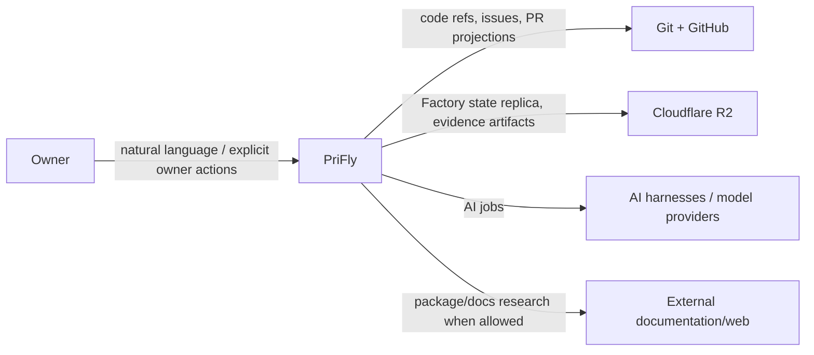
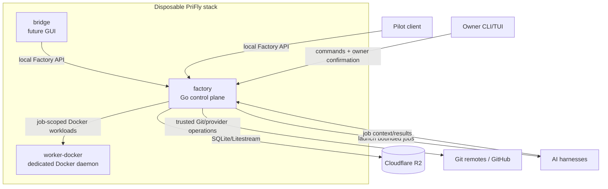
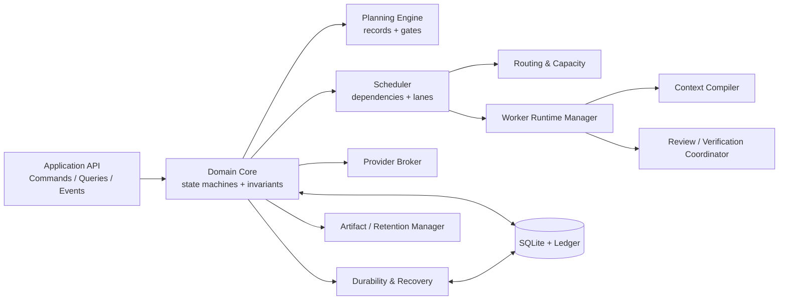

# Architecture

Kind: explanation

This document is the C4-level map of PriFly. Detailed subsystem contracts live in the linked explanation and reference documents.

## Context

PriFly is a local-first autonomous software factory used by one owner in v1. The owner interacts through Pilot, CLI, and later Bridge. PriFly manages software work across one or more repositories while keeping its workflow authority inside Factory. Git/GitHub store code and provider projections; R2 stores recoverable Factory state and large evidence artifacts; AI harnesses execute bounded Worker jobs.

## Container

`factory` is the authoritative runnable unit. It owns SQLite, the domain engine, scheduling, provider credentials, durability, and Worker lifecycle. `worker-docker` is a disposable execution universe for Docker-capable jobs and is deliberately separate from the outer Docker context that hosts Factory. `bridge` is a future GUI container and does not own state. Pilot and the owner CLI are clients of Factory, not orchestration peers.

## Component

The **Application API** is the single mutation/query boundary. The **Domain Core** validates authority and state transitions. The **Planning Engine** owns Planning Records, baselines, policy envelopes, and readiness gates. The **Scheduler** turns ready work into safe execution lanes. **Routing & Capacity** selects eligible Routes deterministically. The **Worker Runtime Manager** provisions attempts, worktrees, and runtime resources. The **Context Compiler** builds bounded provenance-tagged Worker context. The **Review / Verification Coordinator** constructs exact acceptance subjects and independent evidence. The **Provider Broker** is the privileged external-mutation choke point. **Durability & Recovery** publishes authoritative frontiers and performs explicit takeover. The **Artifact / Retention Manager** protects required evidence and recovery roots.

## Cross-cutting state and authority

Factory is the only workflow authority. SQLite is canonical current state and semantic history; Git is code/history authority; provider systems are projections and external facts. Every authoritative mutation uses a typed Command. Consequential AI artifacts cannot self-promote, and consequential owner actions require the owner-only confirmation capability.

See [Persistence and durability](persistence-and-durability.md), [Planning architecture](planning.md), [Execution architecture](execution.md), and [Provider integration](providers.md).

## Delivery and acceptance flow

A released Work Item becomes one or more Worker attempts in namespaced worktrees. Exact Worker commits are checkpointed upstream. Independent verification produces machine-observed evidence. A fresh Reviewer judges semantic sufficiency. An Acceptance Certificate binds the exact planning, attempt, code, target, evidence, and policy state. Factory then consumes that certificate through an admitted exact-target integration protocol.

See [Review and validation](review-and-validation.md) and [Acceptance contract](../reference/acceptance-contract.md).

## Recovery and update flow

Authoritative state is acknowledged only after remote database durability and CAS publication of the Published Frontier. Explicit takeover fences old publication through the same coordination record. Recovery restores exactly the published frontier and inherits all published `SEND_ARMED` provider obligations before new authoritative work resumes. Upgrades may roll back only before the upgraded Factory publishes its first new authoritative state.

See [Recovery and upgrades](recovery-and-upgrades.md) and [State machines](../reference/state-machines.md).
