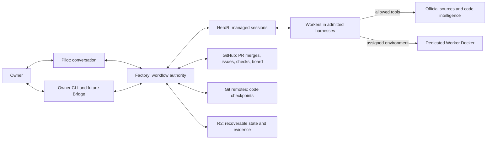
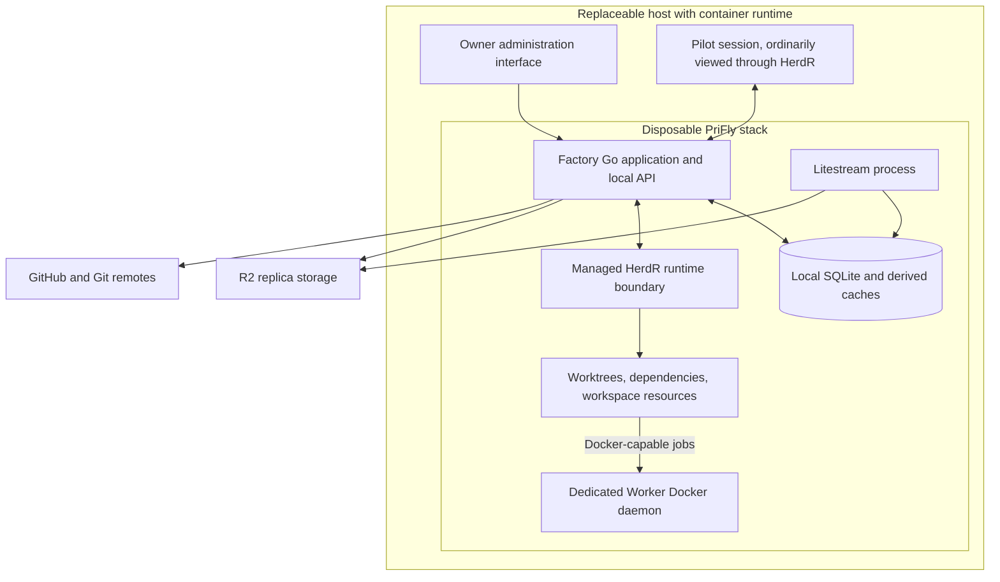
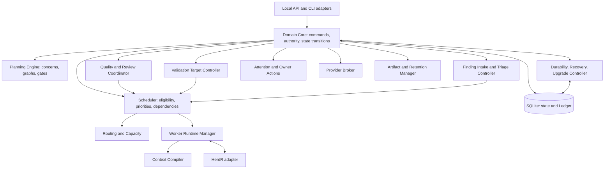
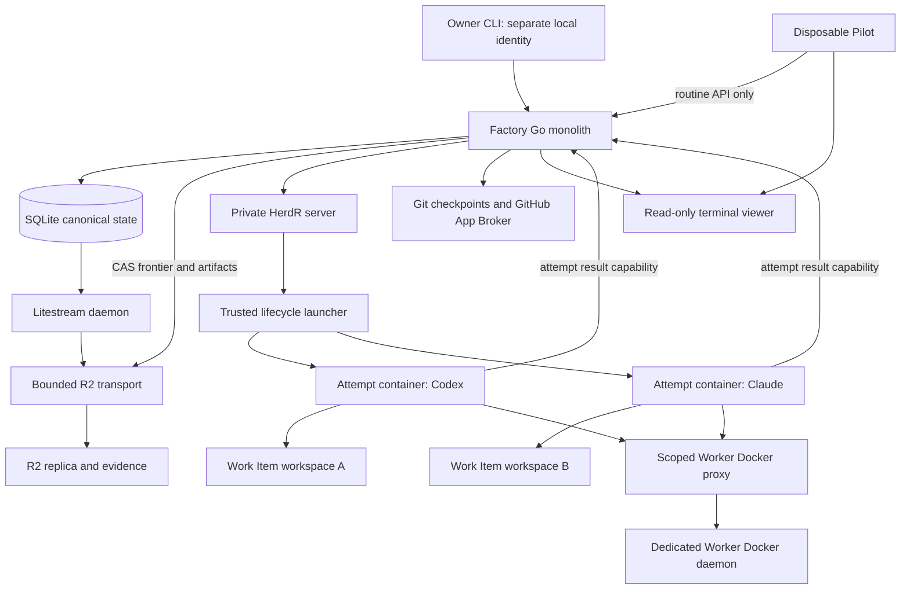

# Architecture

Kind: explanation

PriFly's architectural audience is the product owner/operator, design reviewers and implementers. The views answer scope and external authority (Context), deployment and isolation (Container), and responsibility and interface ownership (Component). They describe the target design; no deployment has been qualified yet.

## Context

### Essential terms

**Factory** is the deterministic control plane. **Pilot** is its conversational client. **HerdR** is the selected initial session/runtime substrate. A **harness** is the program running an AI coding session. A **model** provides inference to that harness. A **Worker role** says what job the session is doing. A **Route** selects the harness, model, effort, account, capabilities, and capacity used for a particular execution.

A **Project** is the product or system being developed. It may span repositories. A **Work Item** is an executable unit within that project, not a synonym for one chat or one GitHub issue.

### Figure 1 — System context

GitHub remains the familiar place to inspect PRs and board progress. It is not the only place where the work exists. Factory holds the machine-readable records and publishes a projection to GitHub. A GitHub outage may delay those projections; it does not erase the planning record or make a conversation authoritative.

## Container

### Figure 4 — Logical deployment

The deployment does not mount the outer host's Docker socket into Worker sessions. Worker Docker is a separate disposable daemon. Its placement as a sidecar or equivalent packaged service must preserve that separation. HerdR server placement and OS identity mechanics must be qualified against the workspace/capability requirements in [Section 13](execution-runtime.md#herdr-workspaces-and-worker-runtime); the diagram is not a claim that one unrestricted shared socket provides per-Worker permissions.

**Technology admission is a real deliverable.** The release must record the exact versions, process ownership, mounted paths, API/schema capabilities, and tested combinations. A dependency's marketing description is not an implementation proof.

## Component

### Figure 3 — Factory components

These are logical components inside a modular monolith, not separate microservices. A component may request work, but only the Scheduler/Runtime path creates a Worker execution. The **Quality and Review Coordinator** selects contracts and checks returned evaluation records; it is not a permanent “quality LLM.”

## Technology choices

### Selected technologies and their boundaries

| Technology | Selected responsibility | What it does not decide |
|---|---|---|
| **Go** | Factory's compiled modular-monolith core, CLI, local API, domain transitions, scheduling, adapters. | The languages used by managed Projects. |
| **Docker / Compose** | Disposable packaging of Factory and a dedicated Worker Docker environment. | Workflow state or malicious-code containment guarantees. |
| **SQLite** | Canonical current state, semantic history, command identities, planning, triage, execution, attention, metrics, and artifact references. | Code history or large raw logs. |
| **Litestream + Cloudflare R2** | Off-host database replication and recoverable-position support; R2 also holds large evidence artifacts. | Which uploaded state is authoritative; Factory's Published Frontier does that. |
| **Git + GitHub** | Exact code checkpoints, PRs, CI observations, provider-side merge, and board/issue projections. | PriFly planning, priorities, or canonical workflow truth. |
| **HerdR** | The selected v1 session/runtime substrate for managing admitted harness sessions and their observable runtime facts. | Work Item completion, acceptance, routing policy, or owner authority. |
| **Versioned JSON + JSON Schema** | Interchange records and structural validation; Go enforces cross-object and policy invariants. | Semantic correctness merely from schema validity. |
| **Markdown + Mermaid** | Human-readable deterministic reports, review packages, and durable documentation/diagrams. | An alternate unstructured workflow database. |
| **age-encrypted JSON + private Git bootstrap repository** | A pinned startup manifest and encrypted secret file, with independent repository access and decryption material. | Workflow-state storage or automatic recovery takeover authority. |
| **Serena** | v1 semantic navigation/editing and source-backed code discovery where the admitted language/backend is supported, alongside exact Git facts. | Canonical knowledge, proof of complete impact coverage, or permission to exceed job scope. |

These selections reduce reinvention while leaving replaceable adapter boundaries. Go, SQLite, and the packaging shape derive from PriFly's product decisions [P1](../reference/source-register.md#source-p1), [P2](../reference/source-register.md#source-p2). HerdR's documented automation surface supports managed panes/agents and CLI/socket control, but its status signals are not business completion records [S03](../reference/source-register.md#source-s03), [S04](../reference/source-register.md#source-s04).

### Initial execution profile: container and capability refinement

The initial profile admits external reviewed execution packages and uses controller-owned HerdR with a trusted launcher attaching disposable attempt containers. Only that launcher holds stack-engine lifecycle control; Workers use a separate build/test Docker daemon through a scoped proxy. Retained Work Item workspaces outlive fresh attempts; isolated review uses separate mutable resources. The publication adapter restores/verifies the exact remote state before CAS and serves only published read snapshots. These refinements preserve the modular-monolith component ownership above.

See [ADR-0029](../adr/0029-admit-external-reviewed-execution-packages.md), [ADR-0030](../adr/0030-own-attempts-behind-herdr-launcher.md), [ADR-0031](../adr/0031-verify-remote-state-before-publication.md) and the subsystem contracts ([planning admission](planning.md#external-reviewed-package-admission), [API bindings](../reference/api-contract.md#initial-execution-profile-bindings), [execution runtime](execution-runtime.md#initial-container-owned-attempt-profile), [security](security.md#initial-execution-capability-boundary), [publication adapter](persistence-and-durability.md#initial-remote-verified-publication-adapter), [transport permits](persistence-and-durability.md#bounded-transport-permits), [Git integration](git-integration.md#initial-non-bypassing-app-profile)) for the exact authority, failure and qualification rules. This is the proposed topology; actual socket/mount/container/host tuple qualification remains required.
