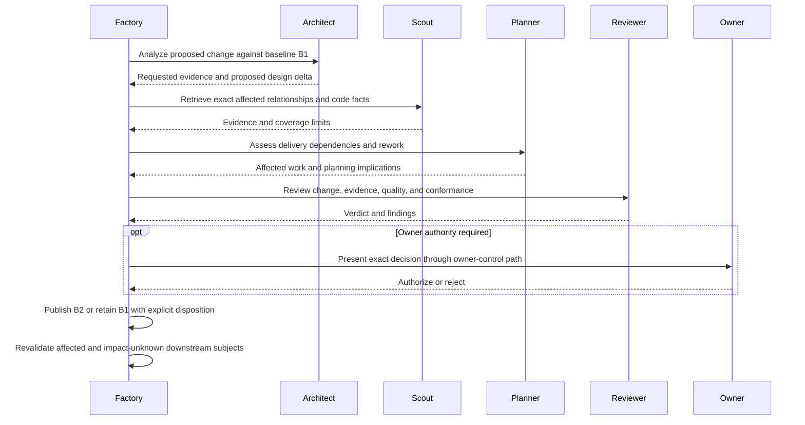

# Change control and arbitration

Kind: explanation

## Change control, arbitration, and the blocking chain

### A baseline can change, but not silently

A **Change Request** proposes a semantic change to released requirements, design, constraints, verification criteria, or decomposition. It identifies the prior baseline, requested delta, reason, evidence, affected stakeholders, and requested authority. The same path can originate from the owner, a planning-change finding, a newly discovered integration conflict, or changed external facts. A material expansion outside the existing phase release waits for the applicable owner authorization. Analysis within an already-released change/maintenance scope can proceed under its explicit limits.

Architect analyzes design/requirement effects. Planner updates delivery effects. Scout supplies existing traceability and code facts; Researcher addresses new external questions; Estimator re-estimates execution time and supportable token use after the changed Work Item or batch scope has been defined. These roles do not dispatch one another: they return requests for Factory to schedule.

### Impact state is explicit

Impact is evaluated per downstream subject:

- `AFFECTED`: evidence establishes that its validity or required work changed.
- `PROVEN_UNAFFECTED`: sufficient evidence under the admitted policy establishes no relevant change.
- `UNKNOWN`: available coverage does not establish either safe conclusion.

Affected and impact-unknown work is paused or withheld from promotion while revalidation occurs. Missing edges in a code graph are not proof of non-impact. Runtime configuration, reflection, generated artifacts, cross-repository contracts, and operational procedures can escape static code relationships.

### Figure 28 — Change proposal to replacement baseline

### Arbitration is not another orchestrator

**Arbiter** receives a bounded contested question: a correction's relevance, contradictory evidence, repeated review failure, an unclear scope boundary, or disagreement between feasible options. It returns a recommendation, supporting evidence, uncertainty, and whether owner authority is necessary.

Factory applies a permitted disposition or escalates. Arbiter does not decide the next arbitrary Worker, waive the Constitution, or change policy directly. Repeated requests to override the same owner assumption can be summarized for the owner, but repetition is not automatic permission to override it.

### The blocking chain

A **blocking relationship** says which exact condition prevents which next action. Examples include a Work Item waiting for a dependency to integrate; a candidate waiting on a current correction; a Validation Target waiting for linked defects; a release waiting on target validation; and a planning baseline waiting on owner authorization.

The owner-facing explanation must traverse this chain rather than merely show “blocked.” For example: “Release R1 waits for restore validation V2; V2 failed because F17; F17 is planned as W9; W9 is ready but cannot start until W8's shared interface change integrates.”

An Attention Item names both the immediate problem and the downstream consequence. Factory may continue unrelated proven-unaffected work. It does not globally stop the entire product for every local defect.

### Change after a provider request is armed

Once a consequential provider operation is `SEND_ARMED`, it may already be in flight. A newly accepted planning change can stop future conflicting work, but it cannot claim a dispatched GitHub merge was cancelled. Factory reconciles the outcome, records any integration as an external fact, and plans the necessary correction if the world changed before the operation completed.

| ID | Requirement |
|---|---|
| PF-CHG-01 | Released semantic baselines change through versioned Change Requests and appropriate authority. |
| PF-CHG-02 | Impact is recorded per downstream subject with evidence and explicit uncertainty. |
| PF-CHG-03 | Affected and impact-unknown work cannot silently retain stale promotion authority. |
| PF-CHG-04 | Arbiter supplies bounded judgment; Factory and the owner retain their respective authority. |
| PF-CHG-05 | Every blocking explanation identifies the required condition and downstream consequence. |
| PF-CHG-06 | Change control does not pretend to cancel already-armed external effects. |
