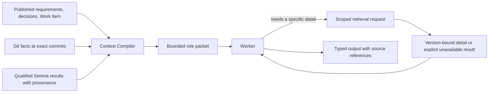

# Context and code intelligence

Kind: explanation

### Context compilation

The **Context Compiler** deterministically assembles a role-specific packet from published records and version-bound repository facts. Its core packet contains the job objective, exact subject, relevant Goal/Outcomes/Constraints/Verification, governing design decisions, permitted actions, selected rubric profiles, required result schema, and the stopping/escalation rules.

A Reviewer receives the exact diff, contract, relevant design, tests, and supplied evidence—not the Implementer's private reasoning or persuasive self-assessment. A current-correction Implementer receives the exact correction set and workspace state. Triage receives findings plus enough surrounding scope and dependency information to judge them. Pilot receives orientation and linked details, not every Worker transcript.

Git provides baseline trees, diffs, history, and identities. Serena supplies the admitted v1 semantic navigation/editing capability. Their indexes are derived caches. Shared Factory context is commit-addressed; mutable editing context is workspace/attempt-scoped. A result from the wrong commit, an earlier dirty tree, or a superseded tool/configuration cannot satisfy an exact evidence requirement [P2](../reference/source-register.md#source-p2), [S09](../reference/source-register.md#source-s09).

**A packet must be usable without the product definition or any prior conversation.** Factory injects an inline bootstrap map identifying the assignment, authority, named inputs, exact references, selected tool bindings, and result channel. The selected prompt tells the Worker which inputs to read before acting and which to retrieve only when needed. A bare record ID, schema name, repository path without a usable reader, or “see [Section 9.2](planning.md#intake-and-three-owner-controlled-phase-releases)” is not supplied context.

The detailed packet contract and role/job input bindings are in [Appendix F](../reference/worker-prompts.md#initial-role-and-job-prompt-library). These are requirements for the existing Context Compiler's output, not a second record store or a new orchestration service. Required input content is either attached or retrievable through a concrete, admitted binding carrying the appropriate revision and access scope. Evaluation criteria, probe definitions, result schemas, and applicable local terminology are content dependencies too. Factory checks structural availability before launch; the Worker checks that the delivered subject and relevant context actually match before using them. Missing, truncated, stale, or conflicting required material produces a specific context request or blocker, not invented instructions or an assumed pass.

### Figure 15 — Progressive context

A tool returning “no references found” is not proof that runtime configuration, reflection, generated code, or cross-repository consumers are unaffected. Missing coverage remains a reason for conservative impact analysis.
