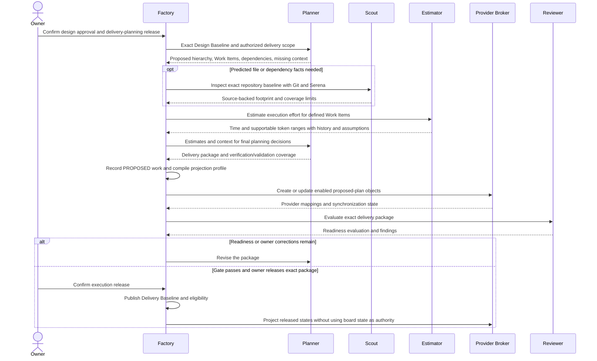

# Delivery planning and execution estimation

Kind: explanation

## Decomposition, estimation, and Delivery Readiness

### From a Design Baseline to executable work

After the owner approves the design and releases delivery planning, Factory gives Planner the exact Design Baseline, its unresolved nonblocking obligations, Project constraints, repository map, and selected planning/verification profiles. Planner organizes work around the earliest useful integrated behavior, then identifies safe parallelism. It must not produce an entire infrastructure layer before any product behavior can be demonstrated merely because that is easy to decompose.

A **Slice** delivers a coherent, independently evaluable increment. An **Enabler** is a justified technical prerequisite that cannot sensibly live in a consuming slice; it names the slices it enables. These are PriFly delivery-policy concepts, not attributed to ISO as formal quality criteria.

A Work Item must include a Goal, Required Outcomes, Constraints, and Verification. It also carries source baseline, parent scope, repositories, dependency edges, expected areas/files, authority envelope, selected quality profiles, an execution-effort estimate with its basis/limitations, and validation relationships.

### What a good Work Item looks like

**Goal:** allow a user to restore an Archive backup into an empty application instance.

**Required Outcome:** restoring a valid backup recreates every in-scope file with the same content hash and reports completion through the supported interface.

**Constraints:** preserve the approved key-handling design; do not introduce a new remote storage dependency; do not overwrite an existing target without the approved behavior.

**Verification:** exercise a populated backup and empty restore destination; compare the declared contents; assert the supported completion result; exercise invalid key and incomplete archive cases; retain the relevant observations.

“Write `restore.go`” is an implementation action, not a Required Outcome. “Run the test suite” is an evidence mechanism, not a definition of the behavior that must be true.

### Execution-effort estimates and predicted change scope

Estimator predicts the effort to execute a **defined Work Item**, not the content of its plan. Planner supplies the scope, acceptance/verification obligations, dependencies, proposed Route, and predicted files/areas touched, supported by Scout and Serena/Git evidence. Estimator consumes those predictors together with comparable historical executions and environment/setup costs.

Every executable Work Item has an estimate record: expected active execution time and range; token usage/range where supportable; method and historical comparables, bucket and sample size; relevant Route/harness context; included/excluded effort; assumptions, confidence/limitations, and main drivers. Unsupported token telemetry is unknown, not zero. With sparse history, an explicitly identified provisional/default estimate and its uncertainty replaces fabricated precision. Original estimates survive later re-estimation so actuals can be compared honestly.

Direct implementation effort is distinguished from separately predicted review/correction and setup overhead. A proposed batch may be estimated after Triage or Planner defines its membership and scope. Estimator returns the cost prediction; Planner/Triage decides whether to split, regroup, or change the proposal. Re-estimation consumes the newly defined scope rather than inventing it.

Estimator does not create requirements, select product scope, discover the file footprint as a substitute for planning, decompose work, choose priorities, form batches, or schedule delivery. An incomplete estimation input produces a named missing-input condition for Planner/Scout, not unauthorized planning by Estimator.

The **Implementation Envelope**, not a file prediction, grants edit permission. A wrong prediction within the already-authorized meaning and area is recorded for calibration; protected/out-of-scope changes use the normal scope/change path.

Initiative duration forecasts are derived from per-item estimates, dependency critical paths, approved concurrency, capacity, and explicit wait/overhead assumptions. Factory calculates the forecast under the selected model; Planner proposes sequence and the owner approves consequential schedule/scope choices. The forecast is not a sum of active effort presented as calendar duration. If milestone projection is enabled, the Initiative's approved schedule fields supply its GitHub milestone dates; a provider date does not create the underlying estimate.

GAO's estimating guidance supplies the basis/method/uncertainty discipline, not a universal formula for AI tokens per feature [S25](../reference/source-register.md#source-s25). PriFly learns that relationship from recorded executions.

### Lanes and dependencies

A dependency must name the condition that releases its dependent work. Typical conditions are “the prerequisite PR is integrated,” “the interface decision is baselined,” or “this Validation Target is validated.” It must not rely on an ambiguous generic `done` flag.

Lanes group work for useful concurrency. Planned area/file overlap is a conservative scheduling hint. Actual edits, shared public contracts, schema changes, shared deployment environments, and validation targets can create conflicts even when filenames differ. Factory may serialize admission where safe independence is unproven.

### Gate 2 — Delivery Readiness

Factory performs structural checks for complete requirement/design coverage, no unexplained orphan work, valid dependencies, named enabler consumers, explicit verification, authorized scope, and selected quality profiles. A fresh Reviewer then evaluates plan quality, baseline fidelity, sequencing, scope size, evidence plans, estimates, negative paths, and early integrated value.

A plan is not ready merely because every row has a title and a size. It is ready when an Implementer can know what to do, why, what it must not change, and how completion will be assessed, without making a hidden architecture decision.

### Figure 13 — Decomposition and plan review

The planning process has its own finite scope/time/usage envelope. A record with no implementation Work Items yet is not exempt from resource bounds. Repeated failure routes to Arbiter or owner attention rather than lowering the quality gate.

**PF-PLAN-01:** Every released Work Item is traceable to approved design meaning. **PF-PLAN-02:** Every Required Outcome has an appropriate verification method and expected evidence. **PF-PLAN-03:** Decomposition preserves product meaning while planning for early integrated behavior. **PF-PLAN-04:** Planning depth scales with uncertainty and impact; quality standards do not disappear for small work.

### Materialize the plan through the configured provider projection

Decomposition produces canonical structure **and an inspectable external plan where enabled**. Planner specifies Project/Initiative/Epic ownership, Work Item contracts, dependencies, classifications, validation relationships, and proposed sequence. Factory durably records that proposal, compiles the selected Provider Projection Profile, and asks Provider Broker to reconcile the desired objects and fields. Planner does not create provider objects or manipulate board state directly.

During the owner-released delivery-planning phase, proposed GitHub objects may be created so the owner can inspect the actual plan before execution. Factory first resolves existing canonical-to-provider mappings and intentional reuse, then creates missing objects in dependency order: enabled Initiative milestones and tracking objects; Epics and Work Item issues; parent/dependency relationships after endpoint IDs exist; labels/fields; and optional board/view memberships. Each create/update uses [Section 22](providers.md#provider-broker-projections-reconciliation-and-rate-limits)'s durable operation and ambiguity rules. A restart resumes from recorded mappings and obligations rather than refiling the plan.

GitHub milestones represent **Initiatives**, not Epics or a separate PriFly milestone object. One Initiative spanning repositories can have multiple repository-scoped milestone mappings. Epic and Work Item representations use the selected profile. Labels, boards, hierarchy links, estimates, and timeline fields are independently selectable; turning off a view does not remove canonical dependencies or completion conditions.

Proposed issues are visibly awaiting execution release and have canonical state `PROPOSED`. The delivery review package includes their links, estimates, dependency/validation coverage, and per-projection synchronization status. An enabled but lagging optional board is shown as pending; it is not misreported as complete and need not block authorization unless the selected inspection policy requires it. Operations required for a later PR/merge remain hard prerequisites at that stage.

After Delivery Readiness and owner execution release, Factory publishes the Delivery Baseline and evaluates which Work Items are `READY`. It projects those states outward. A provider issue's existence, milestone membership, label, or manually moved card never supplies execution authority. Revisions to an unreleased proposal remain within the planning phase; changes to released meaning use change control.

| ID | Requirement |
|---|---|
| PF-PLAN-05 | Each executable Work Item has a time estimate and supportable token estimate, including basis, history/sample size, assumptions, and explicit limitations. |
| PF-PLAN-06 | Estimator only predicts execution effort from defined scope; Planner/Triage retains scope, decomposition, grouping, and sequencing decisions. |
| PF-PLAN-07 | Decomposition records canonical hierarchy and compiles enabled milestones, issues, relationships, tags/fields, and board projections through Provider Broker. |
| PF-PLAN-08 | Proposed-plan objects may be published only within owner-authorized delivery planning and do not make Work Items execution-ready. |
| PF-PLAN-09 | The delivery package includes work contracts, estimates, dependencies, concurrency/forecast assumptions, validation coverage, review results, and provider synchronization status. |
| PF-PLAN-10 | Delivery Readiness plus owner confirmation of the same exact package is required to publish execution eligibility. |

### Externally prepared delivery packages

For the initial execution profile, a reviewed external delivery bundle supplies the full Work Item contracts, outcome verification, dependency release conditions, estimates and separate overhead, footprints/envelopes, selected evaluation/probe versions, validation relationships and provider mappings. Factory validates the graph, evidence, applicability and exact owner releases before publishing eligibility. Existing GitHub planning objects may be reused as projections without becoming canonical authority. Common-triage follow-up and planning-change scope returns through this same reviewed import boundary; it does not give an Implementer planning authority. Native autonomous decomposition/estimation is unsupported until separately admitted. See [ADR-0029](../adr/0029-admit-external-reviewed-execution-packages.md).
