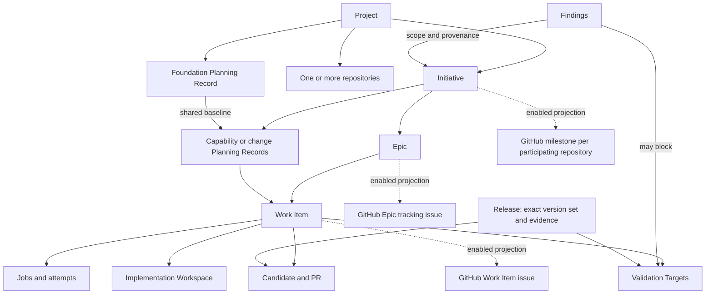

# Domain model

Kind: explanation

## Domain objects, identities, and explicit states

### Work hierarchy

A **Project** is the enduring product/system boundary, including shared purpose, architecture, vocabulary, and repositories. An **Initiative** is a significant outcome that can be approved, delivered, validated, and closed as a coherent undertaking. An **Epic** groups a cohesive part of that delivery around a capability or deliverable. A **Work Item** is a bounded implementation contract sized for one manageable candidate/PR lifecycle. A **Repository** is where some implementation lives. A **Lane** is a scheduling path controlling dependencies and conflicting edits.

A **GitHub milestone maps to a PriFly Initiative**. “Milestone” names that provider representation, not another canonical work tier. A cross-repository Initiative may map to one milestone in each participating repository when the projection is enabled. Dates, releases, and optional schedule checkpoints do not create a competing milestone entity.

Architect proposes capability/design boundaries; Planner proposes the delivery hierarchy; Reviewer checks coherence; the owner approves the package and release. Split an undertaking when it can be approved and validated independently, has stable interfaces, and can be changed or postponed without redesigning unrelated outcomes. Keep shared unresolved behavior together until those seams are defined. Estimate size informs Planner's judgment but does not make Estimator the decomposer. Existing scope is reused when it actually covers the new work rather than creating duplicate structure.

A **Planning Record is not another delivery-hierarchy level**. A new substantial Project normally begins with a foundation record covering shared purpose, boundaries, architecture, capabilities, and cross-cutting decisions. Independently deliverable capabilities can then have their own records referencing that foundation. A small project may initially need only one record. Listing a future capability does not authorize that capability's design or execution. Each record names its Project, affected Initiative/Epic scopes where present, baseline dependencies, and explicit phase releases.

The external representation of each grouping is independently configurable. Omitting an Initiative milestone, Epic tracking issue, or board view preserves the canonical ownership, dependencies, release authority, and completion obligations described here.

### Figure 6 — Domain relationships

### Important record distinctions

**Planning Record:** the persistent graph for a bounded foundation, capability, or change. It begins in Intake with owner intent and contains needs, Goals, Requirements, Constraints, Questions, Research Claims, Options, Decisions, Design, Risks, and trace links. Phase releases and Review Packages identify exact revisions of that graph.

**Planning Gap:** an unsatisfied planning obligation, such as a missing testable outcome, unresolved design choice, unknown applicability, or unavailable evidence. **Gap Register** is a derived view of those gaps. It is not a second database or separate decision authority.

**Review Package:** an immutable revision of the inspectable material submitted at a phase release, with manifest, rendered artifacts, source/diffs, review results, annotation responses, and exact baseline references. **Phase Release:** owner authorization for an exact package, allowed phase, scope, and budget. **Design Baseline:** the immutable design content accepted through Design Completeness and owner design approval. A **Delivery Baseline** binds the decomposition and execution contracts accepted through Delivery Readiness and owner execution release. An **as-built record** identifies what was actually integrated and released. These records must remain distinguishable.

**Finding:** an evidence-backed observation with a bounded proposed routing disposition. It is not yet an instruction to implement. **Work Proposal** means potential future work arising from planning or triage; the unqualified word **Candidate** means an exact proposed code/artifact subject for review, not the backlog of unplanned work.

**Implementation Workspace:** the reusable writable worktree, dependencies, services, and bounded environment for one Work Item/PR. **Worker Job** is the cognitive assignment. **Worker Attempt** is one execution of that assignment. The workspace and the attempt do not have the same lifetime.

**Validation Target:** a versioned integrated capability/story whose intended behavior must be exercised. **Validation Run:** one bounded execution against selected target revisions and a recorded environment. A single target may depend on multiple Work Items or repositories.

### Identity rules

Domain IDs are opaque strings. Revisions are scoped to a mutable record. Immutable baselines, evidence manifests, rubric versions, Route versions, and acceptance records are replaced or superseded, not rewritten. A reference must include the exact revision, commit, digest, or version whenever correctness depends on that identity.

Examples such as `W-42`, `F-7`, and `VT-3` are readable notation, not a commitment to an ID encoding. Git identities in actual records use the repository's full commit/object identity, not abbreviated examples from diagrams.

### Imported artifacts and execution ownership

An externally prepared planning bundle is an immutable artifact set admitted into the existing Planning Record relationships, not a new parallel workflow store. Its external evaluation provenance identifies the producer and independent reviewer without impersonating a Factory Worker Attempt. A registered trust profile and separate owner binding govern that import. The single-use launcher run identity belongs to one Worker Attempt; its container owns the harness process tree, while the Implementation Workspace owns retained worktree/cache/services. A remote verification receipt identifies the restored database position and verified application sequence and is referenced by coordination publication without creating a recursive database mutation. These refinements are proposed in [ADR-0029](../adr/0029-admit-external-reviewed-execution-packages.md), [ADR-0030](../adr/0030-own-attempts-behind-herdr-launcher.md) and [ADR-0031](../adr/0031-verify-remote-state-before-publication.md).
