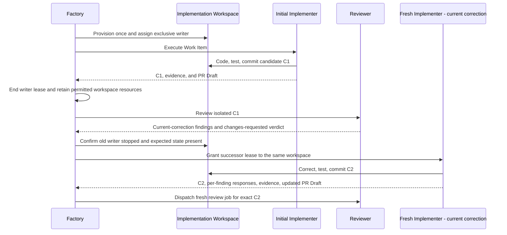

# HerdR, workspaces and Worker runtime

Kind: explanation

### What HerdR provides and what PriFly must add

HerdR is selected to avoid rebuilding a terminal/session management system inside PriFly. Its documented primitives distinguish layout, pane control, and recognized agents. Its CLI/socket surface can create and observe sessions, provide input, read output, and subscribe to events. PriFly's adapter binds those runtime identities to its own jobs [S03](../reference/source-register.md#source-s03), [S04](../reference/source-register.md#source-s04).

PriFly must add application-level admission, authority, exact attempt identity, structured result submission, budget accounting, cancellation, and acceptance. Runtime `idle` or `done` means a session is ready for input; it does not mean the Work Item is complete. A prompt timeout does not prove the prompt was never sent. The adapter reconciles before retrying an ambiguous launch/prompt, rather than creating duplicate jobs.

HerdR session restoration can restore layout and supported agent sessions after restart; original processes do not survive machine loss [S05](../reference/source-register.md#source-s05). PriFly must not allow automatic session restoration to revive cancelled work. The adapter must identify the server/pane/process and admitted attempt, then reconcile or terminate stale execution before granting new authority.

### Result submission is a separate contract

A Worker submits versioned JSON through the Factory CLI or a job-scoped output path whose ingestion is bound to its attempt. The job capability authenticates the submission. HerdR reports runtime facts; it does not have to infer the final business result by scraping a terminal transcript.

Result ingestion checks schema, actor, attempt, current subject, expected revisions, scope, and artifact references. A malformed result can trigger a bounded request to repair the serialization. It does not authorize a new interpretation of the Work Item. A process that exits without a valid result is incomplete/interrupted until reconciled.

### Reusable Implementation Workspace

The workspace contains the Git worktree/branch, dependency installations, build caches, test fixtures, scratch paths, and explicitly workspace-owned services/volumes. It is created for the Work Item/PR lifecycle. An Implementer attempt may finish while the workspace remains warm for a fresh current-correction Implementer or Rebaser.

A **Workspace Lease** is the Factory's exclusive permission for one modifying attempt to use that workspace. It is not a distributed leader lease. Handoff revokes the old attempt's writable capability, waits for its modifying processes to stop, inventories retained resources, verifies the expected candidate/dirty state, and grants the successor access. Long-running retained services belong to the workspace, not to an untracked dead agent.

A fresh logical attempt does not require deleting the worktree or reinstalling dependencies. OS identity/group/ACL mechanics must preserve the same boundary: the previous attempt cannot keep writing after handoff, and a later unrelated workspace cannot inherit access through unsafe UID reuse. The exact Linux mechanism is an implementation qualification item, not an excuse to change these lifecycle semantics.

### Figure 16 — Workspace handoff to a fresh current-correction Implementer

Review uses a separate clean view of the candidate. Dependencies/caches can be safely reused where their identity and access rules permit, but the Reviewer does not share the Implementer's mutable services or hidden local configuration as trusted acceptance evidence.

### Tools and capabilities

Factory resolves the pinned tool profile for the admitted role/job kind, intersects it with the authorized capability envelope, and rejects missing required capabilities. Typical coding permissions include reading the assigned context, editing approved paths, local Git on the assigned branch, scoped test execution, and submission of results/findings. Read-only roles do not receive broad write access. Workers do not normally receive GitHub mutation credentials, R2 credentials, owner confirmation capability, another workspace, or direct database access.

Harness-native allowlists and pre-tool hooks help prevent mistakes. They are not universal across harnesses and are not claimed to contain malicious code. A harness must demonstrate the required controls before its Route is admitted. Generic shell access and Docker access reduce the strength of path-level restrictions; the v1 threat model remains explicitly non-malicious.

Tools that can create new sessions or subagents are disabled where possible or constrained/accounted for inside the current attempt. A child cannot become a new independent Factory Worker merely because HerdR or a harness supports it. Every allowed descendant remains inside the same scope, permissions, cancellation boundary, and cumulative accounting.

### Worker Docker

Container-development jobs need a usable Docker daemon. v1 provides a dedicated shared Worker Docker daemon separate from the daemon hosting Factory. Jobs receive workspace/run-specific names, labels, networks, volumes, ports, and resource inventories. The setup must support building images, Compose-like stacks, and the tests that the managed product requires.

Docker bind mounts resolve on the daemon's host, not magically on the CLI client's filesystem. The packaged deployment must provide coherent workspace paths or an admitted build-context mechanism and demonstrate that jobs can reach only the intended resources [S08](../reference/source-register.md#source-s08). This must be tested, not left as a diagram arrow.

Shared Docker is an efficiency trade-off. It shares image cache and avoids one heavy virtual environment per correction. It can also let an overly broad command disrupt other jobs. Factory records and limits routine access, avoids global destructive commands, and treats unexplained cleanup state as a runtime fault. Docker daemon access is powerful; this design is not a hostile-agent security boundary [S07](../reference/source-register.md#source-s07).

When a workspace is finished or abandoned, Factory stops modifying processes, removes attempt resources, removes or retires workspace services, revokes capabilities, and retires OS identities safely. When cleanup cannot establish a safe state, Worker Docker is marked `DIRTY`; new Docker work waits while the environment is reconciled or replaced. Other affected jobs are interrupted and requeued with their durable checkpoints. A current-correction handoff is not a reason to destroy healthy workspace-owned resources.

### Cancellation and ambiguous launch

Cancellation is first recorded authoritatively. Factory revokes the capability and asks the runtime to stop the session/process descendants. It verifies cleanup before releasing conflicting workspace ownership. Termination and resource retirement are distinct: a terminal Worker Attempt may leave deliberately retained workspace caches, but not an unaccounted process that still writes.

A lost runtime launch response is reconciled using attempt/run identifiers and inventory. Factory must not retry the prompt blindly. It also must not trust a newly created pane whose reused display name happens to match an older attempt. Runtime identity includes the server/session context and the actual admitted execution.

| ID | Requirement |
|---|---|
| PF-RUN-01 | HerdR is the initial managed-runtime integration, behind a replaceable adapter. |
| PF-RUN-02 | The adapter qualifies identity, lifecycle observation, prompt ambiguity, cancellation, and restore behavior for every admitted harness mode. |
| PF-RUN-03 | Worker result submission is typed and attempt-authenticated; terminal UI text is not workflow authority. |
| PF-RUN-04 | A fresh current-correction Implementer reuses the Work Item's worktree and environment after a controlled exclusive-writer handoff. |
| PF-RUN-05 | Review's view of the artifact remains isolated from the implementation workspace's mutable state. |
| PF-RUN-06 | Workspace services, attempt processes, retained caches, and cleanup obligations have explicit owners and lifetimes. |
| PF-RUN-07 | Stale resumes and late results cannot revive cancelled/superseded attempts. |
| PF-RUN-08 | Workers cannot receive the outer Factory-hosting Docker socket as their ordinary Docker access path. |
| PF-RUN-09 | Uncertain cleanup quarantines ownership/resources; unsafe UID reuse is prohibited. |

### Versioned dispatch instructions

Every supported dispatch composes **one shared Worker contract + one role module + one job module + the resolved Context Packet + selected tool/output/evaluation contracts**. Factory supplies the concrete runtime bindings; a Worker is not expected to guess CLI commands, tool names, schema fields, or where the design conversation was stored. Pilot has its own bootstrap/instruction package rather than inheriting Worker authority.

The assembled package is the self-sufficient unit. A role paragraph or job-table row is not independently dispatchable. Factory records module identities and versions, packet/reference identities, selected tools and schemas, the rendered instruction digest, and the material harness configuration with the attempt. Required content and tools must fit the admitted context/runtime budget. Factory must not silently truncate requirements, mandatory probes, or schema definitions to make a package fit. Unsupported job kinds or unresolved required bindings fail admission rather than receiving an unrestricted fallback prompt.

[Appendix F](../reference/worker-prompts.md#initial-role-and-job-prompt-library) defines revised initial wording, the cold-start contract, input/tool bindings for all existing role/job variants, and focused admission fixtures. The prompt modules are now revision `v2`; this is not a claim that executable schemas or a runtime registry have shipped. Actual schemas, tool adapters, and clean-context behavioral tests are required before a variant becomes dispatchable. A serialization repair uses the same result contract and does not authorize changing the underlying facts.

Prompt/skill guidance informs this packaging [S43](../reference/source-register.md#source-s43)–[S48](../reference/source-register.md#source-s48), [S52](../reference/source-register.md#source-s52). PriFly's authority and lifecycle remain controlling: progressive disclosure does not let a Worker select a different role, start subagents, publish provider mutations, or advance an owner gate. Referenced repository instructions and skills are versioned, scope-qualified inputs; an incidental instruction inside code, a tool response, or provider prose cannot extend the attempt's authority.

| ID | Requirement |
|---|---|
| PF-RUN-10 | Owner and Worker sessions are separately addressed; the Pilot entry path never reuses a focused Worker pane and managed creation does not steal focus. |
| PF-RUN-11 | Default Worker observation is read-only; writable intervention is explicit, exact-attempt-bound, and lifecycle-controlled. |
| PF-RUN-12 | Managed Worker auto-resume is disabled until Factory reconciles and authorizes the attempt. |
| PF-RUN-13 | Every admitted job kind has pinned role/job prompts, output schema, tool scope, and stopping rules recorded in its execution manifest. |
