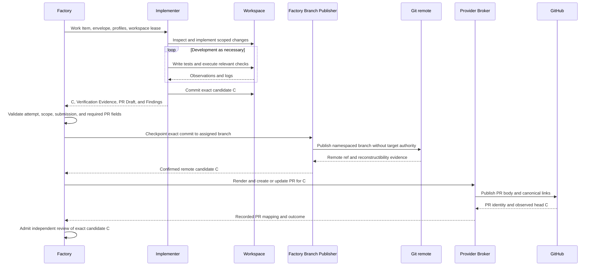

# Implementation and verification evidence

Kind: explanation

## Implementation and reusable verification evidence

### Inputs and meaning of done

An **Implementer** receives a released Work Item, the exact Design and Delivery Baselines, its Implementation Envelope, applicable quality profiles, verification requirements, repository instructions, relevant context, and an exclusive lease on the Implementation Workspace. The job is to satisfy those existing obligations, not to discover a new product scope while writing code.

Implementation is complete for submission when the requested code/configuration/documentation exists; the required tests and checks have been performed or their inability is explicitly reported; the candidate is identified exactly; deviations and discoveries have been recorded; the structured PR Draft explains the proposed change; and the result is in the required structured format. This is **ready for review**, not self-acceptance.

A Work Item can be documentation-only or infrastructure-only. “Code” in the implementation lifecycle includes those artifacts. Their verification methods differ, but their scope, traceability, review, and evidence requirements do not disappear.

### Ordinary implementation sequence

Factory admits the attempt and grants the workspace lease. The Implementer inspects the assigned context, makes the scoped changes, writes or adjusts tests, runs the appropriate checks, and creates a candidate commit. It may run tests many times while developing; those ordinary development iterations do not create a new Factory job for each test.

The submitted evidence must describe the **bytes actually tested**. A test performed before the final commit can be reused when the tested tree is demonstrably identical to the submitted tree for all material inputs. Merely attaching the final SHA to an earlier log is not acceptable. Uncommitted relevant files, generated artifacts, configuration, dependencies, and environment can matter; evidence must expose them when they affect the result.

The Implementer does not need to create a ceremonial extra test run solely because it made a commit. It does need a trustworthy relationship between the tested subject and the submitted subject.

### Figure 17 — Implementation, evidence, and branch checkpoint

The Publisher is trusted Factory software, not a second Implementer. It imports the exact objects into a controlled Git context and publishes them without executing the Worker checkout's hooks or trusting its privileged Git configuration. It preserves the Worker's commit objects rather than replaying edits into a different history. Reconstructibility includes admitted LFS objects or submodule references; unsupported dependency mechanisms cannot be called recoverable.

### Verification Evidence record

**Verification** means establishing a specified property. **Verification Evidence** is the recorded observation supporting that claim. It may come from an Implementer, Reviewer, CI service, or a product Validation Run; those origins are not interchangeable.

| Field group | Meaning |
|---|---|
| Subject | Repository, candidate commit/tree, Work Item revision, and verification-plan revision. |
| Producer | Worker Attempt or automation identity and actual execution manifest. |
| Scope | Which Requirement/Outcome and which check/scenario this observation supports. |
| Execution | Commands/tool actions actually executed, start/end times, exit/result values, skipped checks, and reasons. |
| Material environment | Operating environment, dependency/build/test configuration, test data identity, services, and relevant external conditions. |
| Observation | Expected result, observed result, comparison to predeclared threshold, uncertainty or flakiness. |
| Artifacts | Logs, measurement data, reports, screenshots when useful, and hashes/retention classifications. |
| Test changes | Tests, harnesses, fixtures, assertions, or acceptance-related code changed by the candidate. |
| Limitations | Incomplete coverage, unavailable infrastructure, unverified assumptions, or known failures. |

The record does not turn a claim into fact merely by being valid JSON. The Reviewer checks whether it is credible, relevant, and sufficient. Factory can validate references, hashes, states, and identities; it cannot deterministically infer that a test has good semantic coverage simply because its exit code is zero.

### Progress durability without constant overhead

Long-running implementations checkpoint exact commits at meaningful progress points under a configurable maximum uncheckpointed-work policy. The product goal is not to lose a large amount of completed work and token expenditure when the host dies. The precise checkpoint interval is an operational parameter, not an invented universal constant.

Factory may report that code is locally present, remotely checkpointed but unreviewed, or accepted. These are different facts. Uncommitted edits and running containers are not promised recoverable after total host loss. A code checkpoint must never be presented as accepted simply because it reached GitHub.

### Discovery during implementation

The Implementer can report a blocker or propose one of the three Finding routes. It must not quietly enlarge its scope. A missing requirement or contradictory design enters the planning-change route, and Factory places any necessary blocker on affected work while disposition is pending. An unrelated improvement becomes a follow-up; it does not hold the current implementation hostage unless an authorized relevance decision establishes a real dependency.

### PR Draft and submission contract

Implementer authors a structured **PR Draft** with the candidate. It contains a title, substantive change summary, motivation/Goal, requirement and outcome coverage, implementation notes needed by reviewers, tests and suggested verification steps, evidence references, skips/limitations, validation expectations, documentation changes, and relevant Finding/decision links. The selected PR template determines required sections before implementation starts. A missing required section or placeholder explanation makes the submission incomplete.

Factory owns formatting and canonical metadata, not the engineering explanation. It validates the fields, injects authoritative Work Item/baseline/candidate/provider references, and renders the body deterministically. It does not fabricate a test run, fill an unknown outcome with persuasive prose, or ask another general-purpose model to reconstruct the explanation.

After result admission, Factory pushes the exact candidate through its Branch Publisher and confirms the remote head and recoverability. It then creates or updates the PR through Provider Broker. Only a recorded PR with the expected head and complete review inputs becomes eligible for candidate review. A failed or ambiguous push/create remains an explicit blocker, with [Section 22](providers.md#provider-broker-projections-reconciliation-and-rate-limits) reconciliation rather than a duplicate PR.

A current correction includes updated PR Draft fields when the change affects the description, tests, limitations, or validation expectations. The current PR body may be updated; earlier Review Results and correction comments remain historical entries. The meaningful PR explanation is part of the review subject and can itself receive findings.

| ID | Requirement |
|---|---|
| PF-IMP-01 | Implementer submission includes exact candidate identity, Verification Evidence, structured PR Draft, skips, limitations, and discovered Findings; corrections add per-finding responses. |
| PF-IMP-02 | Evidence refers to the actual tested subject; later commit identity cannot silently replace the recorded tested identity. |
| PF-IMP-03 | Ordinary development checks execute inside the Implementer attempt without a new orchestration job per test. |
| PF-IMP-04 | Factory checkpoints exact candidate commits to assigned branches without permitting Worker target-branch mutation. |
| PF-IMP-05 | A provisional code checkpoint is distinct from candidate acceptance, PR merge, validation, and release. |
| PF-IMP-06 | Discovering unrelated work does not implicitly enlarge the current Implementation Envelope. |
| PF-IMP-07 | Implementer authors the required PR content; Factory validates and deterministically renders it with canonical metadata. |
| PF-IMP-08 | Factory confirms the pushed candidate and creates/updates the corresponding PR before dispatching candidate review. |

### Initial execution boundary

Imported released work enters the same implementation contract as internally planned work. Implementer may edit and commit locally within its envelope but has no provider mutation credential. After writer fencing, trusted Git verifies exact tree/ancestry/scope and checkpoint identity; Provider Broker confirms branch/PR mapping before review. The PR Draft identifies the problem/outcomes, actual change, attributable verification, risk/rollback, limitations and Work Item link; Factory does not fabricate missing substance. Progress checkpoints use controlled writer quiescence and never count as acceptance by themselves.
