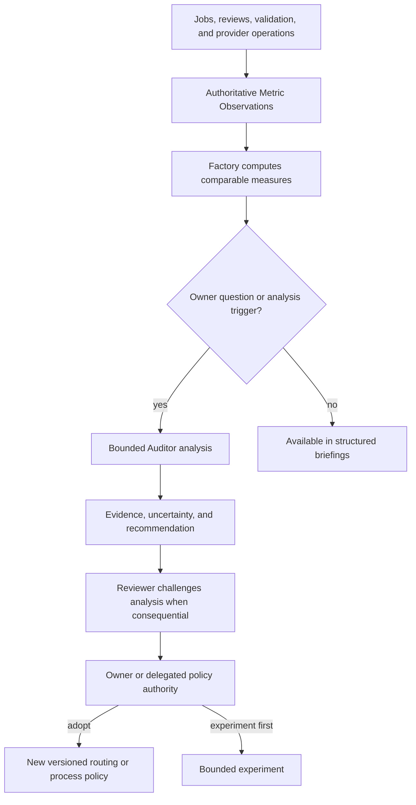
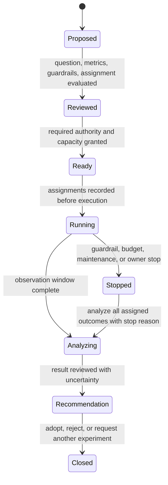

# Metrics, experiments and learning

Kind: explanation

## Metrics, experiments, and institutional learning

### Measurement exists from the beginning

**Metric Observations** used for long-term decisions are authoritative records. They carry subject identity, units, source, observed time, measurement version, Route/attempt/work relationships, and any incompleteness. Heartbeats and terminal tails are operational telemetry and need not be retained forever.

Factory records work-level outcomes across the entire lifecycle, not just the first Implementer attempt. A cheap model that causes many corrections or product defects may consume more total capacity than a stronger model. Evidence reuse and workspace reuse must also be measurable so efficiency gains do not exist only as impressions.

| Metric group | Examples and interpretation |
|---|---|
| Model/harness usage | Input/output tokens, cache reads/writes where reported, elapsed time, provider/account, exact manifest. Missing data is unknown, not zero. |
| Work completion | Completed/cancelled/interrupted work, attempts, correction rounds, owner interventions, time waiting on dependencies or capacity. |
| Evidence cost | Implementer checks, Reviewer reruns and reasons, reused evidence, CI execution, validation runs and coverage. |
| Planning control and visibility | Intake-to-release time, owner revision cycles, design-synthesis effort, estimate calibration, proposed-plan projection lag, and review-history publication lag. |
| Product outcomes | Validation failures, escaped defects, recurrence, affected target revisions, time from failure to integrated correction and later proof. |
| Planning quality | Scope expansion, design changes during implementation, orphan or changed requirements, estimate accuracy, batching effectiveness. |
| Runtime efficiency | Workspace reuse, setup time, cache reuse, daemon resets, lost uncheckpointed work, duplicate/ambiguous launches. |
| Provider operations | Request count, projection lag, ambiguous operations, retries, rate limiting, reconciliation time. |
| Reliability | Publication latency/failures, restore-drill outcomes, recovery time, retained frontier/evidence integrity. |

Subscription cost and token usage are different dimensions. PriFly cannot infer provider billing from tokens if the account plan does not expose that relationship. It can still compare wall time, capacity pressure, observed usage, and quality with explicit measurement limits.

### Deterministic computation and bounded interpretation

Factory computes counts, distributions, trends, and comparisons from typed records. It may trigger a bounded **Auditor** job when there is enough evidence or an owner asks an analytical question. Auditor interprets patterns and proposes explanations or experiments; it does not run continuously as a second orchestrator.

For example, Factory can deterministically show that Route A used fewer first-attempt tokens but more current-correction rounds. Whether this proves the model is worse may require consideration of task difficulty, language, reviewer differences, and missing observations. That analysis is evidence-backed judgment, not a magical routing algorithm.

### Figure 39 — Measurements to reviewed recommendations

### Experiment record and assignment

An **Experiment** identifies a question, hypothesis, eligible population, assignment rule, analysis unit, compared variants, observation window, metrics, quality guardrails, budget, stop conditions, rescue/failure treatment, and decision authority. Assignment is recorded before the outcome and does not silently exclude inconvenient jobs.

Variants can concern model, effort, harness configuration where maintenance permits, context strategy, prompt serialization, or routing policy. The experiment does not change the required quality bar or reviewer independence simply to improve a throughput number.

Trials may progress through retained-input replay, shadow evaluation, bounded low-risk live assignment, and broader live use. Replay means the required inputs are available; it does not guarantee identical responses from a nondeterministic model or a changed external service.

### Figure 40 — Controlled experiment lifecycle

### Comparison integrity

The denominator includes all assigned jobs, failures, abandonments, rescues, and unavailable measurements. Analyses should compare like populations or account for task type, risk, language, size, and relevant baseline differences. Rescue work is attributed to the original assignment and to the actual rescue Route rather than hidden from both.

A Reviewer that passes more poor work can make a producer look efficient. Reviewer calibration therefore uses seeded cases, adjudicated comparisons, retrospective audits, or subsequent validation defects as appropriate. No single arbitrary model score becomes “code quality.”

Delayed product validation means an early result may be provisional. The experiment records its follow-up window and censoring/missing-data treatment. Multiple uncontrolled changes—new harness, new model, new prompt, and new test environment—must not be presented as isolating one causal factor.

### DORA and product-specific quality

DORA's delivery metrics provide diagnostic views of delivery throughput and instability, not universal acceptance thresholds [S31](../reference/source-register.md#source-s31). PriFly should not optimize by splitting work into meaningless deployments or redefining failures to make a chart green.

The owner can ask whether an apparently cheaper Route actually saves end-to-end effort, whether stronger review catches more real defects, whether context compilation reduces exploration, or whether batches reduce overhead. Answers must state which quality measures and populations were observed and which causal claims remain uncertain.

### Lessons and curation

An **Observation** is a recorded fact or pattern. A **Lesson Candidate** is a proposed interpretation. A **reviewed Lesson** is an accepted reusable statement with evidence and scope. A **Recommendation** proposes changing a practice or policy.

Curator organizes reviewed knowledge into bounded, searchable context. It does not transform every transient incident into a permanent rule. Repeated evidence can strengthen a recommendation, but governing policy or Constitution changes still require the proper authority. Obsolete lessons are superseded with provenance rather than silently erased.

| ID | Requirement |
|---|---|
| PF-MET-01 | Historical metrics include full lifecycle cost/outcomes and survive host loss. |
| PF-MET-02 | Unknown usage, quota, cost, or cache data remains explicitly unknown. |
| PF-MET-03 | Experiments record assignment before outcome and include failures, rescue work, and missing data. |
| PF-MET-04 | Quality and cost are reported separately; no single model-generated score determines promotion. |
| PF-MET-05 | Bounded analysis recommends changes; policy does not mutate automatically from correlations. |
| PF-MET-06 | Reviewer calibration and delayed validation outcomes are considered when interpreting route quality. |
| PF-MET-07 | Maintenance/security updates take precedence over preserving an obsolete performance comparison. |
| PF-MET-08 | DORA observations remain diagnostics rather than universal product acceptance gates. |
