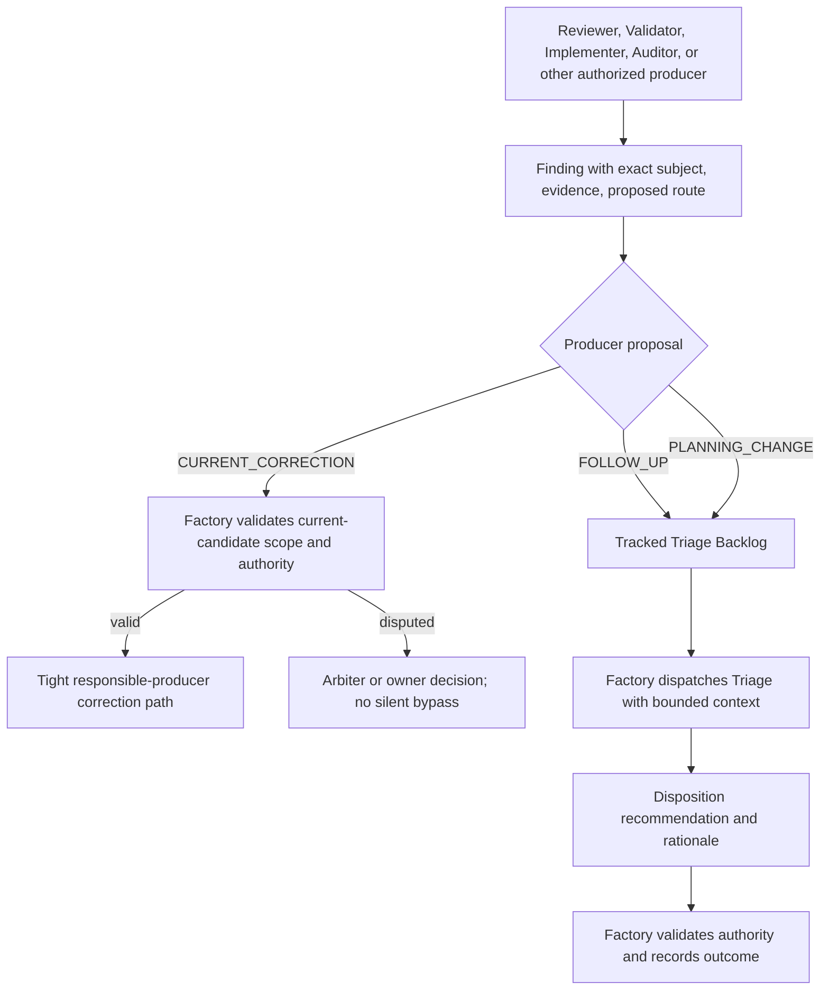
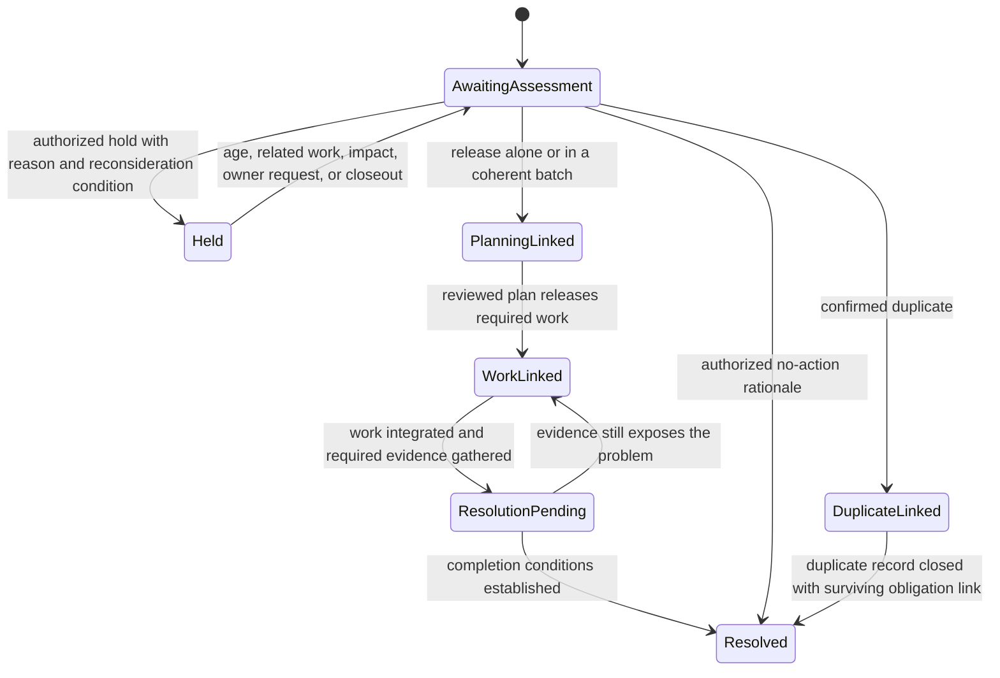
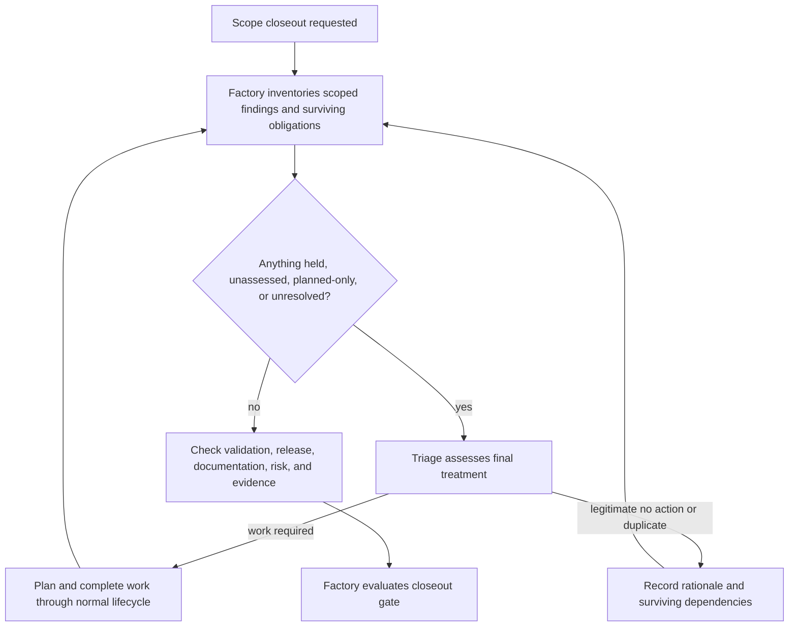

# Findings, triage and batching

Kind: explanation

## Findings, semantic triage, backlog control, and batching

### Finding vocabulary

A **Finding** is an evidence-backed observation concerning an exact artifact, behavior, or project condition. It is not automatically a Work Item, a confirmed bug, or an instruction to change the product.

A **Finding Producer** is any authorized Worker or deterministic Factory component that reports a Finding. It is not another Worker role. The producer makes one of the three proposals in [Independent review](review.md). A **Triage Backlog** is the tracked collection of follow-up and planning-change findings awaiting or undergoing final disposition. **Triage** is the bounded cognitive job that evaluates relevance, criticality, scope, duplicates, grouping, and recommended treatment. Factory owns the resulting records and authorization.

A **Current Correction** belongs to an existing candidate's acceptance loop. A **Follow-up** may become new planned work. A **Planning Change** may require revisiting a governing baseline. These are routing meanings, not severity levels: a follow-up can be urgent, and a planning change can be small.

### Intake records and bounded authority

Each Finding records an ID, exact subject, discovering role/attempt or source event, proposed route, claim, evidence, implicated obligations, observed impact, affected Project/repositories/areas, discovery time, and relationships to existing work or Validation Targets. The producer may state a severity assessment, but that assessment has provenance and can be challenged during triage.

Factory mechanically validates the envelope, references, source authority, idempotency, known exact duplicates, and any current-correction scope predicates. Semantic duplicates and relevance often require Triage or Arbiter judgment. Text similarity is a search aid, not proof that two bugs are identical.

A `PLANNING_CHANGE` proposal does not itself approve changing the plan. When evidence raises a material conflict with active work, Factory records a pending-planning disposition and can conservatively block the affected scope until the authorized path resolves it. Batching must not be used to postpone an already-known safety or correctness blocker invisibly.

### Figure 20 — Finding intake has two paths

### Triage judgment versus Factory mechanics

Factory can retrieve source identities, timestamps, graph relationships, existing obligations, configured thresholds, previously accepted estimates, and current queue states. It can deterministically apply a recorded ranking policy to those facts.

Triage decides questions such as whether a claim is relevant, whether its impact is credible, whether the issue is already represented elsewhere, whether several findings form one coherent change, or whether a proposed implementation fix actually needs a design decision. These are cognitive assessments, not calculations disguised as certainty.

The Triage Worker returns a structured recommendation with evidence and rationale. Factory checks that the recommendation is complete, within delegated authority, consistent with existing protected constraints, and not attempting to waive a current obligation improperly. A high-impact dispute or decision outside delegation routes to Arbiter or the owner. The product does not require an automatic second Triage Worker for every routine item.

### Final treatment and its lifecycle

The following actions are available to the authorized triage process. They are deliberately separate from the producer's three proposals.

| Triage action | Immediate consequence | Does this resolve the Finding? |
|---|---|---|
| Release to planning | Create/link a planning input with explicit scope and precedence. | No. The required outcome must still be delivered or otherwise legitimately disposed. |
| Hold | Keep the finding visible until a meaningful reconsideration trigger. | No. Hold is nonterminal. |
| Batch | Group compatible findings into one planning unit, retaining every finding's traceability. | No. Grouping is not completion. |
| No action | Record why no change is required, with the required authority and supporting evidence. | Yes, when the rationale legitimately resolves the obligation. |
| Duplicate | Link the finding to the surviving finding/work obligation. | It closes duplicate bookkeeping, not the surviving obligation. |
| Owner decision | Create an Attention Item and frozen Owner Action where consequential authority is required. | No, until the decision and its required consequences are resolved. |

A planning-change finding released to planning follows the controlled change path. A follow-up with sufficient existing design may use a small planning record that references that design rather than rediscovering it. Both still receive an explicit goal, outcomes, constraints, verification, and appropriate review before execution. Release to planning is a triage treatment, not owner phase authorization: Factory links any needed Phase Release and keeps new product scope waiting until the owner grants it. Work covered by an existing released maintenance scope can proceed only within that scope's limits and applicable gates.

### Holding and batching without churn

A tiny related cleanup can remain held while useful work proceeds. Factory schedules reconsideration when related findings accumulate, estimated combined size becomes useful, age exceeds the configured review point, impact changes, a dependency becomes blocked, an owner requests attention, or closeout approaches.

A batch is justified by a coherent engineering reason: shared root cause, affected subsystem, compatible verification, or a common product outcome. It is not just “the next six findings in the queue.” The batch retains member IDs and individual acceptance obligations. Findings that make the batch too broad, too risky, or dependent on incompatible decisions stay separate.

The size target, maximum batch size, aging threshold, and urgency override are configured policy parameters. Serious impact can justify immediate planning below the normal batching threshold. Low apparent effort does not prove low risk. Triage or Planner first defines a proposed batch and its scope. A typed Estimator request then predicts execution time/tokens for that proposal, while Scout can supply missing footprint facts. Triage or Planner—not Estimator—decides membership, splitting, and treatment.

### Figure 21 — Triage, hold, batch, and eventual resolution

State names in this picture describe the Finding treatment, not the Work Item lifecycle. The same Finding can remain linked to work over several implementation attempts. Reopening a disproven resolution retains the earlier history.

### Validation-origin findings

A Validator reports through the same intake. A demonstrated product failure records its Validation Target/revision, intended-use scenario, observations, and which target outcome it blocks. That evidence contributes automatic precedence under the common scheduling policy. It does not inflate severity mechanically or bypass planning, review, security, or owner authority.

Usually the implicated code has already merged, so the resulting fix is a normal new Work Item handled by an Implementer in new-work mode. Current-correction mode applies only to an active candidate within its existing Work Item/PR.

A finding's source is not enough to prove the cause. Triage may discover a bad validation setup, duplicate defect, unmet prerequisite, or a real baseline error. It records that conclusion and preserves the observations. It must not call a known failing product requirement “no action” merely to turn a validation indicator green.

### Closeout accounting

Every finding has an explicit owning scope or scopes. Scope membership cannot disappear when a finding is put in a batch or becomes a Work Item. A duplicate that points outside the scope retains any dependency that still prevents the scope from being complete.

Before closeout, Factory requests a final triage assessment of held/unresolved findings. Required work must actually finish and satisfy its completion conditions. Merely releasing it to planning, creating a ticket, or assigning it to a batch does not satisfy closeout. A legitimate no-action decision or resolved duplicate can satisfy the obligation, but its rationale and authority remain inspectable.

A materially changed owner goal may change what the scope owes, through the explicit change-control process. That is different from silently moving unfinished findings elsewhere to report success.

### Figure 22 — Closeout cannot hide the backlog

| ID | Requirement |
|---|---|
| PF-FND-01 | Producer proposals are limited to current correction, follow-up, and planning change. |
| PF-FND-02 | Current corrections use a separate bounded candidate path, not the general triage backlog. |
| PF-FND-03 | Triage semantic judgments are attributable Worker results; Factory owns consequences and policy enforcement. |
| PF-FND-04 | Held findings remain visible with age, owning scope, reason, and reconsideration conditions. |
| PF-FND-05 | Batches preserve every member's origin, relationships, and required outcome. |
| PF-FND-06 | Urgent findings can be released without waiting for a batch threshold. |
| PF-FND-07 | Planning or batching alone is not Finding resolution. |
| PF-FND-08 | Product-validation defects receive explicit scheduling precedence through the common priority/blocking system. |
| PF-FND-09 | Closeout cannot succeed while any scoped obligation remains unresolved merely because it is held or linked to future work. |
| PF-FND-10 | No-action and duplicate outcomes preserve rationale, authority, and any surviving blocking obligation. |

### Initial external planning handoff

Current correction remains Factory-managed on the same Work Item/PR. New-scope follow-up and planning-change Findings are stored with complete provenance, requirement/target links and obligations, then routed to the external reviewed planning workflow until native Triage/Planner jobs are admitted. Coherent batches preserve every member identity; urgency is not suppressed by batch size. Holds age into durable Attention. Imported corrective work uses normal baseline/review/owner-release checks. No standing authority permits Pilot/Workers to discard risk, scope or held obligations; explicit owner disposition is exact-subject-bound.
