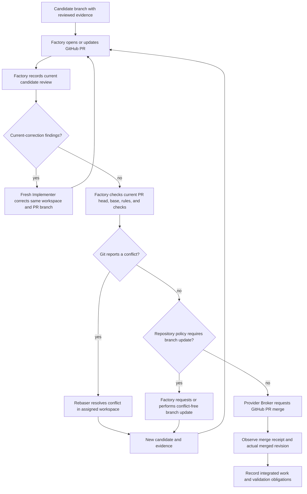
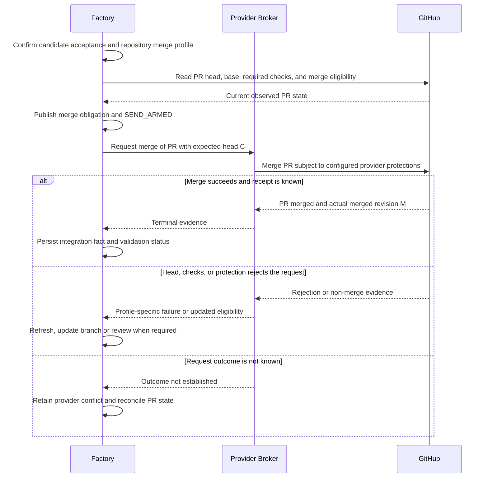

# Git branches, PRs and integration

Kind: explanation

## Git branches, pull requests, rebasing, and merge

### Terms without hidden Git machinery

A **branch** names a line of Git history. A **commit SHA** identifies a commit. The **PR head** is the current commit on the branch proposed by the pull request. The **base branch** is the target, normally `main`. A **merge** incorporates the proposed change into that target through GitHub. A **rebase** reapplies branch commits on a newer base and may produce different commit identities.

A PR can become out of date without containing a conflict. Another branch may have changed unrelated files, and Git can combine both changes mechanically. A **merge conflict** means Git cannot automatically choose how overlapping changes should combine. That requires a bounded **Rebaser** job when the conflict needs semantic resolution.

PriFly's v1 integration path is a GitHub PR. Factory publishes assigned candidate branches and requests PR operations through Provider Broker. Neither a Worker nor Factory publishes directly to `main` as a substitute for merging the PR.

### Candidate, PR, and approval relationship

The PR is linked to the canonical Work Item and exact current candidate. PR title and description are deterministically rendered from the Implementer's admitted PR Draft and canonical metadata; review history, status summaries, and issue relationships are projections of their corresponding Factory records. GitHub checks and merge results are external facts that Factory observes and records.

Factory's candidate acceptance and GitHub's approval/check state are related but not identical. A comment saying “approved” does not authorize a stale candidate. The admitted repository profile specifies how Factory review evidence is represented in GitHub and which GitHub checks/protections must pass. Required human or organization review rules must not be bypassed.

### Figure 23 — Normal PR path and conflict handling

A changed candidate goes through the required review path even when Git produced it mechanically. Evidence may be reused when its applicability is established; this does not imply every test must be rerun. The Reviewer evaluates new code interactions and the configured profile's requirements.

### What a Rebaser does

Factory supplies the candidate branch, target revision, governing Work Item/design, conflict details, and prior review/evidence. Rebaser resolves conflicts without removing either side's intended behavior casually. It documents material decisions, tests the resolution, and returns a new candidate. If the conflict exposes an architectural contradiction, it requests planning/arbitration rather than choosing a new design silently.

Rebaser may reuse the Implementation Workspace after obtaining its exclusive writer lease. It never merges the PR or approves its own conflict resolution. A conflict-free Git operation does not require an AI Rebaser merely because the base moved.

### The real limits of GitHub's merge contract

GitHub's merge API can require the expected **PR head SHA**. That prevents merging a different PR head from the one requested. It is not an expected-base-SHA compare-and-update, and PriFly must not describe it as one [S32](../reference/source-register.md#source-s32).

Repository protection can require PRs, required checks, current branches, and relevant approval freshness. A qualified merge-queue profile may provide further checks on the combined result, but a queue is not a universal v1 dependency [S33](../reference/source-register.md#source-s33). The selected merge profile and its guarantees must be inspectable.

For the initial non-queue profile, Factory serializes its own merge requests per target, checks current base/head and the required repository protections, and uses the expected-head precondition. Strict up-to-date/check policy is required when the project's acceptance depends on testing the current combined branch. If an external actor moves the base concurrently, the admitted GitHub protection behavior must reject or recheck the merge rather than rely on a preceding Factory read alone. That behavior is an implementation conformance test.

This profile does **not** claim that an ordinary PR merge is the old low-level atomic expected-base-ref update. GitHub may create a new merge or squash commit. Factory records the actual merged revision and does not relabel it as the earlier candidate SHA. A project requiring a stronger exact-combined-tree guarantee must qualify a provider-supported profile or remain blocked; Factory cannot bypass the PR route to simulate that guarantee.

### Figure 24 — Merge request and ambiguous response

### After merge

Only observed provider evidence establishes that the work integrated. Factory records PR identity, head, actual merged revision, target, timestamps, relevant checks, and the acceptance it had authorized. It updates the Work Item's integration state and the relevant Validation Targets. Source branches are retained while needed for recovery or evidence, then cleaned by policy.

An external merge outside Factory authority is still a real event. Factory records it as external integration, marks any missing acceptance or validation obligations, and escalates discrepancies. It never invents retrospective approval to make its record look tidy.

| ID | Requirement |
|---|---|
| PF-GIT-01 | All v1 target integration uses GitHub PR merge; direct pushes to the protected target are not an alternate success path. |
| PF-GIT-02 | Factory-owned credentials publish candidate branches and execute admitted provider operations; Workers do not receive target authority. |
| PF-GIT-03 | PR acceptance is bound to current candidate identity and the admitted repository merge profile. |
| PF-GIT-04 | A changed base is distinguished from a Git conflict; only semantic conflict resolution requires Rebaser. |
| PF-GIT-05 | GitHub's expected-head SHA check is not represented as an expected-base atomic guarantee. |
| PF-GIT-06 | Actual provider merge identity and outcome are recorded, including unknown outcomes and external merges. |
| PF-GIT-07 | Provider rules and required checks cannot be bypassed to resolve capacity or scheduling pressure. |
| PF-GIT-08 | Unsupported merge guarantees block admission of that profile rather than quietly weakening project acceptance. |

### Review publication and provider identity

The repository integration profile selects the representation of accepted review evidence: ordinary comments, checks, native PR reviews, or a qualified combination. GitHub's native review API has `APPROVE`, `REQUEST_CHANGES`, and `COMMENT` events, while an ordinary comment is only content [S39](../reference/source-register.md#source-s39). A canonical approval comment must not be represented as satisfying a required native approval that did not occur.

GitHub does not permit a PR author to approve its own PR [S39](../reference/source-register.md#source-s39). Therefore a profile requiring a native approval must qualify an eligible distinct reviewing identity and the applicable repository rules. A profile using checks/comments instead must be compatible with the repository's actual required protections; Factory cannot downgrade those protections or count its own PR-author comment as an approval to get a merge through.

All publication is performed by Provider Broker under recorded identities. Model role independence and provider account eligibility are separately checked. Approval publication names the reviewed head; a later head change invalidates reliance on that approval according to the admitted profile and canonical acceptance rules. Reconciliation records stale, dismissed, missing, or externally supplied reviews without inventing producer-independent review history.

| ID | Requirement |
|---|---|
| PF-GIT-09 | PR creation follows confirmed candidate publication and includes the Implementer's admitted PR Draft before review begins. |
| PF-GIT-10 | Native reviews, checks, and ordinary comments have distinct identities/semantics; the configured representation must satisfy actual repository protections. |
| PF-GIT-11 | A required native approval uses an eligible provider identity independent of the PR author; model role labels do not bypass provider restrictions. |
