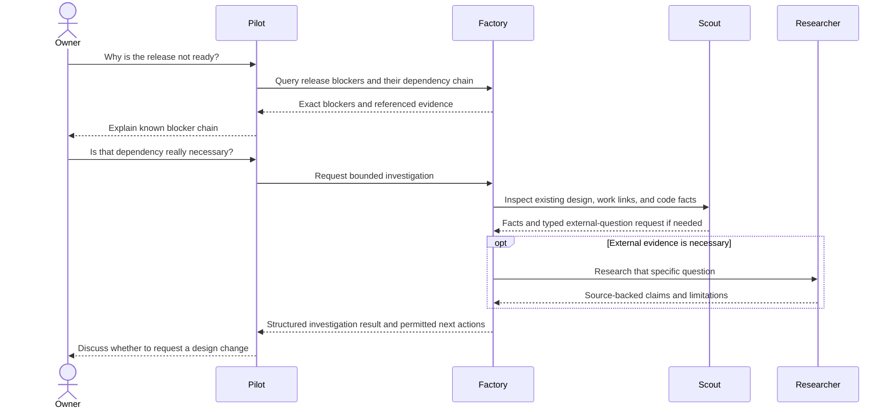
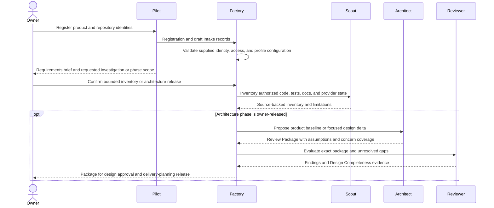

# Operator experience and onboarding

Kind: explanation

## Operator experience, documentation, and evolution

### Operational views

The owner must be able to inspect Project goals, active baselines, open planning gaps, queued/running jobs, Route/capacity state, current correction rounds, held/batched findings, pending/failed Validation Targets, release blockers, provider synchronization, and recovery health. Each summary links to exact underlying records.

A briefing should separate facts from analysis. “Three targets are pending” is a query result. “These two failures probably share a root cause” is a Worker interpretation with evidence and uncertainty. The rendering should make that difference visible without forcing the owner to read every JSON field.

### Stable briefing format

Default Markdown briefings should have predictable sections: requested scope and snapshot time/frontier; completed/integrated/validated work; active work and next eligible work; blockers and owner actions; validation demand; triage backlog/aging/batches; capacity/provider/recovery health; and relevant recommendations. Empty sections can be compact but must not be silently replaced with improvised narrative structure.

The owner can ask to drill into any row. Pilot requests the appropriate query or bounded investigation; it does not scrape arbitrary terminal windows and invent a parallel project status.

### Documentation is a product artifact

PriFly's own canonical repository uses the adopted design-docs layout: overview and explanation, reference contracts, architecture views, decision records, and task-oriented operator material as implemented. Managed Projects adopt a manifest-governed documentation profile; the default is the `design-docs` framework detailed in [Section 9.7](planning.md#new-project-and-existing-product-review-packages), with existing adopted paths preserved. The quality requirement is that necessary information is accurate, findable, scoped, and traceable—not that every Project adopts PriFly's exact directory tree.

User/operator documentation is part of planning when the delivered capability requires it. A container that only works with an undocumented manual permission change is not made usable by closing its code Work Item. Validator and release review use the normal documented instructions as evidence of supported operation.

### Startup guide and repair guide

v1 needs a tested guide for bootstrap, registering repositories/Routes, setting the recovery material aside, starting Pilot, handling owner actions, inspecting pending validation and triage, updating Factory, and recovering after host loss. The repair guide must be usable without a functioning normal Factory interface.

Tutorials can use synthetic data. How-to guides describe supported operations. Reference material defines exact states/commands/settings. Explanations describe why boundaries exist. This avoids a giant copied procedure becoming a second source of workflow semantics.

### Extensibility and retirement

Future Bridge uses the same commands, queries, event notices, immutable owner actions, and stored discussion context. Future runtime/sandbox/provider adapters qualify against the same role/attempt/authority contracts. PostgreSQL, distributed execution, richer egress controls, and multi-cloud backup remain future choices requiring their own rationale.

Project or Factory retirement requires explicit owner authority, export/retention treatment, provider-resource disposition, and safe credential cleanup. Retirement cannot silently delete historical metrics or required records while they remain under a supported retention obligation. A future product-wide decommission workflow must use the same record/authority discipline; v1 can implement a deliberately narrow owner-operated retirement path rather than an elaborate automated platform.

### Figure 42 — Progressive owner inquiry

| ID | Requirement |
|---|---|
| PF-UX-01 | Owner-facing summaries expose exact state, scope, freshness, and links to underlying evidence. |
| PF-UX-02 | Facts and Worker interpretations are distinguishable in briefings. |
| PF-UX-03 | Canonical templates are deterministic and can evolve independently of stored semantics. |
| PF-UX-04 | Operator and repair documentation is testable as part of the product's intended-use validation. |
| PF-UX-05 | Future interfaces/adapters preserve the existing authority and state contracts rather than becoming competing workflow engines. |
| PF-UX-06 | The owner can inspect full package renderings, source files, baseline diffs, diagrams, and annotation dispositions before each release. |
| PF-UX-07 | Plan views identify enabled provider mappings and synchronization state; issue/PR views expose the configured review/correction exchange. |
| PF-UX-08 | Registering a Project/repository does not implicitly release onboarding investigations, architecture, planning, or execution. |

### Project onboarding and existing repositories

Registering a Project establishes its system boundary, owner, repository set, default target branches, allowed Routes/accounts, baseline policy, documentation locations, validation environments, and standards profiles. Secret values are supplied through the secret mechanism, not embedded in a Project description.

Factory verifies read/write capabilities separately. A repository may be readable for Scout analysis but not yet admitted for branch publication or PR merge. GitHub protection/check configuration is inspected or supplied with verifiable evidence. Insufficient provider permissions block the relevant operation rather than expanding credentials silently.

After the owner authorizes an onboarding inventory or the relevant architecture phase, Scout inventories the existing repository's code, docs, tests, workflows, and current issue/provider state. Within the released architecture scope, Architect proposes how existing product requirements/design map into the Planning Record and its baseline Review Package. Existing external issues can be imported as traced input, but their old labels do not automatically become authoritative PriFly approval. Reviewer evaluates the proposed starting baseline. The owner resolves significant assumptions or missing product direction.

For a new repository, the same flow begins with Pilot-led Intake and an owner architecture release rather than inferred legacy behavior. Registering repository identity/access alone does not authorize Scout, Architect, or other project Workers. In neither case does “onboarding complete” mean all future product planning is finished. It means PriFly has a reliable boundary, usable adapters, an accepted starting understanding where needed, and explicit unresolved gaps.

### Figure 43 — Project onboarding

