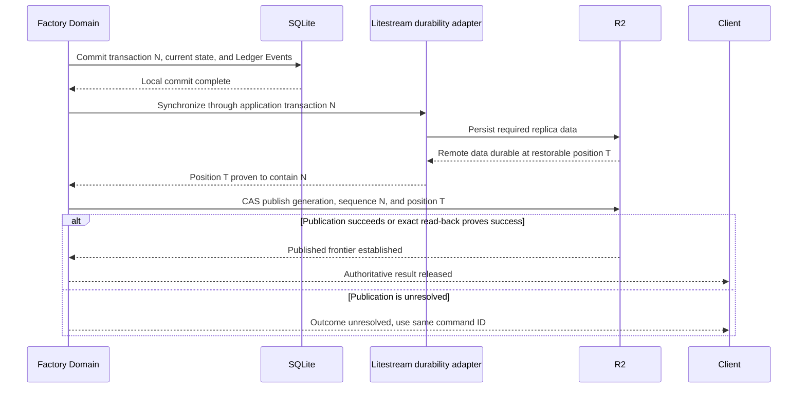
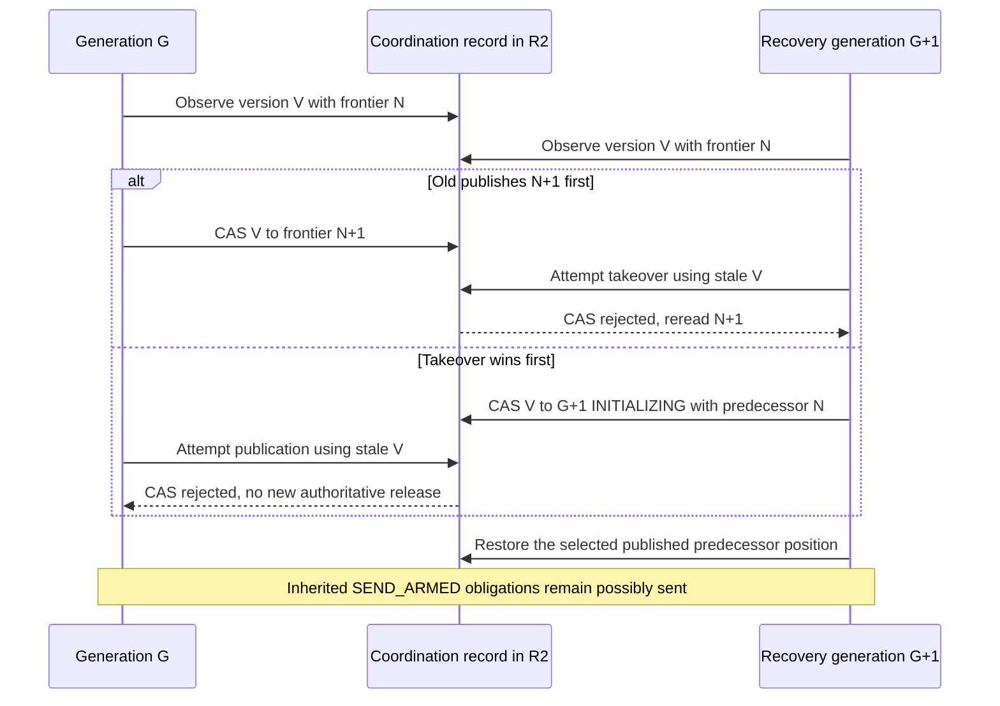
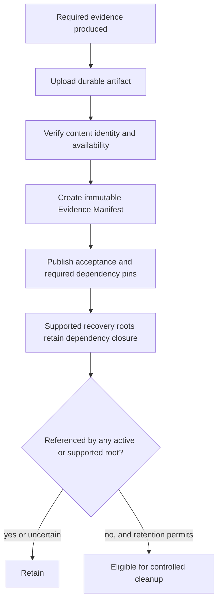

# Canonical persistence and published durability

Kind: explanation

## Canonical persistence, published durability, and retention

### SQLite and the semantic Ledger

SQLite holds canonical current state and the compact semantic **Ledger** explaining meaningful transitions. A current-state mutation and its Ledger Events are written in the same transaction. PriFly is not fully event-sourced: recovery need not replay every historical event to rebuild all current state.

Authoritative history includes owner intent and phase releases, package/annotation revisions, decisions, baselines, estimates, Findings/dispositions, review/correction conversation, accepted results, validation outcomes, projection profiles/mappings, provider obligations, execution accounting used for learning, release/closeout state, and governing policy/prompt versions. Ephemeral data includes heartbeats, live stdout tails, process liveness samples, and disposable indexes.

Git is for code history and recoverable candidate refs. The SQLite file and a stream of workflow JSON files are not committed into Git as PriFly's database strategy.

### Why local commit is not enough

The local host is disposable. Therefore an owner-visible authoritative success must survive destruction of that host. A local SQLite commit alone does not establish that property. Uploading database bytes alone also does not establish which state a successor is required to recover.

A **Published Frontier** identifies the remotely restorable state Factory has made authoritative. It includes a monotonic application sequence and the corresponding remote database position/lineage. One R2 coordination record publishes that frontier together with the active Factory generation.

### Figure 33 — Authoritative publication

The application sequence and Litestream's transaction identifiers are not assumed numerically equal. The adapter must prove their mapping and the exact restore behavior. Litestream documents blocking synchronization and transaction-position restore facilities, but those API features alone do not establish PriFly's complete recovery invariant [S34](../reference/source-register.md#source-s34), [S35](../reference/source-register.md#source-s35).

### Single publication lane and visibility

v1 serializes authoritative commit/synchronize/publish/release ordering for simplicity. It may batch logically compatible events only when the same acknowledgement semantics are preserved. High-volume stdout and heartbeat data do not use this lane.

Canonical reads must not expose locally pending mutations as final state. The implementation may block a read behind publication or maintain a published read projection. Provisional diagnostic views are visibly separate and cannot satisfy gates or authorize provider sends.

If R2 is unavailable, Factory cannot claim new authoritative success. It can retain local-pending work and expose degraded diagnostics, but no downstream consequential action may depend on that unpublished state. Scheduling admission and resource pressure determine whether already-running workers may finish a bounded attempt while publication is blocked; no result becomes accepted merely because it is locally available.

### Coordination, generations, and explicit takeover

A **Factory Generation** is an ownership epoch, not a software version. The coordination record contains Factory identity, generation, lifecycle state, published application sequence, concrete restore position, and replica identity. Conditional updates compare the exact prior object version.

An explicit takeover races against old-generation publication using that same coordination object. If the old publication wins first, a stale takeover must reread and inherit the newer frontier. If takeover wins first, the old generation cannot publish further authoritative work through its outdated object version. This fences new authority; it does not cancel requests already armed and dispatched.

R2's consistency behavior is relevant, but the precise chosen conditional-write interface must be qualified rather than inferred from generic object-storage terminology [S36](../reference/source-register.md#source-s36).

### Figure 34 — Takeover and predecessor frontier

No automatic clock/TTL expiry launches a successor. Recovery does not treat “cannot read the bucket” as permission to create an empty Factory.

### Exact restore lifetime

A published remote position must remain exactly reconstructible for as long as the active coordination record or a supported recovery root depends on it. A single successful restore immediately after upload is insufficient.

Litestream's documented retained LTX boundaries and compaction/retention behavior affect which past states are reconstructible [S35](../reference/source-register.md#source-s35). The pinned adapter configuration must preserve the chosen frontier and reject a setting that cannot honor it. The implementation may use a compatible retention/checkpoint mechanism, but it may not quietly restore later unpublished state or an older state that loses acknowledged history.

This is a focused conformance obligation for the selected persistence implementation. The PRD does not assert that a stock default configuration automatically satisfies it.

### Large evidence and dependency closure

Required external artifacts are uploaded and their identity verified before the authoritative record that depends on them is accepted. **Acceptance Evidence Manifest** lists required evidence, optional diagnostics, and code recovery roots. **Recovery Root Manifest** lists the database checkpoint and external Git/evidence/key references needed to honor that supported checkpoint.

Manifests are immutable. A separate lifecycle records whether a root remains supported or is retired. Cleanup protects both current required pins and every supported recovery root. Root retirement is itself authoritative before the final dependency can be deleted. Uncertain reachability favors retaining data over destructive cleanup.

### Figure 35 — Evidence before acceptance, pins before cleanup

### Cost and recovery trade-off

R2 is the selected off-host store. Its published pricing distinguishes storage/operations from egress, so “no egress charge” is not the same as “free backup” [S37](../reference/source-register.md#source-s37). PriFly records storage and request observations where available, bounds diagnostic retention, and avoids treating every log line as authoritative state.

Historical compact metrics and semantic outcomes have higher retention value than disposable terminal tails. Required acceptance/recovery evidence cannot be deleted merely to satisfy a cosmetic storage target. A budget-pressure condition should stop new expensive work or request attention before it violates retention guarantees.

| ID | Requirement |
|---|---|
| PF-DUR-01 | Current state and semantic Ledger Events change transactionally in SQLite. |
| PF-DUR-02 | Authoritative success requires remote durability and CAS publication of the recoverable frontier. |
| PF-DUR-03 | Unpublished state cannot satisfy canonical queries, gates, released events, or consequential dispatch. |
| PF-DUR-04 | Takeover inherits every acknowledged frontier and published possible-send obligation. |
| PF-DUR-05 | Exact restore positions remain reconstructible throughout their supported lifetime. |
| PF-DUR-06 | Required external evidence exists and is verified before dependent acceptance is published. |
| PF-DUR-07 | Active and supported historical roots prevent deletion of their last required dependency. |
| PF-DUR-08 | Historical learning metrics are authoritative; ephemeral runtime telemetry may be lost. |

### Initial remote-verified publication adapter

The initial candidate adapter uses a separate Litestream 0.5.17 daemon and a single SQLite authoritative write lane. The transaction records application sequence, mutation, Ledger and exact command result together. After blocking remote sync, Factory restores the selected exact remote TXID into isolated verification storage and checks Factory identity, exact sequence, command result, schema and domain integrity before CAS publication. Application sequence is never assumed numerically equal to LTX TXID. The immutable verification receipt is referenced by coordination without inserting another transaction and recursively requiring another proof. Reads use a separate published snapshot, swapped only after publication, or explicitly wait/fail.

The initial retention profile keeps all required remote replica files and all evidence/Git/key dependencies: Litestream remote retention disabled, no provider expiry or supported-root deletion. Retention alone does not stop overwrite; every replica prefix is fresh and never reused, has one admitted writer, and rejects unsafe reset/reinitialization/second-writer paths. Storage pressure stops admission before consuming control/recovery reserves. Real CAS, exact restore after compaction/local loss, lineage collision prevention and fixed-load performance must qualify the profile. [ADR-0031](../adr/0031-verify-remote-state-before-publication.md) records the efficiency trade-off and alternatives.

### Bounded transport permits

A private, authenticated S3-compatible transport in the Factory durability boundary is the only holder of actual R2 credentials and signs forwarded requests. Litestream and Factory clients use its fixed allowed-operation profile; conditional headers, body/response identity and range/pagination semantics are preserved and qualified. It does not expose a general-purpose Worker tunnel. Every write reserves its complete known length before send against a finite published generation/incarnation/prefix grant; retries and ambiguity consume full reservations. Reads consume request permits. Unbounded/multipart behavior outside the admitted profile is rejected. Lost local debit continuity consumes the entire old grant; new incarnations cannot reuse it. Old possible senders retain their full maximum reservation until retirement and reconciliation are proved. A finite bootstrap grant is separately owner-bound. Grant exhaustion holds work; renewal is a published command through the reserved control grant, never a silent reset. This bounds replica amplification and idle/background writes without assuming a compression multiplier; the concrete equation and limits are in the selected deployment profile.

Before local commit, reserve one complete bounded sync/restore/CAS publication ticket and a second ticket exclusively for grant renewal. Already charged finite tickets survive a grant deadline; that deadline prevents new allocations. Preflight proves exact retained-object/restore-plan, database and permitted-new-write bounds fit, or refuses the commit. N can therefore complete independently of ordinary-grant exhaustion, and renewal executes while the lane is free before the next ordinary mutation. Exhaustion outside a qualified bound is a halt/recovery condition, never recursive renewal or early acknowledgement. The pinned daemon uses a qualified S3 part-size above the 128 MiB admitted object ceiling (candidate 256 MiB), with real traces proving only supported single-part operations.
