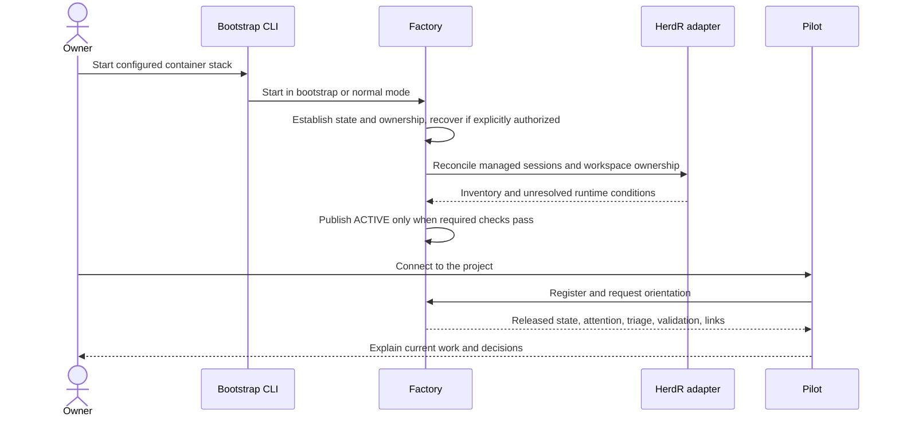
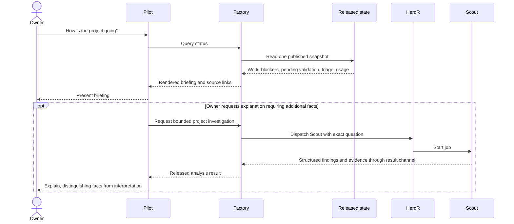
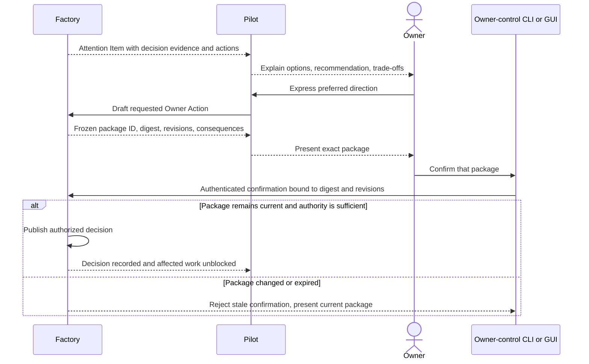

# Pilot and owner interaction

Kind: explanation

## Pilot, CLI, startup, and owner attention

### The conversational boundary

Pilot has a small operating instruction set: how to elicit and record requirements, use the Factory CLI, explain returned records, and present phase releases and other pending owner actions. It does not carry the workflow suite in its own prompt. It does not directly investigate a codebase to answer a substantive engineering question; it requests a bounded Factory job and discusses the resulting evidence.

During Intake, Pilot asks about the problem, users, required behavior, constraints, priorities, exclusions, and success measures. It maintains a draft requirements brief, distinguishes owner statements from suggestions and assumptions, and invites corrections. It reads existing Factory records and already-published documents without launching project Workers. Recording an idea authorizes neither agent fan-out nor provider planning-object creation. A separately confirmed bounded investigation permits only that investigation.

Pilot may perform ordinary conversational interpretation. For example, it can understand that “pause the backup work” likely refers to a named Lane and resolve the reference through a query. It must persist material requests, clarifications, and decisions before relying on them to change later work. Exploratory phrases and examples remain identified as exploratory input unless the owner deliberately adopts them.

**Orientation Packet** means the bounded, Factory-generated entry briefing for a new Pilot: Factory health, active Projects, material recent changes, active and blocked work, pending questions, pending/failed Validation Targets, held triage, and links to deeper records. It is not a compressed copy of every previous conversation.

### Starting the application versus resuming work

Installing or starting the container stack is an operator action. Requesting that an already running Factory resume a Project is a workflow command. These must not be conflated. A small bootstrap/administration CLI remains available when the normal application is not `ACTIVE`.

The owner supplies a private bootstrap repository location and selected revision, repository-fetch access, and an independently held age decryption key through the trusted startup interface. The repository contains `bootstrap.json` and `secrets.json.age`; [Section 24](recovery.md#bootstrap-host-loss-recovery-and-operational-repair) defines validation, decryption, initialization, and recovery. The fetched manifest selects the configured release and container stack. A Pilot already running in HerdR may use the permitted bootstrap wrapper, but does not gain unrestricted host-container administration or recovery takeover authority as a side effect. Destructive recovery and ownership transfer use the separate owner/recovery surface.

On connection, Pilot discovers supported commands, registers its session, and requests orientation. Factory either returns released state or a truthful bootstrap/recovery status. It does not invent an empty Project when state cannot be read.

### Figure 7 — Startup and Pilot registration

A process restart on the same host still checks ownership and durable history. Another host cannot assume ownership because it has the same configuration file. Explicit takeover is described in [Recovery](recovery.md).

### Queries versus requests for additional work

“How's it going?” ordinarily requires a database query, not an AI job. Factory constructs a deterministic briefing from released records. When the owner asks “Why are those changes related?” and the answer is absent, Pilot requests bounded analysis. Pilot proposes the appropriate typed job kind for the owner-authorized question. Factory maps that kind to Scout for existing-project discovery, Researcher for external facts, Architect for design implications, or Auditor for retrospective analysis, subject to the phase and budget checks in [Worker authority routing](../reference/worker-roles.md).

A query is read-only. A request that starts analysis is a command and has an execution budget. Factory must not covertly launch expensive investigations for every routine status query.

### Figure 8 — Status with optional enrichment

### Attention and confirmation

An **Attention Item** records a need to inform or consult the owner. Its urgency is `BLOCKING`, `ACTION_REQUIRED`, `REVIEW_WHEN_CONVENIENT`, or `INFORMATIONAL`. Urgency does not itself confer approval authority. The item names its affected scope, why it exists, evidence, and state-dependent allowed actions.

Factory emits a small notification hint to registered clients. Pilot can wait for a natural conversation boundary to present nonurgent items. A critical item can be surfaced immediately, but silence never means approval or rejection. Factory retains whether an item was notified, presented, acknowledged, and resolved as separate facts. Lost notifications are recovered by querying the Attention Queue.

An **Owner Action** freezes the exact consequential operation, target revisions, scope, consequences, and package digest. Only an owner-control capability unavailable to normal Pilot and Worker credentials can confirm it. CLI confirmation and a future Bridge approval button use the same contract. Routine reversible commands and explicit standing delegations do not require this extra step.

### Figure 9 — Consequential choice

A material decision package must explain effects on behavior, architecture, data, security, verification, operations, cost/capacity, dependencies, and reversibility where those dimensions are relevant. “Choose A or B” without those consequences is inadequate planning input.

### Required interface behavior

| ID | Requirement |
|---|---|
| PF-INT-01 | Every substantive owner request has a durable command or planning-record reference before it influences execution. |
| PF-INT-02 | Replacing Pilot preserves queued attention, accepted choices, material discussion checkpoints, and their provenance. |
| PF-INT-03 | Pilot can query state, request research/design/planning, pause/resume/cancel authorized work, and explore decision evidence without doing that work itself. |
| PF-INT-04 | All clients consume the same allowed actions and versioned semantic contracts. |
| PF-INT-05 | Confirming a stale, expired, or changed consequential package fails without applying the intended mutation. |
| PF-INT-06 | A registered Pilot receives hints; absence of a Pilot neither loses an item nor blocks unrelated work. |
| PF-INT-07 | The owner can inspect what a command would change and which permission it requires. |
| PF-INT-08 | Intake records requirements and open questions without project Worker dispatch or automatic planning-object publication. |
| PF-INT-09 | Architecture, delivery planning, and execution each require the applicable exact-package owner release; engineering gates alone do not authorize the next phase. |
| PF-INT-10 | Material scope expansion or package replacement invalidates reliance on the old release for the changed subject and returns to the required owner decision. |
| PF-INT-11 | A separately authorized Intake investigation is limited to its stated question, budget, and outputs and does not release the broader project. |

### Daily HerdR session and pane experience

The default layout uses two named HerdR sessions within the same deployment: **owner** and **workers**. Session names can be installation-scoped to avoid collisions. HerdR's session/workspace/tab/pane concepts and explicit no-focus creation provide the underlying runtime primitives [S38](../reference/source-register.md#source-s38); the following arrangement is PriFly's operator contract, not a claim that HerdR already implements a PriFly dashboard.

| Session | Workspaces, tabs, and panes | Interaction |
|---|---|---|
| Owner | A control workspace with Pilot, Status, Attention, Packages, and read-only job-observation views; Project views link to exact records. | Everyday conversation, package review, status, and explicit owner actions. |
| Workers | Project workspaces; tabs associated with a Planning Record, Work Item, or Validation Run; panes labeled with role, job kind, and attempt. | Factory-managed execution with recorded server/session/workspace/tab/pane/agent identity. |

The proposed `prifly pilot` entry command attaches to or creates the owner-side Pilot location and registers that Pilot with Factory. It does not send input to the currently focused Worker pane. Replacing Pilot affects that conversational session only. Worker creation and notifications do not steal owner focus; detaching the owner client leaves authorized work running.

“Watch job” opens a PriFly-rendered view of HerdR's read-only observation stream. Typing, paste, and control keys in that view cannot reach the Worker. Writable control is a separate, explicitly authorized operation through Factory; normal inspection never uses takeover. Before intervention Factory binds the action to the exact attempt, manages automation and writer ownership, and records any effect on evidence or subsequent re-review. HerdR's separate observation/control streams are primitives for this interface, not a substitute for it [S38](../reference/source-register.md#source-s38).

Managed Worker automatic agent resume is disabled using the qualified session configuration; the documented setting is `[session] resume_agents_on_restore = false` [S05](../reference/source-register.md#source-s05). After restart, Factory reconciles persisted attempts and resources before it resumes or redispatches any work. Names and tabs are navigational aids; socket permissions, capability scopes, and lifecycle controls enforce access. A lost or moved pane is resolved through recorded runtime identity rather than whichever terminal is currently active. [Section 13](execution-runtime.md#herdr-workspaces-and-worker-runtime) defines cancellation and workspace handoff.
