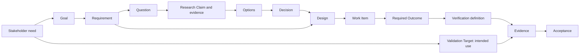
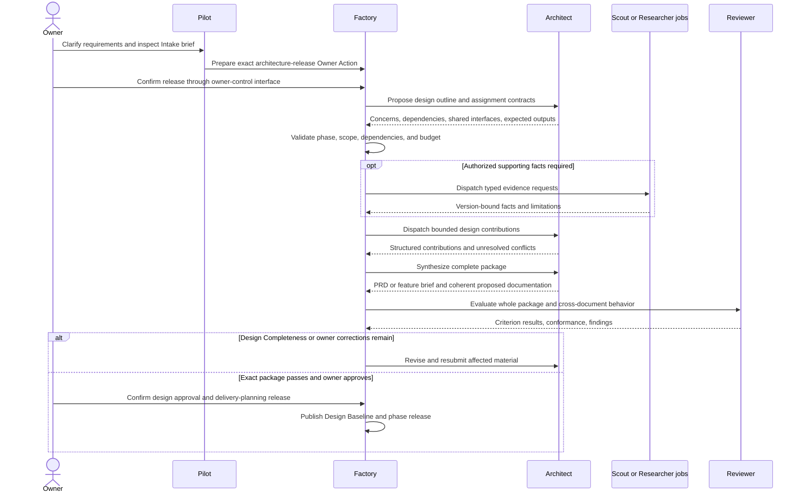

# Requirements, design and owner phase releases

Kind: explanation

## Idea refinement, research, architecture, and Design Completeness

### The Planning Record is a graph, not a giant prompt

The Planning Record must preserve both the content and the relationships of engineering decisions. A **Requirement** is a condition the product must satisfy. A **Constraint** restricts acceptable solutions. An **Assumption** is an explicitly unproven premise. A **Question** is an unresolved information or decision need. An **Option** is a potential answer. A **Decision** is a choice made under identified authority. A **Design** describes the chosen solution. A **Risk** connects an uncertain event to consequences and treatment.

Factory stores those objects and exact trace links. Architect develops the meaning; Factory checks structure and controls publication. A natural-language explanation may summarize the graph, but it cannot replace it.

### Figure 10 — Planning traceability

A small change may have a small graph. It still needs the same relationships; smaller work does not get a different meaning of “complete.”

### Intake and three owner-controlled phase releases

Pilot and the owner first develop a draft requirements brief in `INTAKE`. It records the problem, users, goals, required behavior, priorities, constraints, exclusions, success measures, and unresolved questions. Owner requirements, Pilot suggestions, examples, and assumptions have distinct provenance. A saved musing is not a work order.

The owner releases three exact packages. Each release is an Owner Action through [Section 8.4](pilot.md#attention-and-confirmation), binding the package ID/revision/digest, Planning Record revision, scope, permitted phase, applicable budget, and any explicit limitations. Pilot may explain or draft the action but cannot confirm it with model authority.

| Owner release | Inspectable package | Confirmation prompt | Permitted work |
|---|---|---|---|
| Requirements to architecture | Requirements brief, existing baseline references, acknowledged unknowns, proposed architecture scope and resource envelope. | “Would you like to release these requirements to architecture?” | Technical design, supporting discovery/research, design contributions, synthesis, and design review within the released scope. |
| Design approval and delivery-planning release | PRD or feature brief, coherent design-document package, diagrams, decision records, review results, annotation responses, and remaining nonblocking obligations. | “Approve this design and release it to delivery planning?” | Decomposition, dependency/validation planning, execution estimation, plan review, and enabled proposed-plan provider projections. |
| Delivery plan to execution | Work hierarchy/contracts, dependencies, per-item estimates and forecast basis, concurrency proposal, validation coverage, review results, and provider links/synchronization state. | “Release this delivery plan for execution?” | The specified implementation, review, current correction, PR, and validation work, subject to each operation's remaining gates and authority. |

Design Completeness and Delivery Readiness are engineering gates. They supply evidence that a package is ready; they never supply the owner's release. Conversely, owner confirmation does not override a failing gate. Factory publishes a Design Baseline when the same package passes Design Completeness and receives design approval; it publishes a Delivery Baseline and execution eligibility only when the same delivery package passes Delivery Readiness and receives execution release.

Within a released phase, Factory can coordinate bounded jobs and ordinary in-scope corrections without requesting approval for every dispatch. Material scope expansion, changed governing requirements, or a replaced package must return to the appropriate release and revalidation path. An unchanged, previously released scope does not become unapproved merely because a Worker attempt is replaced.

An owner-authorized Intake investigation has its own exact question, allowed role/job kind, budget, and output. Its result enriches the draft but does not release architecture. Existing unrelated authorized work can continue while this request remains in Intake. A previously released maintenance scope can cover routine triage-driven work only within its recorded boundaries and applicable gates; it is not blanket permission for a new product direction.

### Research Claims and freshness

A **Research Claim** is an explicit assertion with source and derivation, not a whole research essay treated as indivisible truth. It records the question answered; the source identity and locator; publication/version and retrieval time where available; what was directly observed versus inferred; conflicts; limitations; and `valid_as_of` or a recheck condition.

Claim freshness depends on use. Current provider behavior needs current evidence; a language feature may need an exact version; local code facts need a repository commit; a stable engineering standard needs a pinned edition. A broken link or inaccessible document is not automatically proof that an established claim is false, but unresolved source ambiguity cannot support a blocking judgment.

W3C PROV-DM supplies the entity/activity/agent and derivation vocabulary for this provenance [S24](../reference/source-register.md#source-s24). It is a provenance model, not a guarantee that a cited source is correct. Credibility and relevance still require judgment.

### Mandatory concerns and the Gap Register

Factory instantiates the Project's versioned concern inventory for each Planning Record. The initial concern families cover stakeholder behavior, functions, product qualities, data/persistence, migration/compatibility, security/trust, external contracts, failure/recovery, operations/observability, verification/validation, rollout, documentation/support, and dependencies/risks.

Architect may propose `APPLICABLE` or `NOT_APPLICABLE`. Factory establishes **effective applicability** under the declared policy and review path. An observable protected change, such as a persisted schema change, cannot be waived by a producer's N/A label. Missing policy or detector coverage becomes **Applicability UNKNOWN**.

The Gap Register is a query over unsatisfied obligations. Every gap includes the affected object, the reason it blocks or does not block, evidence needed to resolve it, the responsible role, and the earliest lifecycle gate where it matters. An unimplemented Work Item is not automatically a Design Completeness gap: completeness is phase-specific.

| Gap example | Normal next role/action |
|---|---|
| Existing interface behavior not known | Scout investigates the exact code version. |
| Third-party API capability unclear | Researcher checks official version-specific documentation or qualifies it empirically. |
| Recovery behavior not designed | Architect develops the missing behavior and alternatives. |
| Owner's acceptable trade-off missing | Pilot presents a decision package; owner supplies authority. |
| Design's evidence is contradictory | Reviewer challenges it; Arbiter may analyze an unresolved dispute. |
| Decomposition is not executable | Planner revises it after Design Completeness, not an Implementer improvising scope. |

### Authority and the Constitution

A **Constitution** is a set of explicit owner-approved Project invariants. Conversation, examples, repeated historical decisions, and inferred preferences cannot create constitutional rules. A Worker may challenge a rule, but only the owner can amend or override it through the authorized path.

Decision authority is classified as Local, Project, Strategic, or Constitutional. Local choices can be delegated inside a bounded design/work scope. Material changes to product direction, trust boundaries, destructive behavior, public contracts, or cross-project architecture require the corresponding higher authority. The classification is a proposal subject to policy, not a label that grants its own permission.

A **Delegation Grant** identifies the grantee, allowed actions, exact scope, prohibited/protected surfaces, expiry/version, and review requirements. Exceeding it creates a blocker or authority request, not an opportunity to reinterpret the grant.

### Gate 1 — Design Completeness and owner design approval

Gate 1 applies to the bounded capability represented by the Planning Record. Before decomposition is released, the design must provide a sufficient basis for planning useful work without leaving fundamental behavior to the Implementer.

Architect submits exact requirements, designs, decisions, risks, and supporting claims. Factory checks structural completeness and assembles the required quality profiles. A fresh Reviewer evaluates requirements and design quality, intended need coverage, consistency, feasibility, and the declared project constraints. The Reviewer may ask Factory for more context or run a bounded technical check during the same review.

Factory marks the exact design package eligible for owner approval only when required decisions have valid authority; relevant blocking gaps are closed; applicability is resolved; required quality evaluations pass or have valid N/A; and project conformance passes. Publishing the Design Baseline and starting delivery planning additionally require the owner's approval/release of that same package. A material unmet requirement is not turned into N/A because an owner accepts a risk. Either the requirement remains blocking or an authorized change explicitly changes the baseline expectation.

### Figure 11 — Design review and release

**PF-PLN-01:** Design can outline possible delivery seams, but delivery-planning jobs and proposed-plan provider materialization require Design Completeness plus owner design approval/release; no implementation is released from an unapproved design. **PF-PLN-02:** Passing percentages never override a remaining blocking criterion. **PF-PLN-03:** Historical baselines retain their content and decision provenance after replacement.

### New-project and existing-product Review Packages

A Review Package is the owner-facing design product, not a collection of Worker transcripts. Its manifest identifies exact record revisions, repository baseline commits, document paths/content digests, generated views, evaluated criteria, unresolved questions, and feedback dispositions. Required package artifacts use the durability and retention rules in [Section 23](persistence-and-durability.md#canonical-persistence-published-durability-and-retention) so a replacement Pilot or recovered Factory can present the same package.

For a **new Project**, the package includes a PRD using a flexible content-coverage pattern: problem/users, goals, scope/exclusions, stories/workflows, functional behavior, quality expectations, acceptance/validation intent, risks/dependencies, and open decisions. Headings and depth fit the product; coverage matters more than forcing every PRD into one rigid template. The package also contains the proposed canonical design set and an integrated review summary tracing requirements to the design and its major trade-offs.

The default canonical set follows the adopted `design-docs` framework [P5](../reference/source-register.md#source-p5). Existing `docs/doc-manifest.md` controls actual paths and applicable document kinds. A new project proposes adoption explicitly; an existing project changes its manifest only through reviewed design change. The following are defaults and coverage obligations, not instructions to invent empty files:

| Artifact | Default location and content |
|---|---|
| Documentation manifest and index | `docs/doc-manifest.md` names the design set, adopted paths, rationale areas, and kinds; `docs/README.md` indexes the set. |
| Glossary | Root `CONTEXT.md`, terms and canonical spelling only; a context map where the product genuinely has multiple vocabularies. |
| Architecture | `docs/explanation/architecture.md` with C4 Context, Container, and Component views, each with an inline Mermaid diagram and explanatory prose. |
| Domain model | `docs/explanation/domain-model.md`, or the manifest's adopted equivalent, describing relationships, rules, and states using the glossary. |
| Security and external contracts | Applicable security model in explanation; API, CLI, configuration, and machine contracts in reference. Required content is named in the manifest. |
| Subsystem explanations and roadmap | Focused explanations of significant behavior and dependencies, including a product/delivery roadmap rather than a copied issue ledger. |
| Decisions and rationale | `docs/adr/NNNN-<slug>.md` using MADR, generated `docs/adr/README.md` status index, and applicable `docs/rationale/<area>.md` entries. |
| User and operator material | Relevant `docs/tutorials/`, `docs/how-to/`, `docs/reference/`, and `docs/explanation/` content; later delivery obligations are explicit when the product cannot yet be exercised. |

MADR decisions include Context, Decision Drivers, Considered Options, Decision, and Consequences with status and amend/supersede relationships. Accepted decision history is preserved; a changed design proposes an amendment or superseding ADR rather than rewriting the original choice. Diátaxis kind markers and the framework's ADR/rationale exemptions follow the manifest and source standard.

For an **existing-product feature**, the package is a focused change package: feature requirements; exact current baseline references; design delta and deliberately unchanged behavior; proposed added/edited/deleted documents as a patch; necessary ADR proposals; affected capabilities, data, interfaces, repositories, and active work; and a verification/validation impact summary. It contains both the rendered resulting documents and the diff, so a small-looking patch cannot hide a contradictory resulting design.

PRDs, deliberation, research results, and planning records remain Factory-retained review artifacts. Durable design outcomes become proposed canonical repository files. Package approval does not itself push them to the target branch: the delivery plan identifies the reviewed documentation Work Items and PRs that will land them, ordered before dependent implementation where necessary. The adopted documentation framework is reused; its old reliance on GitHub threads as planning authority is not inherited.

### Partition design work and synthesize the result

The first Architect job after architecture release produces a **Design Outline**: concern coverage, shared vocabulary, interfaces/constraints, bounded design assignments, dependencies, required input/output artifacts, output ownership, and proposed synthesis/review scope. These are assignments to the Architect role, not new standing roles.

Factory checks the outline against the owner-released scope, budget, required concern inventory, and acyclic dependencies. When valid, it dispatches ready assignments through the normal Scheduler. Semantic uncertainty about a partition returns to Architect; protected authority changes return to the owner. Factory does not decide architectural boundaries by itself.

Each contribution names what it owns and what it consumes or proposes for shared contracts. Concurrent contributors return structured proposals rather than writing competing canonical versions of the same file. An Architect synthesis job reconciles terms, interfaces, states, failure/recovery behavior, assumptions, and trade-offs into one coherent package. Unresolved conflicts are explicit, not silently resolved by concatenation or last-writer-wins.

A fresh Reviewer evaluates the complete synthesis for requirement coverage, cross-document consistency, end-to-end failure traces, and applicable engineering criteria. Factory assembles/indexes/renders the admitted artifacts and validates paths, links, schema references, and diagrams. For a small feature, one bounded Architect job may perform outline, design, and synthesis as declared in its job contract; unnecessary parallel fan-out is not a goal.

### Annotation, revision, and release identity

The owner can inspect source Markdown, rendered documents/diagrams, and baseline diffs. Feedback is captured as a **Package Annotation** tied to package revision and, where possible, a requirement, section, figure, decision, file, or text range. Pilot may structure the feedback; Architect or Planner interprets substantive changes in the appropriate phase.

The next package includes an annotation-disposition record: addressed with exact change references; a reasoned alternative; unresolved question; or an owner-withdrawn request. Neither a model's “addressed” label nor an edited provider comment supplies owner approval. A changed package has a new revision/digest and displays what changed since the previously inspected version. Its required evaluations are refreshed according to impact; the previous package's confirmation cannot release the replacement.

| ID | Requirement |
|---|---|
| PF-PLN-04 | Each planning phase release identifies the exact Review Package, record revision, scope, permitted phase, and execution budget. |
| PF-PLN-05 | A new-project design package includes a PRD, manifest-governed proposed canonical design set, diagrams, traceability, and integrated review results. |
| PF-PLN-06 | An existing-product feature package references its baseline and includes focused design/document deltas and appropriate ADR proposals. |
| PF-PLN-07 | Design partitioning and synthesis are explicit Architect jobs; Factory performs contract admission, dispatch, rendering, and structural validation. |
| PF-PLN-08 | The full synthesized package receives independent cross-document review before owner design approval. |
| PF-PLN-09 | Owner annotations and their dispositions remain tied to exact package revisions, and replacement packages require current release authority. |
| PF-PLN-10 | Package review exposes both the rendered proposed result and the relevant baseline diff; required files and evidence remain recoverable. |
| PF-PLN-11 | Canonical documentation lands through planned, reviewed PRs; Factory-held planning material is not another repository specification tree. |

### External reviewed-package admission

The initial execution profile admits externally prepared planning through a typed, immutable bundle. The bundle carries exact source/requirements/design/delivery revisions, review artifacts and provenance, criterion results, concern/traceability coverage, bounded work, and actual owner-release records. Import records a proposal, never execution eligibility. Factory checks the same gate relationships and protected triggers before accepting a matching owner release. It does not invent historical Factory attempts or retrospective approvals. An owner-configured import trust profile binds named external producer/reviewer identities and their independent evidence; arbitrary file labels or provider comments cannot register a trusted evaluator. Owner confirmation cannot erase a blocking finding. [ADR-0029](../adr/0029-admit-external-reviewed-execution-packages.md) defines this bootstrap boundary; the eventual native planning jobs produce the same semantic records.
