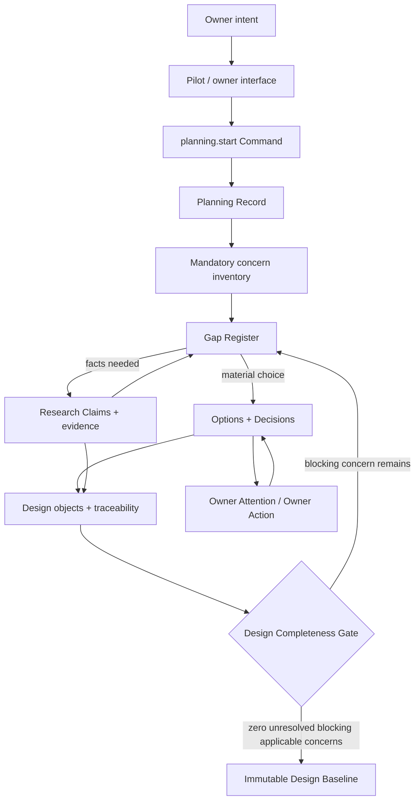
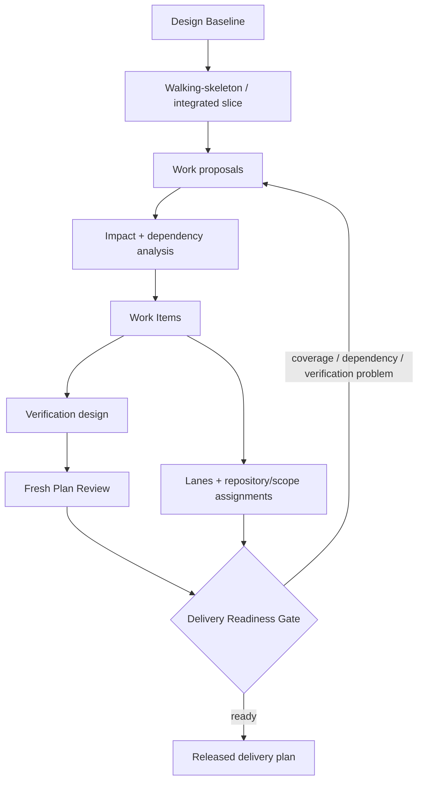
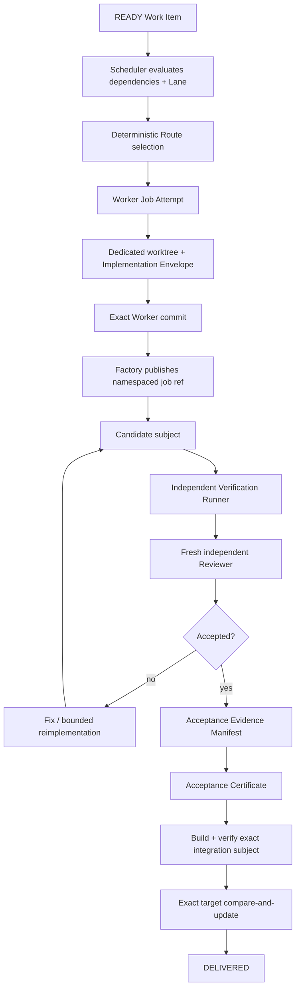
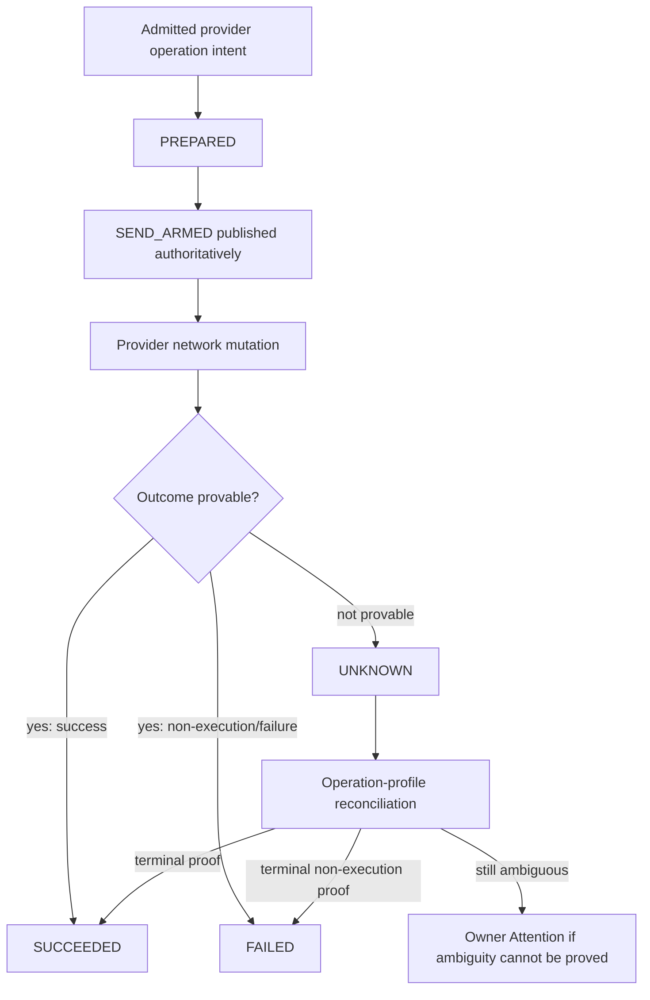
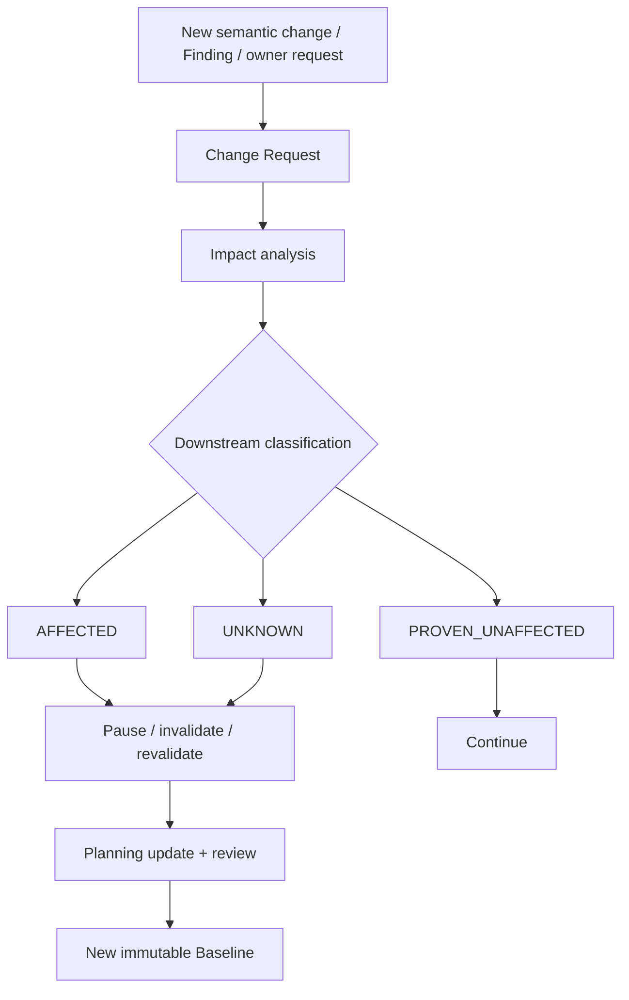
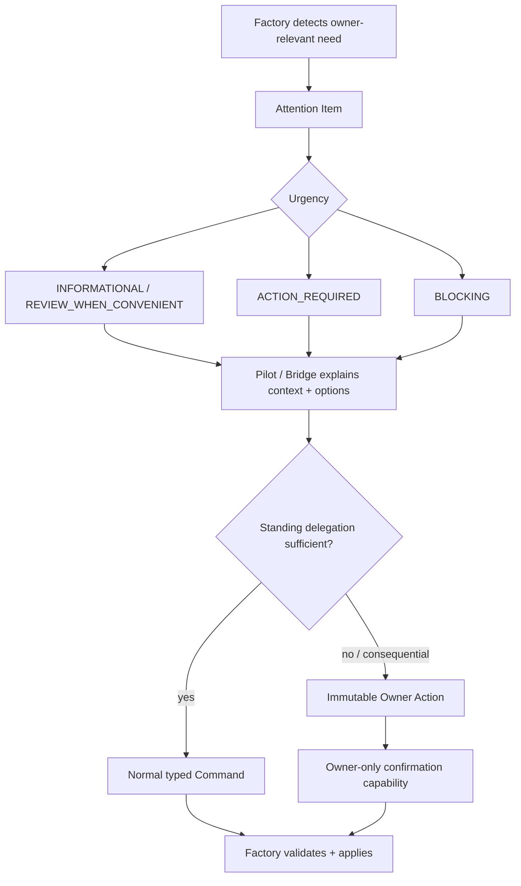
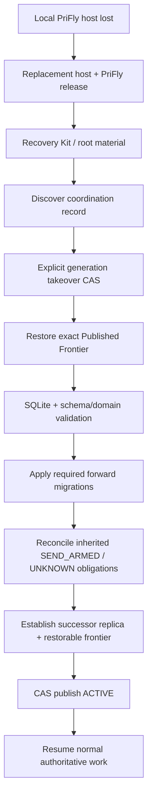
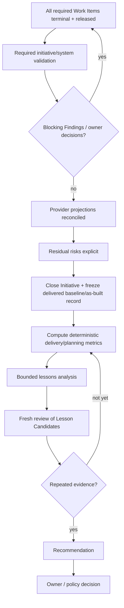

# Product lifecycle

Kind: explanation

This document shows how PriFly's existing canonical subsystems participate in one end-to-end piece of software work. It is a **cross-subsystem choreography**, not a second specification: each box links conceptually to the subsystem document that owns its detailed rules.

The product-level promise and success criteria live in [Product definition](product.md).

## Owner intent to Design Baseline

The first lifecycle converts an owner goal into an explicit, traceable design rather than immediately creating implementation tasks.



Important properties:

- PriFly researches discoverable facts rather than turning every unknown into an owner question.
- AI may propose applicability/classification, but Factory policy establishes effective authority.
- Strategic/Constitutional or otherwise consequential choices use the correct Owner Action path.
- Design Baselines are immutable released snapshots. Later semantic changes create Change Requests rather than editing history in place.

Canonical detail: [Planning architecture](planning.md), [Planning policy](../reference/planning-policy.md), [Pilot and owner interaction](pilot.md).

## Design Baseline to executable delivery plan

After design is complete, PriFly decomposes for early integrated/testable value first and parallelism second.



Each executable Work Item carries:

```text
Goal
Required Outcomes
Constraints
Verification
```

Tests and commands are evidence mechanisms for Verification; they are not substitutes for semantic Outcomes.

`SLICE` is the default Work Item kind. An `ENABLER` is exceptional and names the consumers that make it necessary.

Canonical detail: [Planning architecture](planning.md), [Schemas](../reference/schemas.md).

## Work Item to delivered code

This is the normal autonomous delivery path for one ready Work Item.



The important identity chain is exact:

```text
Planning Baseline
→ Work Item revision
→ Worker Attempt
→ candidate commit
→ verification evidence
→ Reviewer verdict
→ Acceptance Certificate
→ exact integration subject
→ exact target update
```

Any material change to the bound subject invalidates the relevant certificate rather than silently carrying approval forward.

Canonical detail: [Execution architecture](execution.md), [Review and validation](review-and-validation.md), [Acceptance contract](../reference/acceptance-contract.md), [Provider integration](providers.md).

## Provider side-effect lifecycle

External effects follow a separate durable obligation lifecycle. This is intentionally distinct from ordinary in-memory request/retry logic.



`SEND_ARMED` is the crash-safe possible-send boundary. A recovered unresolved SEND_ARMED operation is treated as possibly sent; PriFly does not blind-retry an operation merely because its result was not observed.

Canonical detail: [Provider integration](providers.md), [Provider operation profiles](../reference/provider-operation-profiles.md), [State machines](../reference/state-machines.md).

## Post-baseline change and impact flow

A released baseline is not edited in place when the product/design changes. PriFly opens a Change Request and computes conservative blast radius.



`UNKNOWN` is conservative: absence of a discovered impact edge is not proof that downstream work is unaffected.

The replacement baseline becomes the authority for newly released downstream work. Existing accepted evidence remains historical evidence for the exact subject it originally certified.

Canonical detail: [Planning architecture](planning.md), [Context and code intelligence](context-and-code-intelligence.md).

## Owner Attention and consequential authority

PriFly's autonomy is bounded by durable Attention Items rather than by keeping the Owner continuously in the execution loop.



Silence, conversational ambiguity, or Pilot interpretation is never consequential confirmation. Pilot may draft and explain an Owner Action but cannot mint the owner-control proof.

Canonical detail: [Pilot and owner interaction](pilot.md), [API contract](../reference/api-contract.md), [Schemas](../reference/schemas.md).

## Local-host loss and recovery flow

The Factory host is disposable; acknowledged authoritative state is not.



Recovery restores the coordination-selected authoritative frontier, not merely the latest bytes that happen to exist remotely. Uploaded-but-unpublished tails are not promoted into history.

Canonical detail: [Persistence and durability](persistence-and-durability.md), [Recovery and upgrades](recovery-and-upgrades.md), [State machines](../reference/state-machines.md).

## Initiative closure and learning loop

Delivery is not complete merely because all code merged. Initiative closure verifies that the delivered system and its external projections are in a known terminal state.



The learning ladder remains:

```text
Observation
→ Lesson Candidate
→ reviewed Lesson
→ repeated evidence
→ Recommendation
→ owner/policy decision
```

Factory may automate measurement and bounded experimentation; it does not autonomously rewrite Constitution or governing policy.

Canonical detail: [Experiments, metrics, and learning](experiments-and-metrics.md), [Observability, retention, and replayability](observability-and-retention.md), [Planning architecture](planning.md).

## How to read these flows

The diagrams intentionally omit implementation mechanics that belong to lower-level contracts. In particular:

- they do not define SQLite table layout;
- they do not define HTTP paths or transport framing;
- they do not replace the authoritative state machines;
- they do not add new permissions or lifecycle states;
- they do not imply every optional optimization is active in the first executable milestone.

When a diagram and a subsystem/reference contract appear to disagree, the subsystem/reference contract and accepted ADRs are authoritative and this lifecycle document must be corrected.