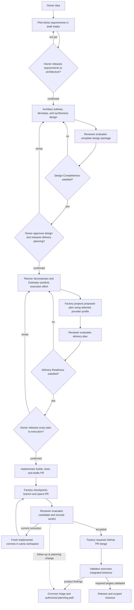

# Product lifecycle and owner journey

Kind: explanation

### Figure 2 — End-to-end product journey

A release can cover a subset of a larger Initiative. An Initiative may therefore have several releases before its own closeout. The order is not a demand to finish the entire Project's lifetime architecture before delivering anything; each Planning Record governs a bounded capability or change.

---

## User stories and a worked journey

### Core user stories

| ID | Story | Completion visible to the owner |
|---|---|---|
| US-01 | As an owner, I describe an idea without knowing its implementation language. | Pilot records a draft requirements brief and open questions without starting project Workers or adopting examples as binding choices. |
| US-02 | I want decisions explained with meaningful alternatives. | A decision package shows the question, evidence, recommendation, consequences, reversibility, and required authority. |
| US-03 | I want control over when architecture, delivery planning, and execution start. | Three explicit owner releases identify exact packages and permitted scope; Design Completeness and Delivery Readiness independently show remaining engineering blockers. |
| US-04 | I want several repositories and different harnesses to work together. | One Project can schedule role-appropriate jobs across its repositories with explicit dependencies and collision control. |
| US-05 | I want ordinary work to proceed while I am absent. | Independent lanes continue; owner-gated work waits in a durable Attention Item. |
| US-06 | I want a new Pilot whenever the old one becomes saturated. | The new session registers, receives orientation, and resumes queued discussions from Factory records. |
| US-07 | I want tests reused when the evidence is adequate. | Reviewer records which Implementer evidence was accepted and which checks it actually reran. |
| US-08 | I want a small review correction to be cheap. | Implementer inherits the worktree, dependencies, and permitted workspace services without a full environment rebuild. |
| US-09 | I want discovered work preserved without endless churn. | Follow-ups have a home, history, size/criticality assessment, and hold or batch decisions. |
| US-10 | I want to know whether the product actually works. | Validation Targets distinguish pending, failed, and validated integrated behavior. |
| US-11 | I want product failures fixed through normal engineering controls. | Validator findings enter common triage, receive explicit precedence, and return their targets to pending only after blocking fixes land. |
| US-12 | I want all code integrated through PRs. | GitHub records the merge; no Worker or Factory bypasses that route with a direct target-branch push. |
| US-13 | I want to change direction without losing provenance. | A Change Request identifies affected work, preserves the old baseline, and publishes a reviewed replacement. |
| US-14 | I want to recover after losing the machine. | Recovery restores published state, metrics, obligations, and retained code without the old local checkout. |
| US-15 | I want to upgrade the factory without losing my way to repair it. | Health checks and a standalone repair path exist; rollback obeys an explicit publication cutoff. |
| US-16 | I want to compare Routes using outcomes, not intuition. | Experiments include failures, rescue effort, review quality, delayed validation outcomes, and missing measurements. |
| US-17 | I want consistent output every time. | CLI, Pilot, board projections, and future GUI are rendered from the same structured records and versioned templates. |
| US-18 | I want a release and closeout to mean something. | Required acceptance evidence, validation, scoped findings, and operational handoff are complete or explicitly dispositioned under the governing scope. |
| US-19 | I want to inspect and mark up a coherent design before decomposition. | The Review Package includes rendered documents, source files, baseline diffs, diagrams, review results, and a response to each annotation. |
| US-20 | I want an existing-product feature to build on the current design. | A feature change package references the existing baseline and proposes focused document edits, additions, and ADRs instead of redesigning the whole product. |
| US-21 | I want GitHub to show both the plan and how review progressed. | Enabled Initiative milestones, Epics, issues, labels, relationships, and board views reflect Factory state; issues and PRs show the configured review/correction history. |
| US-22 | I want to use Pilot without interrupting Workers. | The owner session opens separately, Worker observation is read-only by default, and Worker creation does not steal focus. |

### Worked example: an Archive project

The following example is illustrative. **Archive** is a hypothetical containerized backup application with a service repository and a CLI repository. Its names and detailed behavior are not PriFly product requirements.

**Idea.** The owner tells Pilot: “I need encrypted backups and a way to prove I can restore them.” Pilot records that need through Factory. “Maybe use object storage later” is stored as exploratory context, not as a requirement to use a particular protocol.

**Intake and first release.** Pilot asks which files matter, who will restore them, what must be preserved, how keys are supplied, and what successful recovery means. Answers, suggestions, and unresolved questions remain distinguishable in the draft Planning Record. Pilot presents the requirements brief and asks, “Would you like to release these requirements to architecture?” Only the owner's confirmation authorizes architecture and supporting investigation within that scope.

**Design.** An Architect proposes the design outline. Authorized Scout and Researcher jobs supply existing-project and external facts respectively. Architect contributions define backup/restore behavior, interfaces, key handling, failure behavior, and verification intent; a synthesis job reconciles the complete package. An independent Reviewer evaluates the package and cross-document consistency. The owner receives a PRD, proposed canonical documentation, diagrams, decisions, review results, and open questions. Missing recovery behavior remains a Design Completeness gap.

**Design approval and second release.** The owner marks up the package, sees the disposition of each correction, and confirms the exact revised design to release delivery planning. Passing Design Completeness alone does not start Planner jobs.

**Planning.** Planner creates a small integrated path: create a backup, restore it into an empty instance, and compare the restored content. Estimator predicts execution time and, where supportable, token use for each proposed Work Item from its defined scope, predicted file footprint, Route, and comparable history. Planner owns decomposition and sequencing. Verification definitions describe the properties to prove; they do not stop at “run tests.”

**Plan projection and third release.** Under the selected GitHub profile, Factory represents the backup-and-restore Initiative as a GitHub milestone, with any configured Epic tracking issues, Work Item issues, relationships, labels, and board entries. These remain proposed, not execution-ready. Reviewer evaluates the delivery plan. After Delivery Readiness passes, Pilot presents scope, dependencies, estimates, validation coverage, and provider links; the owner releases the exact delivery plan to execution.

**Work.** Implementer receives one Work Item, not the whole planning conversation. It develops the change in its assigned workspace, writes tests, and submits a candidate SHA, verification evidence, and structured PR Draft. Factory pushes the candidate, confirms the remote head, and creates the review-ready PR before dispatching Reviewer. Reviewer inspects the code, tests, and applicable attack probes. Sufficient evidence can be reused without a duplicate test run.

**Correction.** Reviewer identifies that a restore error is swallowed, violating the current Work Item. It files `CURRENT_CORRECTION`. Factory publishes the changes-requested review and dispatches a fresh Implementer in current-correction mode into the same workspace. It returns a new candidate, evidence, and a per-finding correction response. Factory publishes the response; a fresh Reviewer evaluates that subject and records a new verdict. The PR contains the detailed exchange, and the linked issue contains readable round summaries and links. A separate observation about an unrelated progress-display improvement is `FOLLOW_UP`; it does not block the restore PR.

**Merge.** Factory publishes the candidate branch and maintains its GitHub PR. If another PR has changed the base, the configured merge policy decides whether a conflict-free branch update is required. An actual conflict is routed to Rebaser. GitHub, not a direct push by Factory, merges the approved PR.

**Validation.** Once the backup-and-restore slice is runnable, Factory schedules Validator against a fixed integrated version set. Validator uses a fresh representative stack and the normal documented configuration. The unit tests passed, but the real restore process cannot find its key file. Validator records the failure and a Finding. It does not patch the container interactively and declare success.

**Triage.** Triage evaluates the product defect and its blocking relationship. Factory releases it to planning with increased precedence because it blocks a required Validation Target. It becomes an ordinary bug Work Item with requirements, evidence, implementation, review, and a PR. The unrelated display finding remains held until it can be grouped with related small improvements. A batch outside the owner-released product or maintenance scope waits for the appropriate new release.

**Retest readiness.** When every known blocking fix for the restore target is integrated, Factory changes that target from `VALIDATION_FAILED` to `PENDING_VALIDATION`. This increases the normal pending-target count. The normal validation scheduler decides when to run it again; there is no separate fix-wave scheduler.

**Release and closeout.** The release record identifies the tested service image, CLI version, configuration, and validation evidence. Before Initiative closeout, the held display finding is either planned and completed with a coherent batch or explicitly found not to require action. Merely creating a future ticket does not satisfy closeout. Historical metrics then reveal how much work was spent reaching a working product, including the late restore defect.
