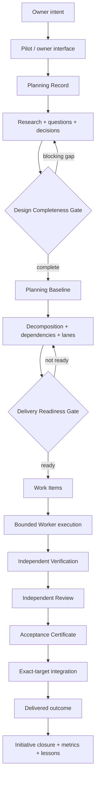

# Product definition

Kind: explanation

This document defines PriFly as a product: who it is for, what experience it promises, which jobs it must perform, and what v1 must make possible. It does **not** restate subsystem architecture, API payloads, schema fields, persistence mechanics, or implementation plans. Those remain in the linked canonical design documents.

PriFly is a **local-first autonomous software factory** for an owner who wants to delegate substantial software-delivery work without delegating away product direction, consequential authority, or the ability to understand what happened.

> **Big orchestration system, small cognitive jobs.**

## Product promise

The owner should be able to express a software goal conversationally and have PriFly carry that goal through structured planning, bounded autonomous execution, independent validation, exact integration, and durable learning with minimal manual coordination.

PriFly should absorb the repetitive coordination burden that normally sits between idea and delivered code:

- discovering what is actually being asked;
- researching facts instead of asking the owner for discoverable information;
- exposing the decisions that genuinely need owner authority;
- turning approved design into executable slices and dependencies;
- scheduling safe parallel implementation;
- preserving expensive in-progress work;
- independently verifying and reviewing consequential AI output;
- integrating exactly the code that was accepted;
- recovering from local-host loss without losing authoritative project history;
- preserving useful delivery evidence and metrics for future decisions.

Autonomy does **not** mean silent authority. PriFly may autonomously execute inside established policy and delegation, but material product, architecture, risk, security, compatibility, recovery, or constitutional decisions remain governed by their explicit authority paths.

## Primary user

The primary v1 user is a single **Owner** responsible for one or more software Projects and repositories.

The Owner wants PriFly to:

- operate for long stretches without constant prompting;
- surface only the questions, approvals, blockers, risks, and incidents that actually need attention;
- explain current state and why work is blocked or proceeding;
- preserve exact code/evidence so work can survive local environment loss;
- keep implementation aligned with approved intent even when many Workers execute concurrently;
- improve future routing/planning decisions from evidence without silently rewriting policy.

v1 is not designed as a multi-tenant engineering organization control plane. The [security model](security.md) and [vision](vision.md) define the deliberate v1 trust and deployment boundaries.

## Jobs to be done

### Turn intent into a complete design

When the Owner describes a goal or change, PriFly should create a durable Planning Record, identify applicable concerns, research factual unknowns, expose material choices, and drive the work to the Design Completeness Gate without converting unresolved uncertainty into guessed requirements.

See [Planning architecture](planning.md).

### Turn approved design into executable delivery

Once design is complete, PriFly should decompose it into the shortest meaningful integrated/testable path, represent dependencies and safe concurrency, and produce Work Items with explicit Goal, Required Outcomes, Constraints, and Verification.

The resulting delivery plan must pass the Delivery Readiness Gate before autonomous implementation begins.

### Execute useful work autonomously

PriFly should dispatch bounded Worker jobs, provide each attempt only the context and authority it needs, isolate concurrent work, preserve exact Git commits, and use deterministic scheduling/routing rather than depending on a conversational model to remember what comes next.

See [Execution architecture](execution.md) and [Routing and capacity](routing-and-capacity.md).

### Challenge AI-produced work before promotion

PriFly should not treat producer confidence as acceptance. Consequential planning, implementation, fixes, and verification artifacts must be challenged by the required independent review/verification path before they can advance.

See [Review and validation](review-and-validation.md).

### Keep the Owner in control without making the Owner the scheduler

The Owner should be able to ask what is happening, why a decision matters, what is blocked, and what PriFly recommends. Routine reversible work may proceed under policy/delegation; consequential Owner Actions require the correct owner-control authority.

See [Pilot and owner interaction](pilot.md).

### Survive loss of the local PriFly environment

The local Factory stack is disposable. PriFly should preserve acknowledged authoritative state, important historical metrics, required acceptance evidence, and bounded in-progress code so a replacement host can resume from the Published Frontier rather than reconstructing project history from chat logs or provider UI.

See [Persistence and durability](persistence-and-durability.md) and [Recovery and upgrades](recovery-and-upgrades.md).

### Learn without self-governing

PriFly should measure routing, estimation, review, verification, rescue, and delivery outcomes and may run controlled experiments. Evidence can produce reviewed recommendations; it cannot silently alter Constitution or governing policy.

See [Experiments, metrics, and learning](experiments-and-metrics.md).

## Core product experience

The expected Owner experience is:

1. **State the goal.** Describe what should become true, not how to orchestrate agents.
2. **Clarify only material decisions.** PriFly researches facts and batches owner questions around consequential choices.
3. **Review the design boundary.** PriFly reaches explicit design completeness before multiplying ambiguity into implementation tasks.
4. **Let the Factory work.** PriFly decomposes, schedules, implements, fixes, verifies, and reviews within bounded policy and capacity.
5. **Receive Attention only when necessary.** The Owner handles real decisions, approvals, blockers, risk acceptance, conflicts, incidents, or useful briefings rather than supervising Worker mechanics.
6. **Receive delivered, evidenced work.** Accepted code is exact, independently evidenced, and integrated against the exact validated target state.
7. **Continue from durable history.** PriFly retains the compact semantic record needed to explain, recover, measure, and improve the system over time.

## High-level product journey

The detailed cross-subsystem variants of this journey live in [Product lifecycle](product-lifecycle.md).

## v1 product capabilities

v1 must establish the product loop, not every future optimization. The target capability set includes:

- conversational Owner interface over durable Factory state;
- typed planning with research, decisions, concern coverage, strict gates, baselines, and Change Requests;
- Project → Initiative → Epic → Work Item delivery hierarchy across one or more repositories;
- deterministic scheduling, dependencies, Lanes, routing, Capacity Pools, and cumulative execution envelopes;
- bounded AI Workers for research, architecture/planning, implementation, fixes, review, validation, and related cognitive jobs;
- dedicated worktrees and exact Git checkpointing for Worker code;
- independent Verification and adversarial Review;
- exact Acceptance Certificates and exact-target integration;
- provider projections and durable provider obligations without making GitHub workflow authority;
- SQLite canonical state with off-host durability and explicit takeover/recovery;
- durable Owner Attention and separate consequential confirmation;
- authoritative historical metrics and controlled experimentation;
- versioned semantic API/schema contracts that allow future Pilot/Bridge/CLI surfaces to share the same Factory semantics.

## Explicit v1 non-goals

The canonical [roadmap](roadmap.md) and [security model](security.md) hold the detailed deferrals. Product-level non-goals include:

- replacing the Owner as product/strategic authority;
- hostile/malicious Worker containment as a v1 guarantee;
- enterprise multi-user or multi-tenant control-plane operation;
- high-availability automatic leader election;
- multi-cloud disaster recovery or survival of total external-account loss;
- atomic distributed commits across repositories;
- autonomous mutation of Constitution or governing routing/planning policy;
- making provider issues/projects/PR state the canonical PriFly workflow database.

## Product success criteria

v1 is product-meaningful when the following end-to-end statements can be demonstrated, not merely when individual subsystems exist:

- The Owner can state a non-trivial software goal and PriFly can carry it from Planning Record through an approved delivery plan without relying on hidden conversational state.
- PriFly can execute at least one meaningful integrated slice autonomously across implementation, verification, review, and exact integration while respecting Work Item scope and execution bounds.
- A producer cannot self-promote consequential output into accepted/delivered state.
- The Owner can leave and later return through a fresh Pilot/CLI session without losing the Factory's meaningful workflow state.
- A material owner decision is surfaced through the correct Attention/Owner Action path rather than guessed from conversational ambiguity.
- Concurrent work can proceed where dependencies/collision policy allow without normal branch/worktree/migration-number coordination becoming the Owner's job.
- Loss of the local PriFly host can be recovered from the declared remote dependencies and Recovery Kit without losing an acknowledged Published Frontier.
- PriFly can explain what was delivered, which exact code/evidence/review authorized it, and which unresolved risks or Findings remain.
- Historical outcome data is sufficient to compare Routes/experiments and make reviewed recommendations without allowing metrics to mutate governing policy automatically.

These are product-level acceptance statements. Concrete implementation tests and milestone-specific thresholds belong in Planning Records, Work Items, verification plans, and release conformance.

## Product boundaries and sources of truth

PriFly deliberately separates product intent from implementation mechanics:

| Question | Canonical home |
|---|---|
| What must PriFly accomplish for the Owner? | this document |
| How does one piece of work move across the whole product? | [Product lifecycle](product-lifecycle.md) |
| What are the system boundaries/deployable components? | [Architecture](architecture.md) |
| What do PriFly's terms mean? | [`CONTEXT.md`](../../CONTEXT.md) and [Domain model](domain-model.md) |
| How is planning governed? | [Planning architecture](planning.md) + [Planning policy](../reference/planning-policy.md) |
| How are code/runtime attempts executed? | [Execution architecture](execution.md) |
| How are acceptance and independent review defined? | [Review and validation](review-and-validation.md) + [Acceptance contract](../reference/acceptance-contract.md) |
| How do clients/Workers exchange semantic state? | [API contract](../reference/api-contract.md) + [Schemas](../reference/schemas.md) |
| How is state made durable/recoverable? | [Persistence and durability](persistence-and-durability.md) + [Recovery and upgrades](recovery-and-upgrades.md) |
| Why was a hard-to-reverse trade-off chosen? | [ADR index](../adr/README.md) |
| What exact feature work should be built next? | Planning Records / Initiatives / Epics / Work Items, not a duplicate committed PRD |

PriFly therefore does **not** maintain a separate giant `PRD.md`. The product definition plus canonical design set describe the durable product; the Planning Record is the living structured feature/decomposition record.