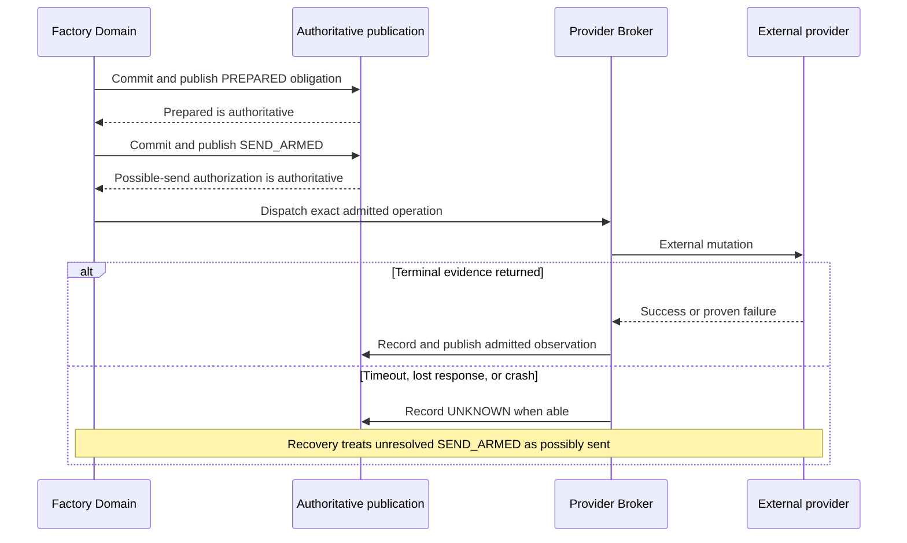

# Provider operations and configurable projections

Kind: explanation

## Provider Broker, projections, reconciliation, and rate limits

### Provider Broker responsibilities

The **Provider Broker** is Factory's privileged external-operation component. It publishes job branches, materializes enabled GitHub Initiative milestones/Epics/issues/relationships/labels/boards, publishes PRs and review/correction history, requests PR merges, and performs admitted release operations. Workers propose or produce data; they do not hold the normal credentials for these mutations.

An **operation profile** defines what an external action means, its authority, required preconditions, correlation, conflict scope, safe retry behavior, and how success/failure/uncertainty can be established. An enabled API call without an admitted profile is not a supported operation.

### Projections are second-class workflow state, not unimportant UI

GitHub issues and boards must accurately show what is happening, but Factory is the canonical workflow database. Projection records map canonical IDs/revisions to provider object IDs and the last known synchronized revision.

Factory writes the changes it knows it made and coalesces safe replaceable current-state projection updates. Historical review verdicts and correction responses are separate append-only entries and cannot be coalesced into a final status. It does not repeatedly fetch every issue to reconstruct the same state. Reconciliation uses available events, conditional reads, bounded polling, and drift checks appropriate to the provider. The exact intervals are configurable and rate-aware.

A projection can be stale without losing the canonical work. The UI must show synchronization lag or an outstanding provider obligation. Conversely, an external human edit is not ignored: the field-ownership policy decides whether it is a supported owner request, a provider-owned fact, or drift that must be explained/reconciled.

| Field class | Treatment |
|---|---|
| Factory-owned projection | Factory's canonical record drives the provider field; conflicting external edits are detected and handled under policy. |
| Provider-owned fact | Actual merge SHA, check conclusion, provider identity, and external events are observations, not rewritten wishes. |
| Explicit inbound interaction | An admitted provider action can request a Factory Command after authentication and semantic validation. |
| Unmanaged provider content | Preserve or ignore according to the integration contract; do not overwrite it merely to make a template match. |

### Durable possible-send boundary

A **Provider Obligation** records an exact intended effect before the effect may be sent. It transitions through `PREPARED`, then `SEND_ARMED`, then a proven terminal result or `UNKNOWN`.

`PREPARED` means the obligation exists but provider mutation code is forbidden to send it. `SEND_ARMED` means the possible-send authorization is authoritatively published. After that point, a crash must assume that the request **may** have been sent, even if no terminal receipt exists.

### Figure 32 — Durable provider operation

Both prepare and arm are authoritative transitions. A runtime crash before arm cannot become a sent request through a background retry outside Broker control. An unresolved armed request keeps its conflicting resource reserved until its profile proves a safe outcome or a permitted owner disposition is recorded.

### Unknown is not failure

A missing lookup result, inaccessible object, or provider timeout does not automatically prove an operation did not happen. A delayed original create may still arrive after a negative lookup. Generic retry-until-success would risk duplicate issues, comments, releases, or repeated effects.

Profiles use native idempotency keys where available, stable correlation markers where helpful, exact object/ref observation, and provider-specific evidence. If no safe resolution is possible, the operation remains unknown and surfaces Attention. This is acceptable for an ambiguous projection create; it is better than inventing exactly-once guarantees.

Observations have source/request identity and relevant provider version or freshness information. An older delayed response cannot blindly overwrite a newer accepted fact. Compensation is a separate explicit operation, not proof that the original never occurred.

### Initial operation families

| Operation | Important contract |
|---|---|
| Publish candidate branch | Exact namespaced ref and object identity; expected prior state; do not overwrite another job's branch. |
| Create/update issue or PR projection | Stable canonical correlation, field ownership, ambiguity handling, no blind duplicate create. |
| Publish review/status information | Exact candidate/review identity; avoid stale review rendering authorizing a new head. |
| Merge PR | Expected current PR head and admitted repository protections; record actual merge result. |
| Publish release/artifact metadata | Exact release manifest and artifact identity; partial success and compensation rules explicit. |
| Read/reconcile provider facts | Non-authoritative external observations become authoritative recorded facts only through admission/publication. |

### Rate limits and degraded operation

Broker accounts for provider rate-limit responses, retry guidance, per-operation urgency, and queued work. Merge/recovery observations and owner-relevant blockers can outrank routine board refresh. Unsafe operations are not retried faster simply because the owner wants more concurrency.

A provider outage can pause merges while research or local implementation continues within its durability and resource bounds. The Broker reports pending operations, last observed provider state, age, and next permitted retry/reconciliation condition. Factory does not query GitHub on every Pilot status request when it already holds authoritative project state.

| ID | Requirement |
|---|---|
| PF-PROV-01 | Every enabled external mutation has an operation-specific authority, ambiguity, conflict, and retry profile. |
| PF-PROV-02 | SEND_ARMED is authoritatively published before the first external mutation may be sent. |
| PF-PROV-03 | Unresolved armed operations retain conflict scope and are never treated as known-unsent. |
| PF-PROV-04 | Projection lag, external facts, and canonical workflow state remain distinguishable. |
| PF-PROV-05 | Reconciliation is bounded/rate-aware and does not use negative observation as universal non-execution proof. |
| PF-PROV-06 | Provider field ownership and inbound-action authority are explicit. |
| PF-PROV-07 | Normal status queries use Factory state rather than unbounded live provider scans. |

### Provider Projection Profiles

A versioned, Project-scoped **Provider Projection Profile** defines which canonical information is represented externally, where it is rendered, which fields Factory owns, and how relationships and history are published. The Project may enable only the views it uses. The profile is configuration, not another planning engine.

| Canonical meaning | Initial GitHub representation when enabled | Optionality and governing rule |
|---|---|---|
| Project | Overview/tracking issue and/or one or more configured GitHub Project board/roadmap views. | Either representation can be disabled independently. A GitHub Project view is not the canonical PriFly Project. |
| Initiative | **Repository-scoped GitHub milestone**, with one mapping per participating repository as needed; optional supplementary tracking summary. | Milestone projection can be disabled. The milestone's source is the Initiative, never a separate canonical Milestone or an Epic. |
| Epic | Tracking/parent issue, with native child relationships or explicitly selected link rendering. | May be omitted externally without discarding canonical parentage. |
| Work Item | Issue with Goal, Outcomes, Constraints, Verification, estimate, dependencies, state, and canonical links. | Issue projection is optional; PR linkage and required review can use canonical references when no issue exists. |
| Classification | Selected labels and/or configured custom fields for type, area, priority, or other canonical classifications. | Vocabulary and field mapping are profile-defined, not inherited wholesale from the old skill. |
| Relationships | Enabled parent/child, dependency, issue/PR, validation, and scope links. | Native capabilities are qualified; explicitly configured rendered links can provide a presentation alternative. Scheduling uses canonical edges. |
| Review conversation | Full technical history on PRs, with issue summaries by default; full mirroring or PR-only publication as configured. | Destination dependencies are validated; disabling issue creation cannot silently discard a requested issue conversation. |
| Current progress | Board status, views, roadmap/timeline fields, progress summaries, and approved Initiative dates. | Each may be disabled. Status changes follow canonical records, not card movements. |

GitHub milestones are repository-scoped, while GitHub Projects supply configurable views and fields [S40](../reference/source-register.md#source-s40). The mapping key therefore includes canonical identity, representation slot, provider repository/scope, and profile version. A multi-repository Initiative can be one-to-many externally. Provider percentage-complete and milestone closure are projections of issue activity, not proof of PriFly Initiative closeout: required validation, findings, and release obligations still govern canonical completion.

An enabled representation must have its required destinations, permissions, and capabilities. For example, issue summaries need an issue destination; native hierarchy links need supported endpoint objects; native required review needs an eligible identity. Invalid combinations fail profile admission or require an explicit alternate mapping. They are not silently degraded by a model.

v1 implements the GitHub adapter. The profile and record contracts separate canonical meaning from GitHub object names so a later GitLab adapter can map the same concepts to qualified capabilities. This separation does not add GitLab implementation to v1. The required PR integration/merge profile is separate from optional planning views: disabling a board, milestones, or issues cannot disable review, evidence, protection, or merge requirements.

### Desired-state compilation, history delivery, and profile changes

Factory compiles the recorded plan, authorized phase, selected profile, and retained mappings into desired provider state. Provider Broker executes admitted operations in dependency order and records exact identities/outcomes. Reconciliation compares desired and observed state under field ownership rules. It does not infer decomposition from labels or reconstruct review state from prose.

Current summaries and board fields may collapse to the latest desired value. Review and correction entries retain every event and canonical order. Each rendered entry carries stable correlation to its canonical record; destination mappings record successful publication. A lost posting response remains an ambiguous operation under its profile. A correlation marker helps reconciliation but is not a promise of exactly-once comment creation.

Changing a profile is versioned. Turning a representation off stops managing it under the recorded transition policy and retains its mapping/history. It does not delete or archive existing provider objects unless an explicit authorized operation requests that effect. Re-enabling reconciles those mappings before creating anything new; selected historical backfill preserves original subjects, authorship, and sequence instead of inventing new review rounds.

Unmanaged human content is preserved. External edits to Factory-owned fields become detected drift or admitted input under [Provider reconciliation](providers.md). Provider requests for changed requirements or phase release must pass the same authentication, revision, and owner-action rules as the CLI. Moving a card into Ready or closing an issue never supplies release authority.

Optional display lag is surfaced without blocking unrelated authorized work. A publication required by the current inspection, PR review, or repository merge profile remains a stage-specific prerequisite. The owner sees the affected representation, canonical/observed revisions, pending operation, age, and consequence rather than one undifferentiated “sync failed” label.

| ID | Requirement |
|---|---|
| PF-PROV-08 | Versioned projection profiles independently enable/map planning levels, labels/fields, relationships, views, and review-history destinations. |
| PF-PROV-09 | A GitHub milestone represents an Initiative; multi-repository Initiatives retain explicit repository-specific mappings. |
| PF-PROV-10 | Canonical dependencies, authority, work meaning, and closeout remain unchanged when a provider representation is disabled. |
| PF-PROV-11 | Disabling projection does not imply deletion; profile transitions retain mappings and reconcile before recreation or backfill. |
| PF-PROV-12 | Review/correction entries are durably recorded and published as history, not coalesced or overwritten by current-state synchronization. |
| PF-PROV-13 | Profile capability/destination dependencies are validated, and required PR/merge operations remain distinct from optional planning views. |
| PF-PROV-14 | Proposed-plan materialization and later state updates use durable provider obligations, idempotent canonical mappings, and explicit ambiguity handling. |
