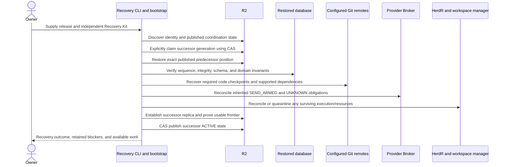

# Bootstrap, host-loss recovery and repair

Kind: explanation

## Bootstrap, host-loss recovery, and operational repair

### Recoverable scope and bootstrap materials

The recovery promise concerns loss or corruption of the local execution host while R2, configured Git remotes, provider accounts, and independently retained recovery material remain available. It does not promise survival of account-wide malicious deletion, loss of every cloud account, or loss of all recovery credentials.

v1 uses a **private Git bootstrap repository** containing a non-secret startup manifest and an **age-encrypted JSON secrets file**. age supplies the file-encryption format and supported tooling/library rather than a PriFly-designed cryptosystem [S41](../reference/source-register.md#source-s41). The qualified release pins its implementation and format compatibility.

| File/material | Content and custody |
|---|---|
| `bootstrap.json` | Versioned manifest: Factory identity, selected release/image references, deployment profile, R2 endpoint/bucket/replica/coordination coordinates, required Git remotes, encrypted-secret path and digest, secret-schema identity, and compatibility requirements. No secret values. |
| `secrets.json.age` | Encrypted structured credentials, key material or references needed by the deployment, with purpose/identity/generation fields and rotation metadata. Plaintext shape is schema-validated after decryption. |
| `README.md` | Minimal supported startup and recovery procedure, manifest/release expectations, and independent prerequisite inventory. No recovery key or plaintext credentials. |
| Independent Recovery Kit | Bootstrap repository locator and selected revision, means to fetch that private repository, age identity/decryption material, and required owner/recovery authority. Kept outside the disposable host and outside the encrypted file that depends on it. |

Initial repository access cannot depend on a credential stored only inside that same repository, and decrypting the secret file cannot require a key stored only in that encrypted file. The owner retains these prerequisites in trusted independent custody. The bootstrap repository distributes configuration and encrypted secrets; SQLite/R2 remains the authoritative workflow-state path.

### Bootstrap is not ordinary project work

On a genuinely new installation, the owner explicitly initializes a new Factory identity and remote configuration. On an existing installation, startup discovers and validates existing identity/state. Missing local files do not imply a new installation. A remote-access failure must remain an error, not trigger empty database initialization.

Bootstrap performs the following bounded sequence through the restricted startup/administration interface:

1. Receive the repository locator, selected revision, repository-fetch capability, and decryption-key reference or protected input channel. Do not copy plaintext secrets into Pilot chat, process arguments, ordinary environment dumps, logs, or Worker context.
2. Fetch that revision without executing repository-provided hooks or arbitrary code. Validate the manifest schema, expected Factory identity, release/compatibility fields, and encrypted-file identity. Record the selected Git revision rather than silently following later branch movement.
3. Decrypt `secrets.json.age` into restricted transient runtime storage or protected descriptors, validate its schema and required secret generations, and distribute only the scoped secrets needed by each trusted component. Do not write plaintext into the repository or long-lived unprotected workspace; remove transient material after provisioning and on failure.
4. Validate remote access and discover existing Factory coordination/state. An inaccessible bucket, mismatched identity, or missing prerequisite is an actionable startup error. Initialize a new Factory only after an explicit new-identity action; recovering an existing one requires the separate takeover authority and exact-frontier procedure below.
5. Start the manifest-selected container stack in bootstrap/recovery mode, verify state and runtime ownership, establish usable durability, and publish `ACTIVE` only when its requirements are satisfied. Attach Pilot afterward or expose truthful pre-ACTIVE diagnostics.

Updating bootstrap configuration or rotating credentials creates a new reviewed manifest/encrypted-secret revision. Rotation verifies clean-host acquisition and preserves keys or a valid rewrap path for every supported recovery root. A stale bootstrap revision cannot be silently accepted if its secrets or compatibility no longer support the published state.

The deployment is a disposable container stack with a packaged core binary and pinned runtime dependencies. Starting it on a replacement machine should not require reinstalling that machine's operating system or reconstructing the previous user's home directory by hand. The host still needs the declared container runtime and operator bootstrap prerequisites.

### Figure 36 — Empty-host recovery

Some inherited provider operations can remain unknown after read-only reconciliation. Activation must preserve their conflict reservations and may allow unrelated safe work under policy; it must not clear the uncertainty simply to reach an `ACTIVE` display. If the unresolved operation affects the safety of activation itself, recovery remains blocked.

### Interrupted recovery

The coordination record retains the predecessor frontier while the successor is `INITIALIZING`. If that successor dies before activation, a later recovery advances generation and starts from the same last published authoritative source. Locally restored or migrated bytes that were never activated do not silently become the chosen history.

Replica namespaces are generation-specific. An old process uploading to its abandoned namespace cannot replace the successor's authoritative pointer. Lost CAS responses require exact read-back proof; when that proof is unavailable, recovery stops at an explicit unresolved step rather than guessing.

### Recovering workspaces

Factory reconstructs needed workspaces from durable branch checkpoints and current Work Item/attempt records. Warm caches and running services may be gone. That is acceptable under host-loss recovery; the guarantee concerns published state and checkpointed code, not resurrection of arbitrary process memory.

Previously running attempts become interrupted/reconciled. New attempts get new identities and appropriate scopes. A stale runtime that later reappears cannot submit a result as the current attempt. A current-correction Implementer can reuse a surviving healthy workspace after normal handoff, or use a reconstructed one after host loss; it must not assume hidden pre-crash state still exists.

### Pre-ACTIVE repair path

A restricted recovery CLI is available when normal Factory/Pilot services cannot become active. It can inspect recovery status, diagnose remote access, provide or rotate bootstrap credentials, retry a restore or reconciliation step, inspect manifests, and produce a sanitized diagnostic bundle.

It cannot run normal project delivery before canonical state and authority are established. This keeps the repair mechanism usable when PriFly itself is broken without creating an unrestricted alternate workflow engine. The owner does not need a healthy Pilot or the normal Attention Queue to repair the Factory database access path.

### Restore drills

Periodic disposable restore drills verify actual recovery from the published source and its required external dependencies. They check historical metrics, command results, findings, work relationships, provider ambiguity, and pinned evidence—not just that SQLite opens.

At least one verified recovery root is retained against ordinary cleanup until a newer verified root replaces it. Drills report measured recovery time and failures. The product does not promise a numerical recovery-time target until the selected deployment and data size have been tested; the practical goal is a straightforward automated replacement rather than enterprise failover.

| ID | Requirement |
|---|---|
| PF-REC-01 | Existing Factory recovery is distinguishable from explicit initialization of a new Factory. |
| PF-REC-02 | An independently retained Recovery Kit avoids dependence on lost local state or circular credentials. |
| PF-REC-03 | Recovery restores the published authoritative source, not arbitrary latest replica bytes. |
| PF-REC-04 | Interrupted initialization retains a valid predecessor recovery path. |
| PF-REC-05 | Recovered unresolved provider operations preserve their conflicts. |
| PF-REC-06 | Pre-ACTIVE repair works without a healthy Pilot or normal workflow service. |
| PF-REC-07 | Restore drills exercise semantic state, metrics, code roots, and evidence dependencies. |
| PF-REC-08 | Reconstructed work uses new attempt identities and does not accept stale resumed execution. |
| PF-REC-09 | v1 bootstrap fetches a selected private-repository revision containing `bootstrap.json` and `secrets.json.age`, validates it, and provisions the declared stack. |
| PF-REC-10 | Initial repository access and age decryption material are independently retained; neither can depend solely on the repository/file it unlocks. |
| PF-REC-11 | Decrypted secrets use restricted transient handling and scoped provisioning, not prompts, logs, plaintext Git files, or ordinary Worker environments. |
| PF-REC-12 | Bootstrap and secret rotation preserve identity, compatibility, remote-state discovery, and supported recovery-root decryption. |
