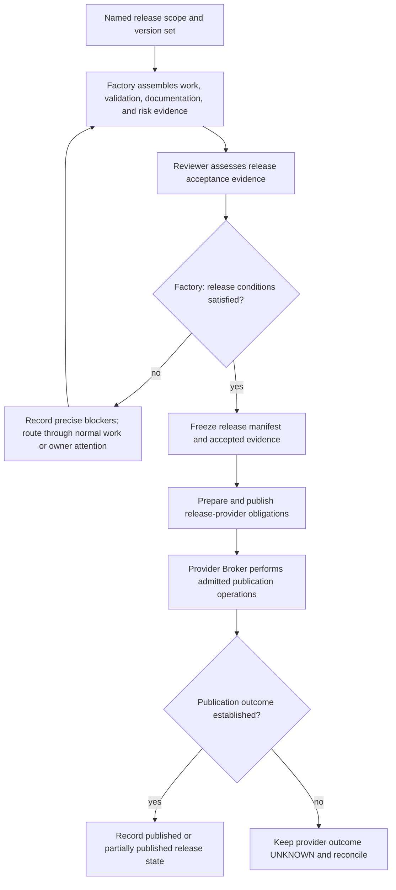
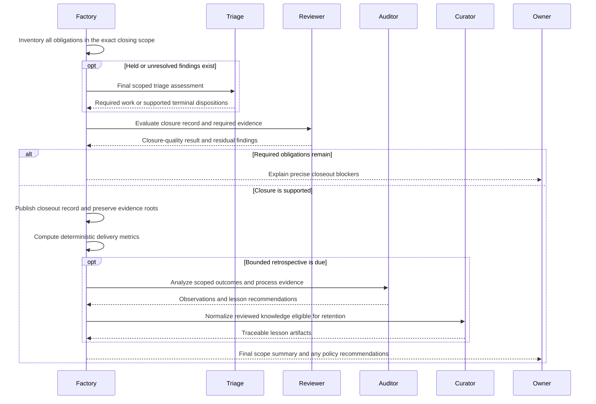

# Release and scope closeout

Kind: explanation

## Release, closeout, and completion of the product journey

### Distinguish integration, release, and closeout

**Integrated** means GitHub merged a Work Item's PR into the target. **Validated** means an exact product capability was exercised successfully in its intended context. **Release** is a named delivered version set with the required packaging, evidence, documentation, and publication. **Closeout** is accounting for every obligation in a named scope and deciding that scope is complete.

A Project can continue for years. Its individual Initiatives, Epics, planning scopes, and releases can close at different times. “Delivered” in owner briefings must include the specific level meant: merged, validated, released, or scope closed. It must not hide those distinctions behind one unqualified green status.

### Release record and readiness

A Release record names its Project, intended audience/use, included capabilities and Work Items, exact repository/build versions, applicable quality/security/supply-chain profiles, required Validation Targets, required evidence and documentation, unresolved residual risks, dependencies, and publication operations. Multi-repository release records contain a version set rather than implying a cross-repository atomic commit.

Factory assembles the readiness record from canonical data. A bounded Reviewer evaluates release acceptance evidence and any semantic sufficiency questions under the release's profiles; this is evidence assessment, not an automatic repetition of every implementation test and Validation Run. Mechanical checks confirm exact versions, required signatures/attestations where adopted, complete references, and current evaluation state.

For a container product, ordinary release contents may include an image digest, source revision, build recipe/provenance, supported configuration, operator instructions, and the validated scenario evidence. These are selected by the product's release profile; the example does not mandate a specific registry service for every Project.

### Figure 29 — Release readiness and publication

### Partial delivery and publication

Multi-repository PRs and multi-artifact publications can succeed partially. PriFly records that state honestly. Planning must define compatible sequencing, feature flags, data migration order, or other methods when a partially delivered feature would otherwise be unsafe. No v1 mechanism promises atomic publication across unrelated providers.

An interrupted release is not automatically rolled back. The operation profiles determine whether compensation is meaningful; already consumed external releases cannot be made nonexistent by changing Factory's database. The owner receives explicit actions when automatic safe continuation is unavailable.

### Closeout gate

Closeout evaluates the exact scope against its obligations. Required Work Items must have the required terminal/integration state. Required Validation Targets must be validated for the relevant versions or legitimately not required. Required release/publication operations must be known. Documentation and operator/support obligations must be current. Material residual risks must have valid treatment and authority.

The common Triage Backlog is swept for the scope. Held items, unresolved owner decisions, open current corrections, planning-only follow-ups, and duplicate links with surviving blockers prevent an unsupported closeout. Any finding that requires work must have its required outcome completed, not merely assigned.

A scope can be cancelled or intentionally reduced by an owner-authorized change. That is recorded as cancellation or changed scope, not successful completion of the original promise. Metrics must distinguish those outcomes.

### Figure 30 — Closeout and learning

The Curator only normalizes material that has the required review/authority. The sequence's retrospective does not autonomously promote an unreviewed Auditor recommendation into policy. [Section 26](experiments-and-metrics.md#metrics-experiments-and-institutional-learning) defines that path.

### Journey completion example

For Archive, merging restore code changes marks the related Work Item integrated. A Validator then exercises backup creation, configured storage, recovery with the CLI, and relevant adverse cases on the chosen container/configuration. A restore bug becomes a common triage finding; planned corrective work merges; the failed target returns to pending; the scheduler later runs the required validation again.

When those scenarios pass, the release record ties the exact container digest and CLI revision to the evidence and instructions. Before the Initiative closes, the held findings from the journey are resolved through required work or valid explicit dispositions. The owner can inspect what shipped, what was tested, why small findings were batched, how many review corrections occurred, and which costs were incurred. None of that requires preserving the original Pilot session.

| ID | Requirement |
|---|---|
| PF-REL-01 | Integrated, validated, released, cancelled, and closed are distinguishable outcomes. |
| PF-REL-02 | Release records bind exact versions, scope, evidence, documentation, risks, and provider publications. |
| PF-REL-03 | Product acceptance is not inferred from candidate review or a count of merged PRs. |
| PF-REL-04 | Partial publication/delivery is explicit; v1 does not claim atomic multi-provider release. |
| PF-REL-05 | Every scoped finding and surviving obligation is accounted for before successful closeout. |
| PF-REL-06 | Creating planned work or moving an unresolved item elsewhere cannot fabricate completion. |
| PF-REL-07 | Closure retains enough evidence and configuration identity to explain the delivered result. |
| PF-REL-08 | Lessons may inform recommendations; they cannot silently change governing policy. |
