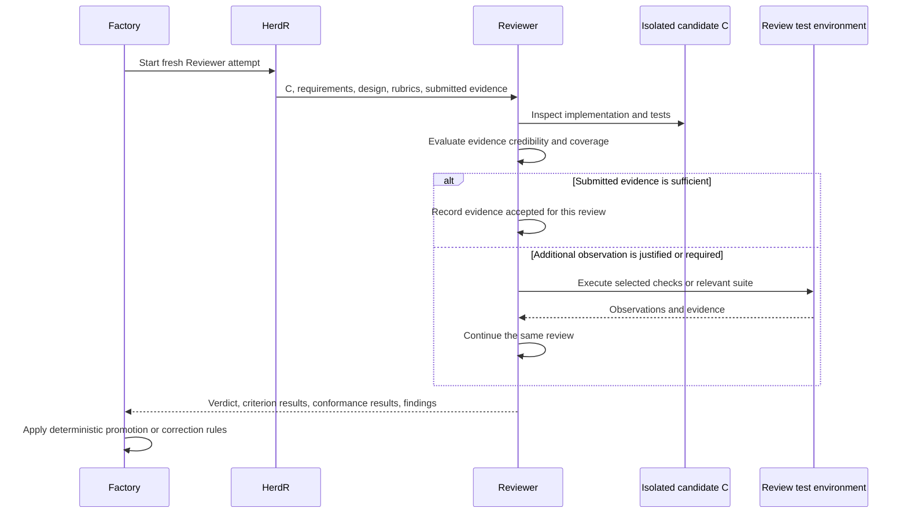
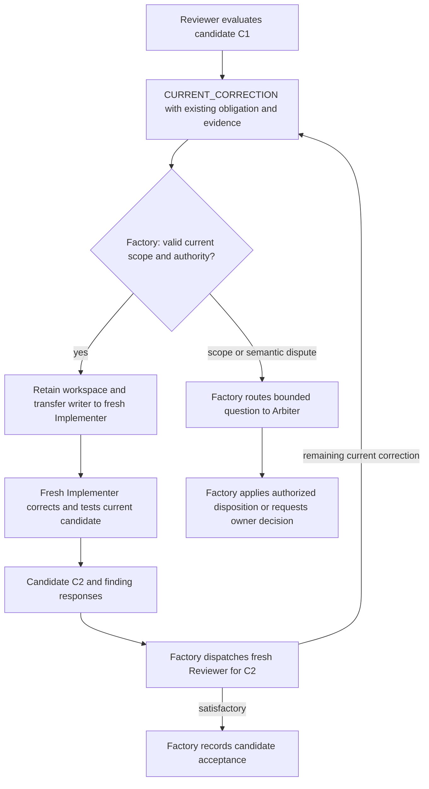

# Independent review and current correction

Kind: explanation

## Independent review and the current-correction path

### The Reviewer owns one review to its verdict

A **Reviewer** receives an exact artifact, the corresponding requirements/design, the applicable standards-backed quality profiles, existing evidence, and the relevant previous findings. Its context is independent of the producer's private reasoning. It receives the canonical review/correction history and admitted issue/PR discussion relevant to its subject so prior Findings and owner input are not forgotten. Provider comments are attributed context, not an alternate approval record.

The Reviewer answers three separate questions: Is the work good engineering? Does it conform to its governing project obligations? Is the evidence sufficient for the requested acceptance scope? Factory then determines whether its workflow conditions permit promotion.

A Reviewer can inspect existing evidence, execute a targeted test, run a broader suite, inspect an official standard, or perform an adversarial experiment in its review environment. **Gathering additional evidence continues the same review. It does not dispatch a new Reviewer to review the act of running a test.**

### Figure 18 — One Reviewer, optional additional evidence, one verdict

“Fresh” applies to independent evaluation of a changed artifact. It does not prohibit a single review from using its own growing understanding of the same artifact. A timeout or runtime failure may require another attempt, but the factory records that as an interruption rather than pretending a test execution changed the candidate.

### When evidence can be reused

Reuse is appropriate when the tested subject and relevant environment match; required checks were executed; results and limitations are available; the tests meaningfully exercise the required behavior; and no governing profile requires an additional independent run. The Reviewer records the reuse decision and why the evidence was sufficient.

Incomplete logs, changed assertions, a changed test harness, unexplained skips, flaky behavior, or a high-risk failure mode may justify more testing. These are reasons to evaluate evidence, not a universal rule to repeat the full suite. A Project can adopt mandatory independent checks for selected risks, but it must declare them before affected work is released.

The Reviewer may create temporary adversarial test material in its isolated environment. It must distinguish such material from the immutable candidate. It cannot edit the production candidate and approve its own change. A discovered improvement to the shipped test suite becomes a Finding or an authorized producer change.

### Review results and finding proposals

A review returns explicit criterion results, project-conformance results, accepted and newly gathered evidence references, a verdict, and Findings. A Finding's producer proposal is limited to:

| Proposal | Meaning in a review |
|---|---|
| `CURRENT_CORRECTION` | The current candidate fails an existing obligation required for its acceptance. |
| `FOLLOW_UP` | A concern deserves tracking but is not necessary to accept this design. |
| `PLANNING_CHANGE` | The governing requirement, design, constraint, or plan may need to change. |

The Reviewer cannot invent a new acceptance requirement after seeing the implementation and call it a current correction. It must identify the existing requirement, quality criterion, constraint, or defect in current functionality that establishes relevance. A producer proposal is not permission to rewrite the baseline.

### Tight current-correction path

A valid current correction blocks the current candidate. It bypasses the common Triage Backlog because it concerns completing work already authorized. Factory validates that the finding is tied to the active reviewed subject and within the relevant authority and scope, then dispatches an **Implementer**.

The fresh current-correction Implementer inherits the same Implementation Workspace through the controlled handoff in [Workspace handoff](execution-runtime.md). It receives the specific findings, governing obligations, reviewed candidate, and existing evidence. It changes only what is needed, runs appropriate checks, commits a new candidate, and returns a response for each finding explaining the change and evidence.

A changed candidate receives a fresh review attempt. The new review is not allowed to omit previous unresolved findings merely because its context is fresh. It evaluates the new subject and any relevant regression risk. The correcting Implementer cannot close its own findings by asserting that they are fixed; the acceptance path establishes resolution.

### Figure 19 — Correction without a new Work Item

The corrective attempts share the Work Item's cumulative execution envelope. Repeated severe failures may use a more capable eligible Route, reimplementation, or Arbiter diagnosis. They do not start an unlimited stream of new budgets.

### Planning artifacts also have correction paths

A Reviewer can find defects in a Requirement set, design, plan, estimate, or research artifact. The tight return path goes to the **responsible producing role**, not automatically to Implementer. Architect repairs a design or requirement set; Planner repairs decomposition; Researcher repairs an inadequately supported claim; Estimator repairs its estimate. These are bounded jobs within the same planning scope.

For code, tests, configuration, and documentation candidates, current correction is an Implementer job mode. The assignment identifies the active candidate and prior Findings; the role remains Implementer. Each correction uses a fresh attempt with the existing workspace and cumulative Work Item budget.

### Candidate Acceptance Certificate

An **Acceptance Certificate** is an immutable record binding the exact candidate, Work Item and baseline revisions, applicable rubric versions/evaluations, review result, accepted evidence, and governing policy. A separate mutable projection says whether that certificate is currently usable, stale, or already associated with an integrated PR.

Acceptance does not assert all evidence was independently executed. It records the evidence's actual provenance and the Reviewer's sufficiency assessment. Required external evidence objects must be durable before the acceptance is published. Missing required evidence blocks acceptance even when the code looks correct.

Acceptance authorizes a request to integrate through the admitted PR workflow. It is not a claim of successful GitHub merge, successful product Validation, or completed release.

| ID | Requirement |
|---|---|
| PF-REV-01 | Candidate review is independent of the producer and bound to an exact subject. |
| PF-REV-02 | Reviewer may trust sufficient evidence or gather more evidence within the same review attempt. |
| PF-REV-03 | Running a test does not require another Reviewer. |
| PF-REV-04 | Material candidate changes require review of the changed subject; previous unresolved findings remain visible. |
| PF-REV-05 | Current corrections identify an existing obligation and remain inside the existing Work Item/PR lifecycle. |
| PF-REV-06 | A fresh Implementer in current-correction mode uses the existing Implementation Workspace, not an automatically rebuilt environment. |
| PF-REV-07 | Planning-artifact corrections return to their responsible producing role. |
| PF-REV-08 | Reviewer does not modify and then approve the artifact under review. |
| PF-REV-09 | Required evidence is durable before candidate acceptance; its provenance is not upgraded by assertion. |
| PF-REV-10 | Review, correction, and escalation consume the same parent scope's bounded execution allowance. |

### Review conversation as structured, inspectable history

Review produces a visible engineering exchange, not only a status field. Factory retains versioned Review Results, Correction Submissions, and ordered **Review Conversation Entries**. It renders and publishes those entries through the configured provider profile. The semantic author is the responsible role/attempt; the provider posting identity is Factory's admitted account.

| Entry | Required meaning visible in the default rendering |
|---|---|
| Changes requested | Review round and exact candidate, verdict, blocking Findings and existing obligations, supporting evidence, quality/conformance results, and attack-probe outcomes. |
| Corrections submitted | Prior review and Findings, candidate before/after, per-finding changes and commit/location references, checks/evidence, and unresolved or disputed points. |
| Subsequent review | Fresh evaluation of the new exact candidate, explicit disposition of earlier blocking Findings, relevant regressions/new Findings, evidence judgment, and approval or changes requested. |
| Approved | Exact approved candidate, what was examined, accepted evidence and limitations, permitted follow-ups, and the resulting acceptance reference. Approval does not claim the PR has merged. |
| Integrated | Observed PR merge identity and actual merged revision, with remaining validation/release obligations shown separately. |

A Review Round is assigned by Factory and binds a single exact candidate, the evaluation contract, and its review attempt/results. Gathering more evidence for that candidate continues the same review. A changed candidate receives a fresh review; Factory links it to the earlier review and correction response rather than deriving round numbers by counting Markdown headings. An interrupted attempt is recorded as such and is not silently converted into a completed round verdict.

The default GitHub rendering places the **full technical exchange on the PR** and a **readable per-round summary on the linked Work Item issue**, including finding outcomes and links to the detailed entries. From the issue, the owner can understand what failed, what changed, why it was accepted, and whether it merged. The profile may instead select full issue mirroring or PR-only publication. Disabling issue projection requires an explicit compatible destination choice.

Each entry names its canonical ID, sequence, Work Item, review round, candidate or candidate transition, producing role/attempt, predecessor/cause, and referenced Findings/evidence. The text is a deterministic view of the structured record. Published history is append-only in meaning: later corrections or supersessions add entries and links; Factory does not rewrite a changes-requested comment into an approval. A separate current-summary field may be updated.

The correcting Implementer's “fixed” response is a claim. Only the subsequent admitted evaluation and Factory's gate establish resolution. A review may approve with explicitly nonblocking follow-ups, but cannot conceal a current acceptance blocker. Human/provider comments remain separate attributed input unless admitted into Factory through an authorized command path.

### Acceptance ends in an explicit Factory integration action

After Reviewer returns approval, Factory checks exact-head acceptance, resolved current Findings, required evidence, phase/scope authority, current repository protections/checks, and unresolved provider conflicts. It records the acceptance and approval conversation entry, then prepares and arms the PR-merge operation. Provider Broker requests the GitHub merge under [Git integration](git-integration.md). Only an observed merge records `INTEGRATED`, the actual merged revision, and updated validation obligations.

Required native review/check publication must be confirmed before merge when the repository profile depends on it. Optional issue-summary lag is visible but does not itself confer or remove acceptance. A native review approval and a human-readable approval comment are distinct provider artifacts; [Section 17.6](git-integration.md#review-publication-and-provider-identity) defines the identity and protection requirements.

| ID | Requirement |
|---|---|
| PF-REV-11 | Every changes-requested, correction-submission, approval, and integration exchange is an ordered structured record tied to exact subjects and responsible attempts. |
| PF-REV-12 | The configured GitHub view exposes review history on PRs and selected issue summaries/mirrors without reconstructing workflow state from comment text. |
| PF-REV-13 | Historical review/correction entries are not coalesced into current status or overwritten by later verdicts. |
| PF-REV-14 | An Attack Profile supplements rubrics with recorded probe outcomes; mandatory unprobed work remains explicit and blocking where required. |
| PF-REV-15 | Reviewer approval is followed by Factory-controlled PR merge authorization, provider execution, observed integration, and validation-state updates. |
