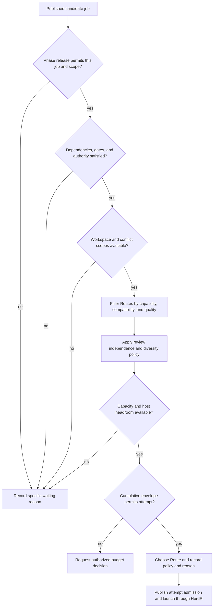

# Scheduling, routing and capacity

Kind: explanation

## Scheduling, routing, capacity, and bounded autonomy

### Deterministic scheduling with semantic inputs

Factory schedules from published records. It does not ask a central LLM to decide every next action. Semantic assessments—such as a finding's relevance or an estimate's uncertainty—are supplied by bounded Workers and recorded. Scheduling consumes those accepted facts and a versioned policy.

Admission checks include the current phase release and its exact scope/budget, dependency readiness, valid baseline, required authority, live workspace ownership, review/validation backlog, available eligible Routes, provider conflicts, host resource pressure, and the cumulative execution envelope. Scheduling a job is itself an authoritative action.

### Route and Capacity Pool

A **Route** is an immutable versioned execution configuration: harness, model identity, effort/reasoning setting, account/auth mode, capability profile, relevant tools, runtime mode, and associated **Capacity Pool**. A Capacity Pool represents a shared constraint such as a subscription allowance, a metered API budget, a local GPU, or a harness concurrency limit.

Role is independent of Route. Reviewer can run on any qualified Route. A route matrix expresses preferences, quality eligibility, risk restrictions, approved alternatives, and experiment eligibility by role/task/language. Example entries describe “normal implementation Route” or “higher-capability arbitration Route,” not eternal claims that a particular commercial model is always best.

### Selection order

Factory first removes Routes that cannot meet required capabilities, compatibility, or quality. It then applies independence/diversity requirements, capacity availability, explicit reservations, and the configured preference/cost policy. High-impact review may prefer diversity, but an inferior route is not selected solely to use a different vendor.

Every decision records the eligible set, exclusions, selected Route, policy version, and reason. A low-cost model is not a saving if its corrections and later defects cost more than the stronger route.

### Figure 14 — Admission and Route selection

### Concurrency and precedence

PriFly maximizes useful concurrency rather than targeting a fixed number of agents. CPU, memory, disk, local-model compute, Worker Docker load, edit collisions, integration traffic, reviewer backlog, and dependency critical paths constrain admission. Factory reserves operational headroom for recovery, publication, notifications, and stopping work.

Validation-confirmed product defects receive an explicit priority contribution because they represent demonstrated broken behavior and may block required targets or releases. This does not falsify severity or put a cosmetic validation finding above an unrelated critical security defect. Triage establishes severity/impact relationships; deterministic scheduling applies the policy to them. The exact weight/ranking configuration is a review parameter, not a numeric formula invented in a prompt.

### Subscription resets and unknown capacity

Capacity records distinguish observed provider data, user-configured reset schedules, estimates, and unknown values. Hourly/rolling and weekly resets can inform concurrency when reliable. Factory does not assume a provider exposes a precise balance. It records the source, observation time, timezone/reset interpretation, and confidence of a capacity estimate.

Near pressure, opportunistic experiments and speculative work are reduced before critical review/arbitration capacity. Routing to a metered fallback occurs only if the owner has authorized that account and spending policy. Exhausted subscriptions are not evaded by inventing identities or violating provider restrictions.

### Execution envelopes and failures

An **Execution Envelope** bounds cumulative work at the Work Item or planning/analysis scope: attempts, review rounds, elapsed execution, measurable usage, premium-route allocation, disk growth, and severe failures as configured. Current-correction Implementer, Rebaser, Reviewer, and rescue attempts do not reset that scope's consumption.

Operational failure—crash, expired credential, outage, quota exhaustion—uses a compatible approved alternative or waits for operator action. Semantic failure—wrong implementation, repeatedly inadequate tests, misunderstood requirement—uses correction, a higher contextual capability tier, fresh reimplementation, or Arbiter analysis. The system does not rely on the model admitting it cannot do the job.

An exhausted envelope creates a durable Attention Item with consumed effort, failed approaches, remaining options, and a recommendation. Unrelated safe work can continue.

| ID | Requirement |
|---|---|
| PF-SCH-01 | No attempt starts without published admission, valid scope, and an accountable Route. |
| PF-SCH-02 | No two modifying attempts own the same Implementation Workspace concurrently. |
| PF-SCH-03 | Priority consumes recorded semantic assessments; it is not secretly recomputed by an orchestrator model. |
| PF-SCH-04 | Unknown quota remains explicit, and capacity-source freshness is visible. |
| PF-SCH-05 | Repeated retries and corrections consume the same cumulative scope budget. |
| PF-SCH-06 | Every blocked admission has an inspectable reason and a condition that would unblock it. |
| PF-SCH-07 | Maintenance/security updates are not held indefinitely for better performance on an obsolete harness. |
