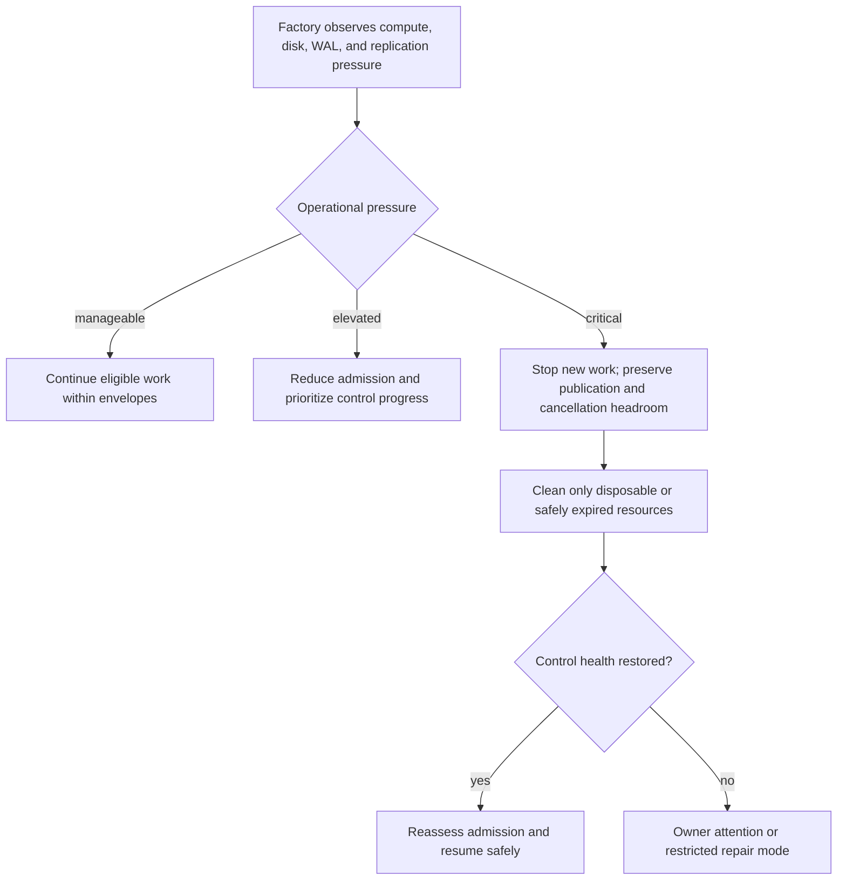

# Security, privacy and resource safety

Kind: explanation

## Security, privacy, resource safety, and data retention

### v1 trust model

Workers and configured harnesses are assumed fallible, not intentionally hostile. They can misinterpret instructions, run overly broad commands, write the wrong path, or create conflicting resources. PriFly must guard against these ordinary failures. It does not claim containment of a compromised kernel, malicious Docker client, deliberately exploitative Worker, or stolen cloud-account administrator.

This is an explicit engineering boundary, not permission to omit basic credential hygiene. Least privilege, clear paths, assigned branches, separate control-state permissions, role tooling, and observable lifecycle ownership remain required.

### Privilege separation

Factory retains canonical database access, provider mutation credentials, recovery publication credentials, and owner-action enforcement. Workers receive only their scoped client capability and approved job tools. The owner-control credential/interface is not mounted into ordinary Pilot or Worker execution.

Root or equivalent administration needed to provision Linux identities and resources is exercised by the packaged lifecycle mechanism, not given to every harness. The implementation must minimize the privileged boundary while still supporting the selected containerized runtime. A shared runtime API with unrestricted pane creation cannot be treated as a Worker-safe tool just because it is local.

Hooks and harness permission modes are useful accident-prevention controls. Shell and Docker access can bypass some tool-level path restrictions. Documentation, UI, and release claims must preserve this distinction rather than advertising a security sandbox that does not exist.

### Data leaving the Factory

Configured model/harness providers are permitted to receive the context necessary for their jobs. Enterprise DLP, multi-tenant customer-data governance, and a substantial egress-policy subsystem are not v1 scope. PriFly nevertheless avoids raw secrets in prompts/logs, unbounded environment dumps, unnecessary diagnostics exports, and dynamically invented third-party upload destinations.

A Project can choose local-model routes for experiments or sensitivity, but model location does not itself prove privacy. Runtime logs, context tools, telemetry, and external verification actions also require consideration under the selected deployment profile.

### Retention classes

Compact semantic history and historical decision/measurement evidence are retained as canonical state. Required artifact evidence is pinned for acceptance/recovery obligations. Optional diagnostics have bounded retention. Derived code indexes, caches, and terminal tails can be discarded and regenerated or lost.

A retained hash does not mean the original bytes can still be retrieved. Each historical execution has a replayability classification: required inputs retained; conditionally reproducible with specified external prerequisites; or not replayable. Even fully retained inputs do not promise deterministic model output.

Secrets are referenced by identity/generation, not copied into ordinary JSON records. Retaining an old supported recovery root may require retaining compatible decryption material or a valid rewrap path. Rotation and cleanup must not silently make the root unusable.

### Control headroom and disk pressure

Factory needs capacity to publish state, cancel jobs, reconcile operations, and recover. It must not admit so much worker storage or compute that its own control path cannot function. Admission considers actual CPU/memory/disk/WAL/replication pressure and per-scope resource envelopes.

Under severe pressure, new work stops first; caches and safely expired optional artifacts can be cleaned; required evidence remains protected. Factory never deletes a currently required recovery dependency to make room for another speculative agent run. Uncertain cleanup can quarantine a workspace or reset the disposable Worker Docker environment.

### Figure 41 — Resource-pressure response

| ID | Requirement |
|---|---|
| PF-SEC-01 | v1 security claims are limited to the declared fallible/non-malicious execution model. |
| PF-SEC-02 | Worker capabilities exclude normal canonical-state, provider-mutation, and owner-confirmation authority. |
| PF-SEC-03 | Secrets remain scoped and absent from ordinary context, logs, and canonical payloads. |
| PF-SEC-04 | Required evidence/recovery dependencies survive ordinary retention and credential rotation. |
| PF-SEC-05 | Replayability reports availability and prerequisites honestly; hashes alone are not recoverable content. |
| PF-SEC-06 | Admission preserves control-plane recovery, publication, and cancellation headroom. |

### Initial execution capability boundary

The launcher is trusted and may control attempt containers on the stack engine; the Worker-facing build/test daemon is separate. A Worker receives only its own workspace, bounded scratch/auth material and attempt-scoped API/tool capabilities. Factory state, owner controls, HerdR socket, lifecycle engine, other workspaces and R2/GitHub keys are excluded. The proxy rejects global prune, privileged/host-namespace containers and unapproved mounts/ports/resources. Engine authority is not described as harmless or as hostile-code containment. Mount/identity/resource enforcement requires real qualification; failure cannot be repaired by widening Worker privilege.

External planning import explicitly trusts registered external evaluator provenance and owner-bound identities. It validates exact subject/evidence relationships without claiming cryptographic proof of model independence. Secret rotation and subscription refresh have a trusted credential owner; private conversations/mutable user configuration never become independent review context. Selected quality overlays and proposed operating bounds are in [deployment parameters](../reference/deployment-parameters.md).
