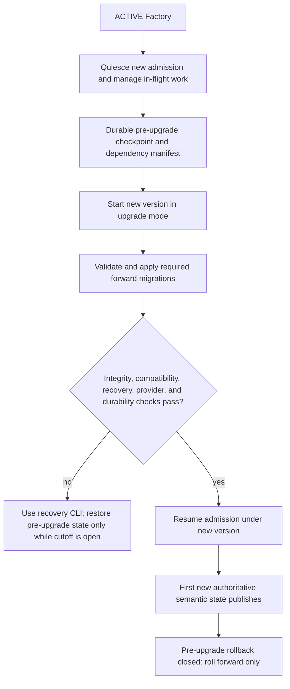
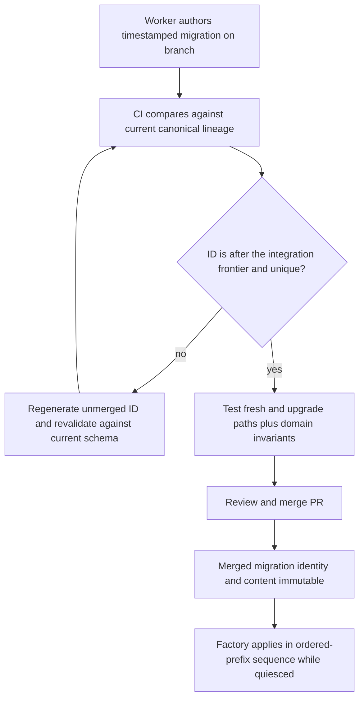

# Factory upgrades and migrations

Kind: explanation

## Factory upgrades and database migrations

### Upgrade objective

PriFly may be the tool used to help repair PriFly. An upgrade must therefore preserve an independent recovery route and perform health checks before it admits normal new authoritative work. Installation success or a running process is not sufficient evidence that the upgraded Factory is safe to use.

Factory quiesces new admission, drains or interrupts incompatible work, resolves or preserves armed provider obligations, publishes a durable pre-upgrade checkpoint, starts the new version in upgrade mode, validates/migrates state, checks compatibility and durability, and only then resumes normal work.

### Figure 37 — Upgrade and rollback boundary

The cutoff is the first successful publication of new authoritative semantic state under the new version, **even if the acknowledgement is lost**. Merely reading a health endpoint or presenting a new binary version is not that cutoff. Any activation/migration operation that itself publishes new semantic state must be included in the implementation's explicit cutoff classification; the system cannot keep calling rollback “safe” after such publication.

### Required health checks

Health checks verify database integrity and baseline/ledger compatibility, core domain invariants, command/Worker/schema compatibility, current coordination authority, working remote durability, required credentials, provider read/reconciliation access, and the ability to recover the pre-upgrade checkpoint. Required tool/runtime compatibility checks confirm that the selected harnesses can still launch, produce typed results, and cancel correctly.

Failure keeps the application in a diagnostic/repair state. There is no automatic “ignore migration error and start anyway” path. After the cutoff closes, a new repair build or forward migration is used rather than discarding new decisions or results by restoring old history.

### Migration identity and ordering

Database migrations are forward-only files with UTC microsecond timestamp IDs:

`YYYYMMDDHHMMSSffffff_<kebab-slug>.sql`

The timestamp prefix is a **20-character ordering identifier**, not an elapsed duration or an integer database counter. Implementations must not assume it fits a signed 64-bit integer. IDs are unique and parsed/validated as the declared format. Timestamp precision reduces parallel filename collisions but does not resolve semantic schema conflicts.

For each baseline/epoch, a supported database's applied migration history must be an **ordered prefix** of the canonical migration lineage. A lower timestamp introduced after a higher migration has become canonical cannot be silently skipped or applied late. Before merge, the new migration is regenerated above the current integration frontier and retested against that lineage. A migration becomes immutable when merged to `main`.

### Migration execution and failure

Only the Factory migration runner changes the canonical database schema, while normal work is quiesced or pre-ACTIVE. Workers author/test migrations against disposable databases. The runner records ID, checksum, application time, Factory version, and baseline/epoch. Checksum disagreement is a hard compatibility failure.

Transactional behavior and interruption recovery must be defined for the selected library and each admitted migration class. The product does not assume every possible SQLite maintenance operation fits one transaction. An interrupted migration cannot be marked applied merely because its filename was encountered. Recovery checks actual ledger/schema state before proceeding.

There are no paired `down` migrations as the product rollback contract. Before the upgrade cutoff, restore the verified checkpoint when needed. After it, roll forward.

### Figure 38 — Parallel migration authoring without out-of-order application

### Pre-v1 consolidation

Development may produce many experimental migrations. Before the first supported v1 release, the active tree is consolidated into a clean schema baseline. Consolidation is deliberate, not an automatic deletion of old files whenever the directory looks large.

The current development Factory is brought to the exact expected migration frontier, checkpointed, and validated. A new baseline is generated and checked for semantic schema equivalence. The existing database is promoted to the new baseline marker without discarding its data or historical metrics. Fresh databases initialize from that baseline.

Older pre-v1 databases that did not reach the consolidation frontier are not promised indefinite direct compatibility. They may need the older source revision to advance them before promotion. Post-v1 migrations needed by a supported upgrade path remain immutable and available; a newer fresh-install baseline cannot erase those obligations.

### Harness maintenance versus performance experimentation

Harness security and maintenance updates must not be delayed just because an older version benchmarked faster. Factory records exact execution manifests and compares observed performance after updates. Compatibility/security smoke checks qualify the new combination before normal autonomous use; they are not an excuse to keep an obsolete unsafe harness for an indefinite experiment.

An active attempt should not silently change material tools underneath its evidence. An update either waits for a safe bounded drain or interrupts/requeues the attempt with a new execution identity. The applicable maintenance policy determines urgency and behavior.

| ID | Requirement |
|---|---|
| PF-UPG-01 | Upgrade requires a durable pre-upgrade recovery point and pre-admission health checks. |
| PF-UPG-02 | Successful new semantic publication closes rollback even when its reply is lost. |
| PF-UPG-03 | Migrations are timestamped, forward-only, checksummed, and applied in an ordered-prefix lineage. |
| PF-UPG-04 | Late lower-ID migrations are rejected/regenerated before merge, not silently applied out of order. |
| PF-UPG-05 | Fixing or consolidating development schema must preserve the current development Factory's authoritative data/metrics. |
| PF-UPG-06 | Supported post-v1 upgrade paths retain their immutable required migration history. |
| PF-UPG-07 | Maintenance updates preserve manifest attribution and are not held indefinitely for obsolete performance advantages. |

### Initial self-development activation

Workers build and test a candidate controller separately from the running stack. Only the restricted owner upgrade path can activate it: drain admissions, stop/reconcile attempts and obligations, publish a pre-upgrade recovery root and upgrade state, then replace the controller with the exact reviewed image/archive identity. The candidate validates/restores a copy and applies only ordered-prefix forward migrations. First new-version authoritative publication closes rollback even if its acknowledgement is lost. Pre-ACTIVE repair remains usable without Pilot and cannot dispatch normal delivery. Qualification uses old/new stacks, lost replies and exact data/history comparisons.

The initial graceful admission drain is bounded to 10 minutes, followed by the selected cancellation/retirement deadlines. An unresolved writer/provider/activation condition holds activation rather than extending a nominal deadline into silent success.
