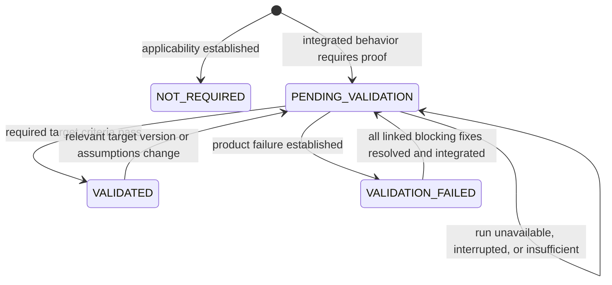
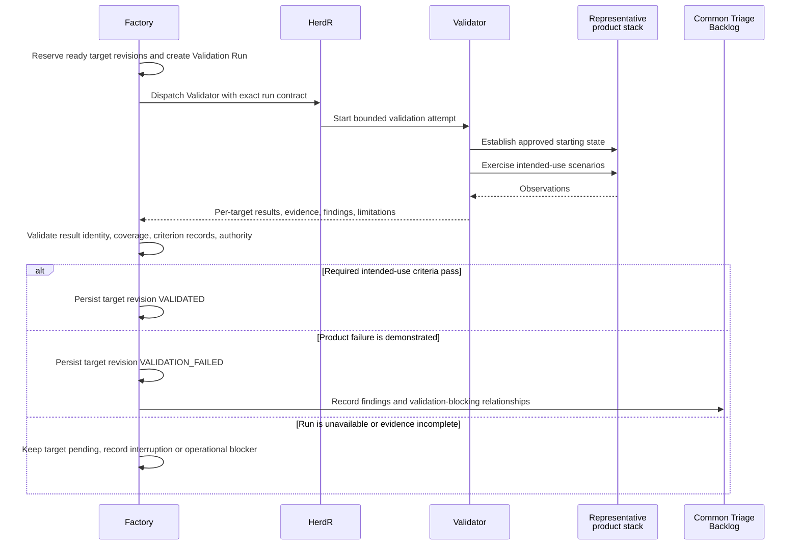
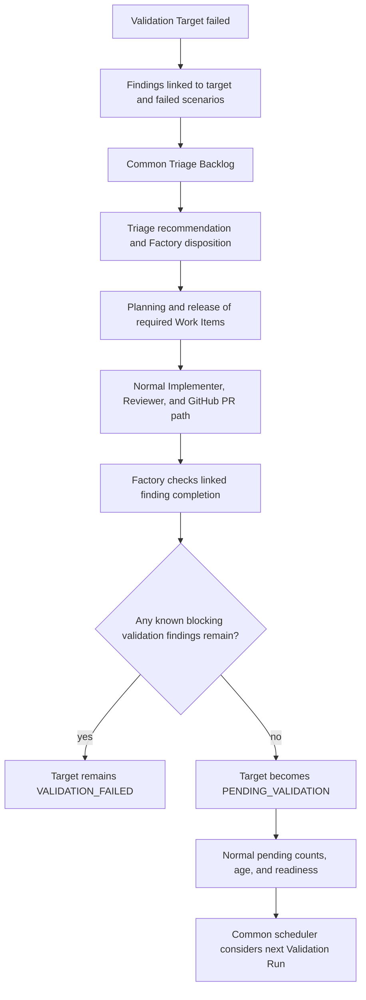

# Product validation and target scheduling

Kind: explanation

## Product validation and pending-target scheduling

### Terms and purpose

**Validator** is the Worker that exercises integrated product behavior against intended use in a representative environment. **Validation Target** identifies the capability, scenarios, requirements, integrated version set, and configuration that require this proof. **Validation Run** is one bounded execution against one or more target revisions.

This is not a second name for PR review. Candidate review asks whether a change is suitable to merge. Validation asks whether the integrated product actually supports the intended story. A collection of individually accepted PRs can still fail at that level.

A target can span repositories. For example, Archive's container and CLI may jointly implement the restore story. The run records the exact versions and configuration it exercised rather than asserting that “the latest project” passed.

### Target status is separate from work status

| Validation status | Meaning |
|---|---|
| `NOT_REQUIRED` | The declared validation requirement does not apply, with a recorded basis. |
| `PENDING_VALIDATION` | The current integrated target revision requires product evidence not yet established. |
| `VALIDATION_FAILED` | Evidence demonstrates that one or more required intended-use conditions failed. |
| `VALIDATED` | The required intended-use conditions passed for the recorded target revision and environment. |

A run being queued or running is recorded on the Run, not substituted for the Target's proof state. This keeps “someone is testing it” distinct from “it works.”

### Figure 25 — Validation Target lifecycle

Transitions are Factory decisions based on an admitted run result and exact target revision. A late passing report for revision 3 cannot clear pending validation on revision 4.

### When Factory considers validation

Factory evaluates validation demand after meaningful product events: a runnable slice integrates; the configured pending-target threshold is reached; a failed target becomes pending after its blocking fixes integrate; an owner requests validation; or a release/closeout requires proof.

These are triggers to evaluate readiness and schedule under the common capacity rules. Factory records the decision to run or wait and its reason. Prerequisites, environment availability, running validations, and duplicate target reservations are considered. Pending counts and age are visible in briefings so lack of validation cannot be hidden by many merged PRs.

The default counting unit in this design is the **current pending Validation Target revision**, not raw PR count. Several PRs contributing to one story do not create meaningless duplicate validation jobs. Project policy may also use merged-work volume as a trigger input. Exact numeric thresholds remain configurable.

### Validation Run contract

Before dispatch, the Run contains target IDs/revisions; the integrated repository/build version set; intended-use goals and scenarios; prerequisites; representative environment/configuration; approved fixture/data/credential references; applicable validation/product-quality criteria; expected results; normal operator actions; evidence requirements; and an execution envelope.

A representative environment is not automatically production. The owner/project must authorize the environment and any consequential external actions. Real credentials, when needed, are supplied through scoped secret mechanisms and are not put in canonical logs or general context packets.

Validator provisions or uses the approved fresh/controlled stack, executes the complete scenario, and records observations. A fresh scenario must not rely on leftover permissions, data, state, or undocumented repairs from a previous run. Expensive reusable image caches are acceptable when they do not change the intended starting conditions.

### The zero-workaround rule

The run passes only through the supported product/operator path. An ad hoc permission grant, manual file injection, undocumented configuration override, or improvised restart that rescues a broken scenario does not make it pass. The action and observed failure become evidence.

A documented restart that is itself an intended recovery procedure is not automatically a workaround. The distinction is whether the action belongs to the approved scenario and normal supported operation, not whether a particular command word appears. The Validator cannot rewrite the scenario after seeing failure to bless an improvised repair.

### Figure 26 — Validator reports; Factory records; common triage follows

Factory does not independently understand a user journey by executing a JSON validator. The Validator supplies the bounded semantic assessment and observations. Required review of validation plans, disputed results, high-risk evidence, or release evidence follows the relevant profile. There is no unconditional new Reviewer or second full product test for every ordinary passing run.

### Fixes return targets to the normal pending pool

A product defect goes to common triage. It can be planned alone or with related work according to criticality, size, and blocker relationships. Its demonstrated product impact gives it scheduling weight. The resulting Work Item follows ordinary implementation, review, PR merge, and evidence rules.

When a linked correction Work Item is integrated, Factory evaluates all known blocking findings for the affected target. If blockers remain, the target remains `VALIDATION_FAILED`. When all required blocking corrections are resolved and integrated, the current target becomes `PENDING_VALIDATION` and contributes to the normal pending metrics again. That transition is not a claim the product now works.

Normal scheduling selects another run when its trigger/readiness conditions apply. Release or closeout may make that next run immediately necessary, but fixing one bug is not inherently a command to launch a fresh validator.

### Figure 27 — Product defects use normal work scheduling

### Failure attribution and freshness

A missing test credential, dead test host, or interrupted harness is not automatically a product defect. The result records a run problem and leaves unproven targets pending. A product-generated error under the intended supported conditions can establish failure. Ambiguous attribution may require Scout, Researcher, or Arbiter input; it must not be converted to a pass.

A multi-target run produces results per target/scenario. One successful path cannot clear unexecuted targets. A target with an unchanged name but a changed relevant build/configuration is a new evaluation subject. The history of old successful and failed revisions remains available for metrics.

| ID | Requirement |
|---|---|
| PF-VAL-01 | Integrated work and product Validation have separate state and evidence. |
| PF-VAL-02 | Every run binds exact target revisions, product versions, scenarios, environment, and criteria. |
| PF-VAL-03 | Validator exercises intended behavior and reports evidence/findings; it does not implement its own fixes. |
| PF-VAL-04 | Product defects enter common triage and ordinary planned work, not a private validation workflow. |
| PF-VAL-05 | Demonstrated validation blockers contribute explicit scheduling precedence without bypassing other controls. |
| PF-VAL-06 | Failed targets return to pending only after all relevant known blocking findings have been resolved/integrated. |
| PF-VAL-07 | Returning to pending updates normal trigger metrics and does not force an independent fix-wave loop. |
| PF-VAL-08 | Incomplete or infrastructure-failed runs do not establish product success or automatically establish product defect. |
| PF-VAL-09 | Late results cannot clear a newer target revision or an unexecuted target. |
| PF-VAL-10 | Passing validation uses supported operator behavior without improvised workarounds. |

### Initial handover validation

The initial profile validates two real PriFly code Work Items implemented concurrently across Codex and Claude Code, including current correction, Factory-driven PR integration and observed target version set. Validation runs against a separate representative candidate stack and includes stale results, environment blocks and defect-fix accounting. Host-loss recovery and candidate-controller activation are exercised through supported operator commands. Undocumented manual repair prevents a scenario pass. Imported follow-up fixes retain target/defect links through external planning; normal scheduling decides the next current-revision run.
