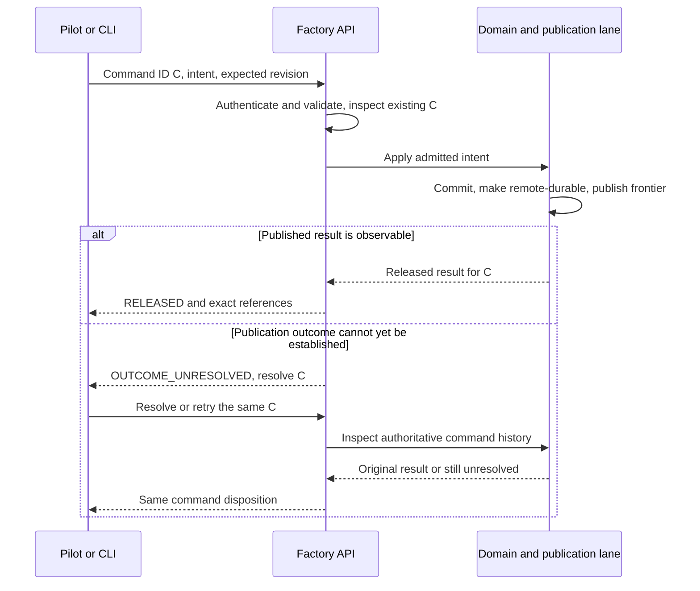

# Application API contract

Kind: reference

## Application API, canonical records, and deterministic presentation

### One semantic boundary, several clients

The **Application API** is Factory's interface for Commands, Queries, and Events. Pilot normally uses the CLI as its client. The owner can use the CLI directly, and Bridge can later consume the same semantics. A graphical approval button must not implement a separate authority rule from the CLI's owner-control operation.

A **Command** requests an authoritative mutation. A **Query** reads state without changing it. An **Event** records or announces a semantic fact. Events do not confer authority on the receiver, and reconnecting clients query current canonical state rather than assuming they received every notification.

Concrete HTTP paths, socket filenames, and Go type names are implementation decisions. The semantic envelopes, authority, idempotency, exact references, and error behavior are product contracts.

### Identity and admission

Commands identify the command ID, versioned operation type, authenticated actor, correlation/causation, target and expected revision where relevant, and typed payload. Actor identity comes from the actual capability, not from an arbitrary `actor` field submitted by a model.

Factory authenticates, validates structure, checks for an existing command identity, validates authority and current state, executes the domain operation, and publishes its authoritative transaction. Reusing an ID for different intent fails. Retrying the same admitted intent resolves to the same published result or its still-unresolved status.

Request equality concerns client intent and identity. Server-generated admission timestamps and ephemeral transport metadata cannot make an otherwise identical retry appear to be a new request. A caller whose permissions have been revoked does not regain data access merely by guessing an old command ID.

### Result finality and uncertainty

A terminal **Command Result** is either `RELEASED` or a provably final `REJECTED`. A **Command Status** can instead report that the outcome is unresolved. If remote publication succeeded but the response was lost, Factory must not manufacture a rejection just because it cannot immediately prove success.

| Condition | Client interpretation | Required behavior |
|---|---|---|
| Released result known | The semantic action took effect authoritatively. | Return result, changed object references, and published frontier. |
| Definitive rejection | The command cannot take effect under this admission/result. | Return structured reason and appropriate next action. |
| Outcome unresolved | The caller does not yet know whether authoritative publication occurred. | Resolve/retry with the same command identity; do not create a second intent. |
| Provisional progress | Work is locally pending or waiting on durability. | Keep separate from terminal success and canonical evidence. |

An idempotency conflict, stale revision, insufficient authority, unsupported schema, absent capacity, and provider ambiguity are different errors. Their retry guidance must be typed, not inferred from human message text. Once a terminal result is fixed, repeating it is not a way to obtain a different state-dependent decision; genuinely changed intent uses a new command after the necessary refresh.

### Figure 31 — Command outcome and same-ID resolution

### Logical operation families

The following are semantic operations the product must expose, not a frozen list of HTTP endpoints. Some operations are Factory-internal; their existence does not make them available to a Worker capability.

| Family | Representative operations | Normal authority |
|---|---|---|
| Project/configuration | register Project/repository; select profile; inspect capabilities | Owner or scoped configuration authority |
| Planning | record Intake; prepare/confirm phase release; submit outline/contribution/package/annotation; propose Decision; publish baseline; open change | Pilot/owner input, scoped role output, exact-package owner-control, and Factory gates |
| Work | request pause/resume/cancel; inspect dependencies; release planned work | Owner/delegation and Factory scheduler |
| Worker | submit result/finding/blocker; request scope; inspect assigned context | Exact current Worker Attempt |
| Review/correction | record round/verdict/probes; admit correction submission and PR Draft; append conversation entry; record acceptance | Factory with exact-subject Reviewer/Implementer evidence |
| Triage | list findings; submit assessment; hold; group; release to planning; record disposition | Triage proposal and Factory/owner policy |
| Validation | request run; reserve targets; submit run result; recompute target status | Owner/Pilot request, Validator evidence, Factory policy |
| Release/closeout | request readiness; record decision; publish release; close scope | Factory and required owner authority |
| Attention | list; defer attention; discuss; prepare Owner Action; confirm exact package | Pilot for discussion/delegation; owner-control for consequential confirmation |
| Provider | prepare, arm, observe, reconcile obligation | Provider Broker and Factory internal authority |
| Runtime/recovery | inspect; drain; diagnose; recover; rotate access; activate generation | Runtime subsystem or restricted recovery operator |
| Measurement | query metrics; propose experiment; record assignment; recommend policy change | Factory measurement, bounded Auditor, required policy authority |

Queries must support progressively bounded reads: a summary should return references for detail, not serialize the whole Factory history. A `command.status` query/operation is necessary to resolve ambiguous responses. Exact naming/versioning is finalized in executable contracts before their producer and consumer are implemented.

### Rendering and template reliability

Canonical Worker output is structured JSON validated structurally and semantically. Factory renderers turn the same record into Markdown, CLI output, Pilot context, GitHub comments, and future GUI views. A model must not be asked to reproduce the authoritative template from memory.

For example, every review rendering draws from the same subject, profile, criterion results, findings, evidence, verdict, and next-action fields. The owner can change the Markdown renderer later without changing the historical meaning of review data. Human display labels can be improved without retroactively altering schema enums.

Large raw logs or binaries are external artifacts, not embedded in every JSON response. References identify their location, content identity, access conditions, and retention treatment. Prompt serialization is a projection and can be measured experimentally; no claim that XML or another format is universally cheapest is part of the product definition.

### Events, ordering, and schema evolution

Events carry a stable ID, type/version, subject, actor, causation, and ordered Ledger position. Delivery may be repeated, so clients deduplicate. History order comes from the published transaction sequence and event index, not wall-clock timestamps. Stream cursors are opaque and versioned as needed.

Canonical schemas are closed by default. Unknown semantic fields and unsupported enum values do not silently create new behavior. Historical immutable records remain interpretable under their original schema. API envelope, operation, Worker protocol, artifact, database, and execution-manifest versions are separately identified.

Executable JSON Schemas and tests must exist when a real producer/consumer for that family is implemented. Until then, these semantic definitions are requirements, not fabricated working endpoints.

| ID | Requirement |
|---|---|
| PF-API-01 | All authoritative mutations use typed, authenticated, idempotent Commands. |
| PF-API-02 | Unresolved publication is nonfinal and resolves using the same command identity. |
| PF-API-03 | Canonical Queries and released Events expose published state, not uncommitted or unpublished projections. |
| PF-API-04 | Worker capabilities cannot invoke owner-only, arbitrary-job, provider-mutation, or direct database operations. |
| PF-API-05 | Record identity, schema version, exact subject, and provenance remain explicit across interfaces. |
| PF-API-06 | Deterministic renderers own output structure; model prose does not become canonical merely because it looks like a template. |
| PF-API-07 | Schema/operation compatibility is explicit; unsupported combinations fail admission. |
