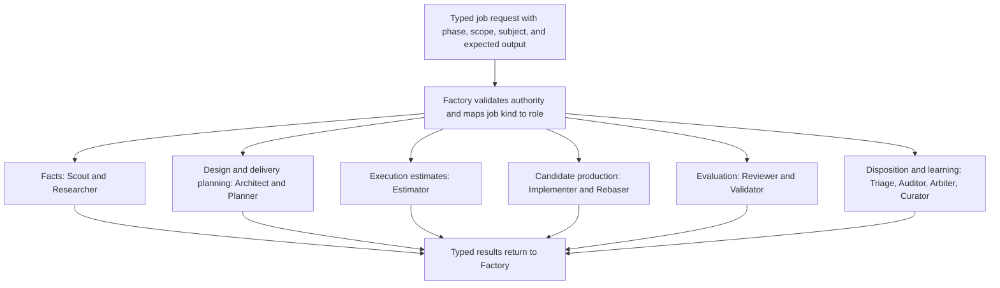

# Worker roles and responsibility routing

Kind: reference

## Worker role catalog and responsibility routing

### Non-Worker participants

| Participant | Responsibility |
|---|---|
| Owner | Supplies intent and consequential authority. |
| Pilot | Translates conversation into Factory requests and presents Factory output. |
| Factory | Records state, enforces policy, decides deterministic eligibility, and dispatches all Workers. |
| HerdR | Runs/manages the sessions selected by Factory and exposes runtime observations. |
| Provider Broker | Performs authorized external reads/writes and records outcomes. |
| Test tools / CI | Execute checks and emit observations; they are not AI Worker roles. |

### The thirteen Worker roles

A role is a reusable job contract. It is not a particular model and not a permanently running session.

| Role | Factory dispatches it for | Required output | Boundary |
|---|---|---|---|
| **Scout** | Bounded discovery from existing repositories, Factory records, documentation, or authorized provider snapshots. | Facts, exact locators, coverage and uncertainty. | No architectural choice; no product code edits. |
| **Researcher** | Questions requiring external authoritative sources, deeper factual investigation, or empirical qualification. | Research Claims with sources, derivation, freshness, contradictions, and limitations. | Does not silently select the product design. |
| **Architect** | Technical refinement of owner-released requirements; design outline, scoped contributions, synthesis, feature impact, and design corrections. | Requirements refinements, design assignments, coherent Review Packages, options/decision proposals, risks, and verification intent. | Does not turn Intake into a technical project without release or approve its own design. |
| **Planner** | Decomposition of an approved design or a bounded planning input. | Work Items, dependency relationships, Validation Targets, lanes/scope forecasts, and Verification definitions. | Does not invent unresolved architecture to make a plan look ready. |
| **Estimator** | Execution-effort prediction for defined Work Items, concrete proposed batches, and changed execution scope. | Active execution-time and supportable token ranges, comparable history/sample size, assumptions, uncertainty, and separate overhead estimates where requested. | Does not create requirements, choose scope, decompose, batch, prioritize, or schedule work. |
| **Implementer** | New implementation or current correction within a released Work Item, including code, tests, configuration, migrations, and documentation. | Candidate commit, Verification Evidence, structured PR Draft, Findings, and per-finding responses for corrections. | Cannot approve or merge its own work; current-correction attempts stay in the existing Work Item/PR. |
| **Rebaser** | A branch update that encounters conflicts requiring engineering judgment. | Conflict-resolved candidate, resolution rationale, and relevant test evidence. | Does not approve the resolution or merge the PR. |
| **Reviewer** | Independent examination of a requirement, design, plan, code candidate, release package, or other consequential artifact. | Criterion results, conformance assessment, evidence judgment, verdict, and Findings. | Does not alter the artifact under review. May run checks within the same review. |
| **Validator** | Intended-use testing of integrated Validation Targets on a representative stack. | Per-target observed outcomes, version/environment identity, evidence, and Findings. | Does not fix the product or create a private work queue. |
| **Triage** | Relevance, scope, urgency, grouping, and treatment of backlog Findings. | Proposed triage decisions, rationale, relationships, and planning/batch recommendations. | Factory validates and applies the decision; Triage does not dispatch implementation. |
| **Auditor** | Cross-cutting or retrospective examination of process fidelity, drift, quality, evidence, metrics, or experiments. | Evidence-backed Findings and analysis/recommendations. | Does not replace normal candidate review or directly change policy. |
| **Arbiter** | A bounded semantic dispute, repeated failure, or unclear decision that ordinary policy cannot resolve. | Recommendation distinguishing facts, uncertainty, alternatives, and required authority. | Does not override the owner, Constitution, or scope automatically. |
| **Curator** | Turning reviewed observations and lessons into maintained, reusable knowledge. | Normalized knowledge/lesson records with sources and supersession links. | Does not manufacture policy from precedent or conversation. |

### Role completion conditions

Every role must finish with one of: the contracted output; a structured blocker; a request for missing context/authority; or an interrupted/failed attempt record. Silence, a pane becoming idle, or confident prose does not establish completion.

Architect and Planner outputs return to Factory and then to a Reviewer. A fresh Implementer in current-correction mode returns a changed candidate to Factory and then to a fresh Reviewer. A Triage recommendation returns to Factory for policy validation; ambiguous or high-consequence classifications can be routed to Arbiter or the owner. A Reviewer who gathers additional evidence finishes the same review rather than requesting another reviewer of that evidence.

### Figure 5 — Routing ownership

No arrow between two Worker roles is needed to move work. Factory is always the handoff authority. Transport through HerdR is omitted here only to keep the role map readable.

### Job selection, dispatch, and unresolved decisions

A cognitive participant identifies the information or engineering task and proposes a **typed Job Request**: job kind, question/objective, exact subject, phase/scope authorization, required inputs, expected output, and resource request. Pilot can propose a bounded investigation only after the owner authorizes that investigation. Within a released phase, the responsible Architect, Planner, Reviewer, or other Worker can request supporting work without dispatching it.

Factory validates the request and uses a versioned job-kind-to-role registry. Existing code/document/history discovery maps to Scout; external factual investigation maps to Researcher; technical alternatives/design map to Architect; decomposition maps to Planner; execution-effort prediction maps to Estimator. An unsupported or ambiguous kind returns a structured routing question to its requester; Factory does not guess from prose or silently upgrade one role into another. A Scout that reaches an external unknown reports it for a new authorized request.

| Decision | Cognitive or owner responsibility | Factory's deterministic responsibility |
|---|---|---|
| Requirements ready to leave Intake | Owner confirms the requirements brief, supported by Pilot's elicitation. | Bind the release to its revision, scope, allowed phase, and budget. |
| Design partition and synthesis | Architect proposes assignments and reconciles their meaning; Reviewer challenges the whole. | Validate assignment contracts and authority, then dispatch by dependencies. |
| Delivery hierarchy and safe work boundaries | Planner proposes decomposition; Architect resolves design seams; Reviewer evaluates coherence. | Validate ownership, trace edges, graph consistency, and phase releases. |
| Execution estimates | Estimator predicts effort from an already-defined scope. | Retain original estimates, compute requested rollups, and join actuals for calibration. |
| Which ready job runs next | Recorded priorities, semantic dependencies, and authorized scope supply the inputs. | Apply the configured eligibility, Route, resource, and scheduling policy. |
| Finding relevance or compatible grouping | Reviewer/Triage provides evidence-backed assessment; Arbiter or owner resolves disputes. | Enforce authority, retain relationships, and apply declared treatment rules. |
| Promotion and revalidation | Required reviewers/validators supply exact-subject evaluations. | Check identity, required coverage, approvals, blockers, and evidence before applying transitions. |
| Provider object selection | Owner selects a projection profile; Planner supplies canonical structure. | Compile that profile and structure into desired provider objects and reconciled operations. |

Every consequential decision records its inputs, decision owner, governing policy/contract, output, and unresolved path. The initial role and job wording is in [Appendix F](worker-prompts.md#initial-role-and-job-prompt-library).
